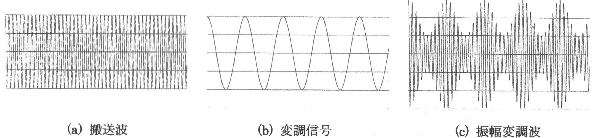
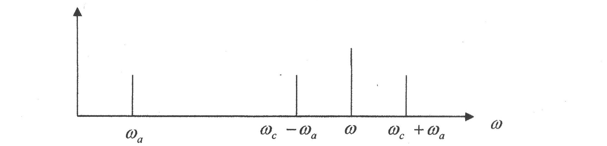
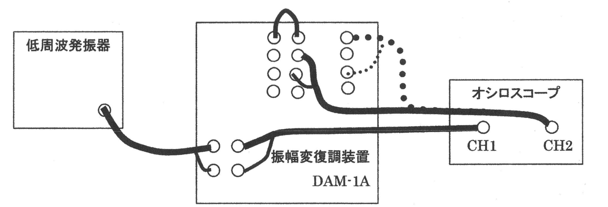
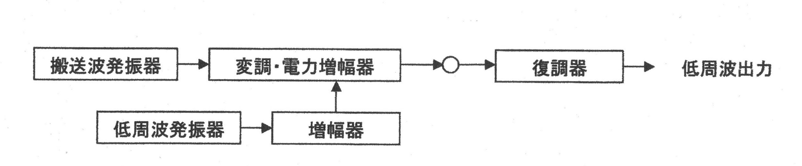
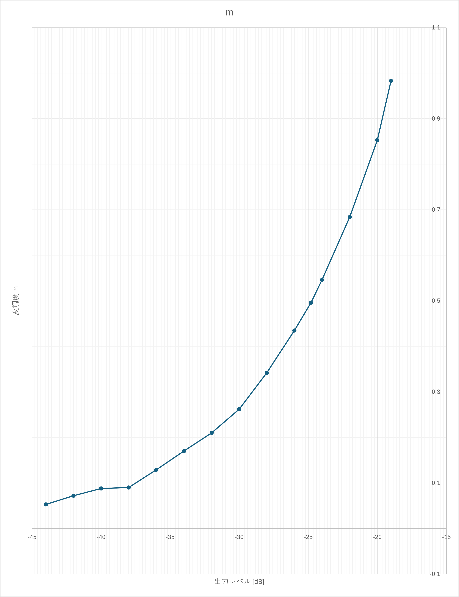
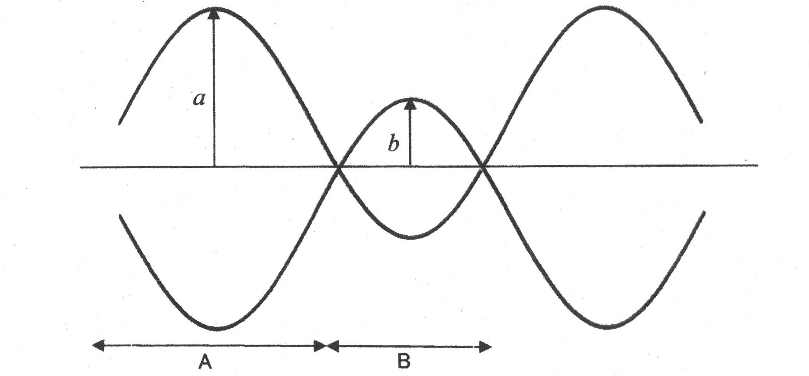
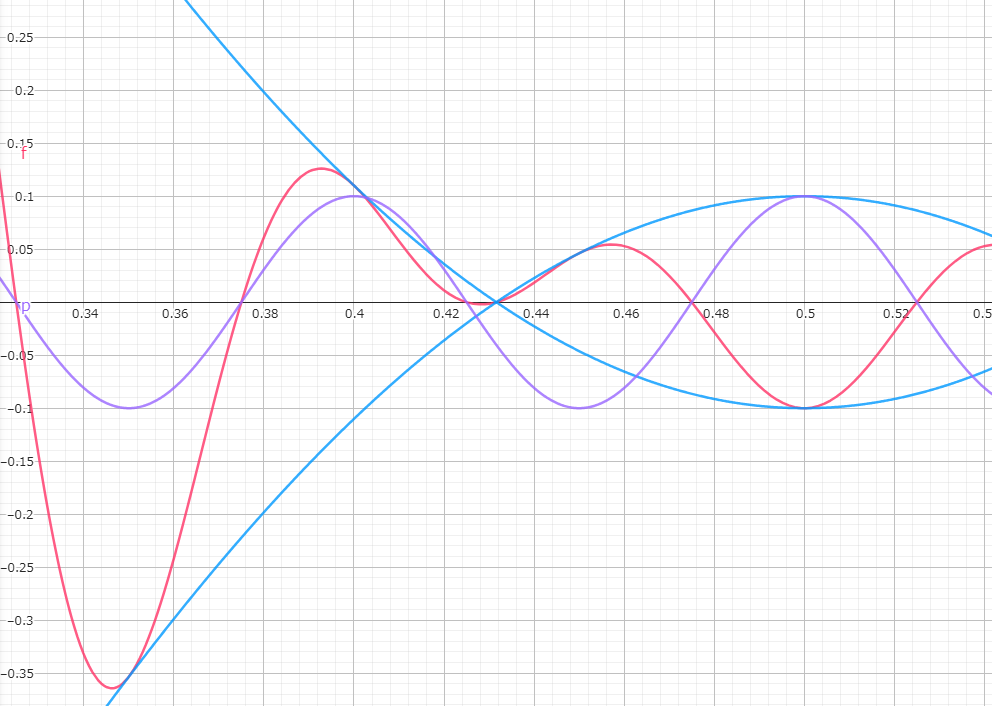

# 目的
&emsp;変調方式の最も基礎となる振幅変調( Amplitude Modulatoin : AM )について、その時間波形を測定観測することで、AMによる搬送波への情報の重畳のしくみと特徴を理解するとともに、オシロスコープの多様な利用方法を習得する。

# 理論
&emsp;変調とは、高周波の正弦波電圧(搬送波と呼ぶ)に伝送したい情報の電気信号(変調信号と呼ぶ)に比例した変化を与える(情報を含ませる)ことである。搬送波の振幅(正確には最大値の包絡線)に信号波の強弱を重畳することで情報を含ませる方式を振幅変調と呼ぶ。
&emsp;角周波数 $\omega_c$ の搬送波を $A_{0}\cos{\omega_c}$ とし、信号波を $v_a(t)$ とした場合の振幅変調波は、
$$v(t) = A_{0}(1 + m v_a(t)) \cos{\omega_c t}$$

となる。$v_a(t)= \cos{\omega_a t}$ とした場合の(1)の振幅変調波の時間波形の概形を図示すると図1のようになる。  

&emsp;ここで、mは変調指数と呼ばれるもので、搬送波に重畳する信号波の深さである。図1はm=0.5の場合である。この値が小さすぎると雑音に弱くなり、逆に、大きすぎると重畳した情報が歪んでしまう。
&emsp;次に、三角関数の公式を用いて変形すると(1)は、
$$v(t) = A_0\cos{\omega_c t}+\frac{A_0 m}{2}cos(\omega_c - \omega_a)t + \frac{A_0 m}{2}cos(\omega_c +\omega_a)t$$ 
となり、第1項は情報の含まれない搬送波( Carrier )、第2、3項目は側波帯( Side Band )と呼ばれる情報の含まれた信号である。信号波の強弱が変化すると、対応する周波数の側波帯のスペクトル強弱が変化することが分かる。(2)のスペクトルを図2に示す。

&emsp;中波ラジオや短波ラジオ放送、アナログテレビジョン放映の映像などがこの方式で放送されている。本実験で使用するAM変調器の搬送波周波数は DAM-1A が 16 kHz、DAM-3 が3.58 MHzである。  

\clearpage

# 使用機器
&emsp;使用機器を以下の表1にまとめた。

|機器名|製造会社|型式|製造番号|台数|
|:----:|:----:|:----:|:----:|:----:|
|変復調器|DENGNEER|DAM-1A|A626020|1|
|オシロスコープ|KEYSIGHT|EDUX1002A|CN58290193|1|
|低周波発振器|KIKUSUI|ORC11|13094817|1|

:使用機器

\clearpage

# 実験方法
1. 振幅変調の確認
   1. 各装置の電源OFFを確認し、AM変復調実験装置(DAM-1A)のAFIN端子に低周波発振器の出力を接続した。
   2. 低周波発振器の周波数を 10 Hz、出力を -30 dBに設定した。
   3. DAM-1A の AM OUT 端子(白)と AM IN の端子(黄)をバナナプラグコードで接続した。
   4. DAM-1A の AF IN 端子にオシロスコープの CH1 のプローブを接続した。ただし、オシロスコープの芯線側は青の端子、ワニ口グリップ( GND となる)は黒い端子に接続した。
   5. DAM-1A の AM OUT端子にオシロスコープの CH2 のプローブを接続した。ただし、オシロスコープの芯線側は白の端子、ワニ口グリップ( GND となる)は黒い端子に接続した。
   6. DAM-1A 、発振機、オシロスコープの電源を入れ、オシロスコープの CH1 は 100 mVOLTS/DIV 、CH2 は 50 mVOLTS/DIV に、また時間軸を 20msec/DIV に設定した。DAM-1A の AF IN端子に入力されている変調信号、および AM OUTに出力された振幅変調波の波形を同時に観測し、方眼紙にスケッチした。
   7. 各機器の設定は変えずに、発振機の出力のみを -20 dBおよび -40dB とした場合と -30 dB の場合との違いを観測し、その特徴を記述した。
   8. 発振器の出力を -30 dB に戻し、周波数を 20 Hz に上げて行った場合の変化を観測し、その特徴を記述した。
2. 変調信号の強弱による振幅変調波の変化(変調度)
   1. 4.1 の実験配線において、オシロスコープの CH 1は 100 mVOLTS/DIV 、CH2 は 50 mVOLTS/DIV に、また時間軸を 0.2 msec/DIV に設定した。
   2. 発振器の周波数を 600 Hz 付近に設定し、振幅変調波が図1(c)のように観測できることを確認した。このときの CH 1 および CH 2 の波形を方眼紙にスケッチした。
   3. 発振器の出力レベルを -40 dB から -20 dB まで 2dB ごとに変化させて、振幅変調波の包絡線の最大値 $V_max$ と最小値 $V_min$ の電圧をオシロスコープから読み取り、記録した。
   4. 変調度: $m=frac{V_max - V_min}{V_max + V_min}$ を計算し、横軸に発振機の出力レベル、縦軸にmを取り、グラフを作成した。
   5. m=0.5 および m=1 となるように発振器の出力レベルを設定し、これらの振幅変調波形をそれぞれスケッチした。また、これらの2点を変調度mのグラフにプロットした。
   6. m>1 となるように発振機の出力を設定した場合の、振幅変調波形を観測し、スケッチした。

3. 変調信号の周波数による振幅変調波の変化
   1. 4.2 の実験配線をそのまま利用し、目安として m=0.5 前後となるように発振機の出力レベルを調整した。
   2. 発振器の周波数を 2 kHz に設定し、オシロスコープを調整し、振幅変調波の包絡線の周期を求めた。
   3. 発振器の周波数を 500 Hz に設定し、オシロスコープを調整し、振幅変調波の包絡線の周期を求めた。

4. 振幅変調波の復調
   1. 4.3 の実験配線をそのまま利用し、発振機の周波数も 500 Hz のままで、オシロスコープの CH 2 を DAM-1A の DET OUT 端子に接続し、CH 1 と同じ周期の信号が得られている。(復調されている)ことを確認した。
   2. 発振器の周波数を変化させて発振器の周波数を 1 kHz および 2 kHz に設定し、それぞれオシロスコープを調整し、復調された信号の周期(周波数)を求めた。
   3. 発振器の周波数を 500 Hz に戻し、出力を現在の値から ±2 dB、±4 dB 変化させて、復調された信号を観測し、その周期(周波数)がどうなったのかを記述した。

{width=400}
{width=400}

\clearpage

# 実験結果
実験結果を以下に示す。

##

1. 実験 4.1.7 でスケッチした波形を図 5 に示した。
2. 実験 4.1.8 で発振器の出力のみを -20 dB, -40 dB とした場合と -30 dB との場合について、振幅変調信号にどのような違いがあるか。-20 dB の場合は -30 dB と比べて、包絡線の振幅が大きくなり、-40dB の場合は包絡線の振幅が小さくなった。つまり、入力信号の振幅に対する振幅変調信号の包絡線の振幅は単調増加の関係が観測された。
3. 実験 4.1.9 で出力を -30dB に戻し、周波数を 20Hz に上げていった時について、入力信号と振幅変調信号の包絡線の周波数は一致し、包絡線の振幅は変化しなかった。

##

1. 実験 4.2.2 で周波数を 600Hz に設定した時の波形のスケッチを 図 6 に示した。搬送波は入力信号 1 周期 に対して約 23.5 周期 含まれていた。したがって、搬送波の周波数は  $23.5 \times 600 = 14.1 [kHz]$ と求められ、公称値の 16 kHz に近い値であった。
2. 実験 4.2.3 で発振器の出力レベルを -40dB～-20dB まで 2dB ごとに変化させて振幅変調波の包絡線の最大値 $V_{max}$,最小値 $V_{min}$ ,変調度 m を表 2 にまとめた。

| 出力レベル [dB] | $V_{max}$ [V] | $V_{min}$ [V] | m |
|-----------------|----------|----------|--------|
| -14             | 3.61     | 0.512    | 0.752  |
| -19             | 3.56     | 0.03     | 0.983  |
| -20             | 3.38     | 0.269    | 0.853  |
| -22             | 3.16     | 0.594    | 0.684  |
| -24             | 2.81     | 0.825    | 0.546  |
| -24.8           | 2.71     | 0.913    | 0.496  |
| -26             | 2.69     | 1.06     | 0.435  |
| -28             | 2.55     | 1.25     | 0.342  |
| -30             | 2.41     | 1.41     | 0.262  |
| -32             | 2.25     | 1.47     | 0.210  |
| -34             | 2.13     | 1.51     | 0.170  |
| -36             | 2.05     | 1.58     | 0.129  |
| -38             | 1.99     | 1.66     | 0.0900 |
| -40             | 1.97     | 1.65     | 0.0880 |
| -42             | 2        | 1.73     | 0.0720 |
| -44             | 1.9      | 1.71     | 0.0530 |
:出力レベルに対する変調度

3. 表 2 を基に横軸に発振器の出力レベル、縦軸に変調度 m を取ったグラフを図 7 に示した。グラフから、$m \leq 1$ の領域では出力レベルと変調度 m は単調増加の関係にあることが分かった。

\clearpage

{width=700px}

4. m=0.5 ( -24.8 dB ) および m=1 ( -19 dB ) となるように発振器の出力レベルを設定し、それぞれスケッチした波形を図 8、図 9 に示した。それぞれの変調度における出力レベルは図 7 のグラフから求めた。
5. m>1 となるように発振器の出力を設定し、スケッチした波形を図 10 に示した。

\clearpage

##

1. 発振器の周波数を 2 kHz に設定したとき、包絡線の周期は 496 [$\mu s$] であった。
2. 発振器の周波数を 500Hz に設定したとき、包絡線の周期は 1.99[ms] であった。

以上から、出力レベル一定のときには入力信号の周波数と包絡線の周波数は一致することがわかる。

##

1. 実験 4.3 と同様の配線で、発振器の周波数を 500 Hz としたときに、入力信号と復調信号の周期が同じであることをオシロスコープで確認した。
2. 発振器の周波数を 1 kHz, 2 kHz に設定した時それぞれについて、復調信号の周期をオシロスコープで求めた。
   1. 1 kHz のとき : 1.00 [ms]
   2. 2 kHz : 500 [$\mu s$]
3. 発振器の出力レベルを -24.8 dB , 周波数を 500 Hz の状態から、出力レベルを ±2 dB、±4 dB 変化させたときの復調信号の周波数、周期を 表 3 にまとめた。

| 出力レベル [dB] | 周波数 [Hz] | 周期 [ms] |
|-----------------|-------------|----------|
| 24.8dB          | 496.38      | 2.0146   |
| 26.8(+2)        | 497.64      | 2.0095   |
| 22.8(-2)        | 507.82      | 1.9692   |
| 28.8(+4)        | 500.00      | 2.0000   |
| 20.8(-4)        | 505.05      | 1.9800   |
:出力レベルに対する周波数の変化

出力レベルを変化させても、復調信号の周波数（周期）は傾向として変化しない事がわかった。

\clearpage

# 課題

1. 低周波発振器の出力は実効値で 3.16 V の時に 0 dB となるように校正されている。このとき、 -20 dB は実効値で何 V に相当するかを計算せよ。  
   -20 [dB] のとき、0 [dB] のときの実効値 3.16 [V]から $\frac{1}{10}$ 倍されるので、実効値で 0.316[V] に相当する。
2. 搬送波の周波数は DAM-1A と同じものとし、変調信号の周波数が 1 kHz で、変調度 m が 50 % の時の振幅変調波を表す式を記述せよ。ただし、搬送波の振幅を 1 とし、式(1)の形式とせよ。  
   搬送波の角周波数 $\omega_c$ を求める
   $$\omega_c = 2 \pi \times 16 \times 10^3 = 32 \pi \times 10^3  [rad/s]$$
   変調信号の角周波数 $\omega_a$ を求める
   $$\omega_a = 2\pi \times 10^3 [rad/s]$$
   変調信号 $v_a(t)$ を
   $$v_a(t) = \cos{\omega_a t} = cos{2000 \pi t}$$
   とすると、式 (1) より,
   $$v(t)=A_{0}(1+mv_a(t)) \cos{\omega_c t}$$
   $$v(t) = 1 \times ( 1 + 0.5 \times \cos{2000 \pi t}) \times cos{32000 \pi t}$$
   $$v(t) = ( 1 + \frac{1}{2} \cos{2000 \pi t})cos{32000 \pi t}$$
   となる。
   式 (2) の形式も求めてみると、
   $$v(t) = A_0\cos{\omega_c t}+\frac{A_0 m}{2}cos(\omega_c - \omega_a)t + \frac{A_0 m}{2}cos(\omega_c +\omega_a)t$$
   $$v(t) = 1 \times \cos{32000 \pi t} + \frac{1 \times 0.5}{2} \times \cos{(32000 \pi - 2000 \pi)t} + \frac{1 \times 0.5}{2} \times \cos{(32000 \pi + 2000 \pi)t}$$
   $$v(t) = \cos{32000 \pi t} + \frac{1}{4}\cos{30000\pi t} + \frac{1}{4}\cos{34000\pi t}$$
3. m > 1 となるような場合、振幅変調波はどのようになるか。  
   $A_0 = 1$, $0\leq m \leq 1$ のとき、振幅変調波の振幅 $A$ は $A \geq 0$ だが、$m > 1$となるとき、式 (1) から分かるように、振幅変調波の振幅が一部で負の値を取るようになってしまうため、振幅 A、つまり振幅変調波の包絡線は負の値を取る。この時、包絡線は交差し、図 10 のような波形になる。この状態を過変調という。

\clearpage

# 考察

角周波数 $\omega_c$ の搬送波を $A_0\cos{\omega_c t}$ とし、信号波を $v_a(t)$ とした場合の振幅変調波は、
   $$v(t)=A_{0}(1+mv_a(t)) \cos{\omega_c t}$$
となる。$m > 1$ の場合、振幅変調波の包絡線は下の図 11 のようになる。

$v_a(t) = \cos{\omega_a t}$ としたとき 

1. 図中の $a, b$ は $m$ を用いてどう表されるか。  
まず、包絡線は、搬送波が $\pm 1$ のときの点での $v(t)$ を結んだものになるので、その式は $\pm A_{0}(1+mv_a(t))$ で表される。  
$a$ は、 $A_{0}(1+mv_a(t))$ で表される曲線の最大値である。その値は、$t=0$の場合を考えれば
$$a = A_0(1 + m)$$
$b$ は、 $-A_{0}(1+mv_a(t))$ で表される曲線の最大値である。その値は、$t=\pi$の場合を考えれば
$$b = -A_0(1 - m) = A_0(-1+m)$$

2. 領域 A と B の位相はどうなっているか。  
領域 A では、振幅成分（$A_{0}(1+mv_a(t))$ ）の符号は正であるため、振幅変調波の位相は搬送波と一致する。  
領域 B では、振幅成分（$A_{0}(1+mv_a(t))$ ）の符号が負であるため、振幅変調波の位相は搬送波と比べて反転、つまり $\pi [rad]$ だけずれることになる。  
これらの事を図 12 に示す。青い曲線が包絡線で、赤の曲線が振幅変調波、紫の曲線が搬送波（振幅を小さくしてある）である。包絡線の交差を境に、それまでの領域では、同相であった搬送波と振幅変調波の位相が、逆相になっていることが分かる。
{width=500px}

# 参考文献
DENGYO, 無線方式博士の電波講座 第3回 無線通信に必要な変調技術(https://www.den-gyo.com/innovation/kouza/radio/detail03.php)
GeoGebra, グラフ描画に使用(https://www.geogebra.org/graphing?lang=ja)