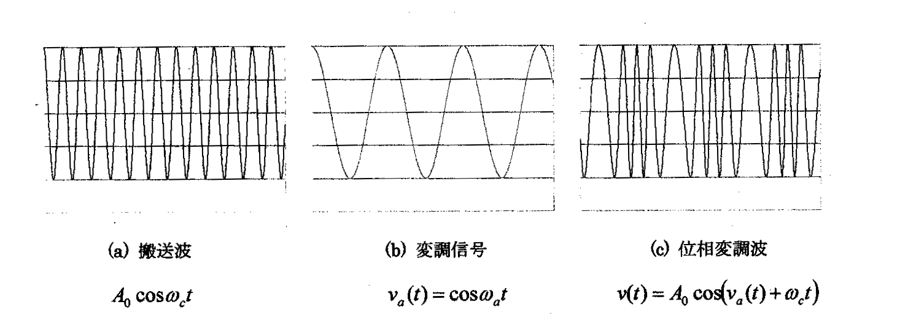
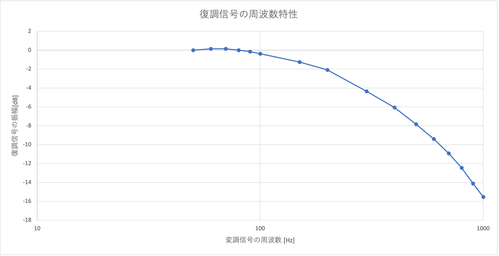
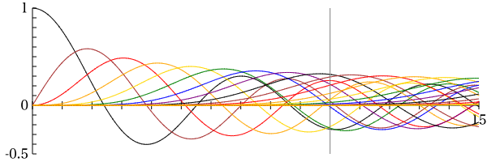
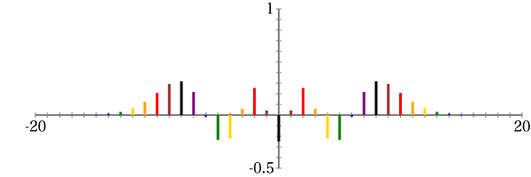

# 目的
AMと並んで変調方式の基礎である周波数変調(Frequency Modulation : FM)について、その時間波形、周波数変化を測定観測することで、FMのしくみと特徴を理解するとともに、オシロスコープの多様な利用方法を習得する。

# 理論
変調とは、高周波の正弦波電圧(以後搬送波)に伝送したい情報の電気信号(以後変調信号)に比例した変化を与える(情報を含ませる)ことである。搬送波の位相に信号波の強弱に比例した変化を与えることで情報を含ませる方式を位相変調と呼ぶ。角周波数 $w_c$ の搬送波を $A_0\cos{ω_ct}$ としたとき、位相とは $\cos$ の中身、すなわち $w_ct$ を意味する。信号波を $v_a(t)$ とした場合の位相変調波は、
$$ v(t)=A_0\cos({v_a(t)+ω_ct}) \tag{1} $$
となる。 $v_a (t)=\cos{ω_ct}$ とした場合の式(1)の位相変調波の時間波形の概形を図示すると図 1 のようになる。

次に、周波数変調について説明する。搬送波が $A_0\cosω_ct$ であるとき、周波数というのは $\cos$ の中身 $θ(t)=ω_ct$ の時間変化 $Ω(t)=\frac{dθ(t)}{dt}$ (これを瞬時角周波数と呼ぶ)のことである。正弦波である搬送波の場合は $Ω_c(t)=ω_c$ のように定数となる。搬送波に対するこの瞬時角周波数 $Ω_c(t)$ を用いれば、逆に搬送波は、
$$ v(t)=A_0\cos{(\int{Ω_c(t)dt})} \tag{2} $$
と表せることとなる。この $Ω_c(t)$ の部分に、変調信号 $v_a(t)$ に比例した変化を与えれば、
$$ v(t)=A_0\cos{(\int{(Ω_c (t)+kv_a(t)dt)})} = A_0\cos{(ω_ct+k\int{v_a(t)dt})} \tag{3} $$
となり、これは、変調信号を一旦積分してから位相変調したことと等価である。
さらに、式(3)は $v_a(t)=\cosω_at$ とすると次式を得る。
$$ v(t)=A_0\cos{(ω_ct + \frac{k}{ω_a}\sin{ω_at})} \tag{4} $$
$m=\frac{k}{ω_a}$ とおくと、

$$ v(t)=A_0(\cos{(ω_ct)}\cos({msin{(ω_at)}}) - \sin{(ω_ct)}\sin{(msin{(ω_at)}} = \sum_{n=-\infty}^{+\infty} J_n{(m)}(\cos{(ω_ct + nω_at)}) \tag{5} $$
となる。ここで、 $J_n(m)$ はベッセル関数と呼ばれるもので、式(5)においては n 次の側波帯 ( $ω_c t+nω_c$ の周波数成分となる ) における周波数スペクトルの強度を与えることになる。ベッセル関数の概要は末尾に記しているとおりで、変調信号が単純な 1 つの正弦波の場合でも、振幅変調のように簡単な周波数スペクトルとはならず、搬送波の瞬時周波数が一定となっていないことから、多くの周波数成分が含まれていることから容易に想像できる。

# 使用機器
&emsp;使用機器を以下の表1にまとめた。

|機器名|製造会社|型式|製造番号|台数|
|:----:|:----:|:----:|:----:|:----:|
|FM Modulator(変調器)|DENGINEER|DFM-1A|A636007|1|
|FM Demodulator(復調器)|DENGINEER|DFD-1A|A646007|1|
|オシロスコープ|KEYSIGHT|EDUX1002A|CN58280339|1|
|低周波発振器|TEXIO|AG-204E|13100548|1|

:使用機器

# 実験方法
1. 周波数変調波の観測
   1. 各装置の電源 OFF を確認し、FM 変復調実験装置 ( DFM-1A ) の AF IN 端子に低周波発振器の出力を接続した。
   2. DFM-1A の FM OUT 端子(白)と DFD-1A の FM IN の端子(黄)をバナナプラグコードで接続した。また、DFM-1A の FM OUT 端子(黒)と DFD-1A の FM IN の端子(黒)をバナナプラグコードで接続した。
   3. DFM-1A の AF IN 端子にオシロスコープの CH 1 のプローブを接続した。ただし、オシロスコープの芯線側は青の端子、ワニ口クリップ ( GND ) は黒い端子に接続した。
   4. DFM-1A の FM OUT 端子にオシロスコープの CH 2 のプローブを接続する。ただし、オシロスコープの芯線側は白の端子、ワニ口クリップ ( GND ) は黒い端子に接続した。
   5. 低周波発振器の周波数を 10 Hz 付近、出力を -20 dBV に設定した。
   6. オシロスコープの時間軸を 20 msec/DIV 、電圧軸は CH 1を 0.1 VOLTS/DIV 、CH 2 を 0.2 VOLTS/DIV に設定した。また、CH 1 、CH 2 ともに AC 結合とし、同期の SOURCE は CH 1 (変調信号)とした。
   7. DFM-1A 、発振器、オシロスコープの電源を入れ、波形を表示させ、画面をキャプチャした。キャプチャした画面から、CH 1 の変調信号の位相が 0°、60°、120°、180°、240°、300° となる時点で時間軸を拡大し、CH 2 の周波数変調信号の周波数を測定した。変調信号の位相と周波数変調信号の周波数との関係を記録した。
   8. 発振器の出力を -10 dBV 及び -30 dBV に変えて 4.1.7 と同様に測定した。周波数変調信号の周波数の変化幅を 4.1.7 の結果と比較した。
   9. 発振器の出力を -20 dBV に戻し、低周波発振器の周波数を 50 Hz とした。 4.1.7 と同様に測定した。周波数変調信号の周波数の変化幅を 4.1.7 と比較した。

2. 周波数変調波の復調
   1. 4.1 の接続状態のまま、低周波発振器の発振周波数を 500 Hz とし、オシロスコープの時間軸を 0.2 msec/DIV、同期 SOURCE を CH 1 (変調信号)に設定して、変調信号と周波数変調波を観測した。この時、周波数変調波が画面上で静止しない理由を考察した。
   2. 同期の SOURCE を CH 2 (周波数変調波)に設定し、変調信号と周波数変調波を観測した。この時、変調信号が画面上で静止しない理由を考察した。
   3. オシロスコープの電圧軸を CH 1 は 50 mVOLTS/DIV 、CH 2は 0.2 VOLTS/DIV に設定した。
   4. オシロスコープの CH 2 のプローブを DFD-1A の DET OUT の緑色端子に接続し、変調信号 ( CH 1 ) 及び復調された信号 ( CH 2 ) を観測した。
   5. 発振器の周波数を 50 Hz から 1 kHz まで変化させ、変調信号の振幅はほぼ一定であることを確認しながら復調された信号の電圧(振幅)を記録した。測定する周波数は 50、60、70、80、90、100、150、200、300、400、500、600、700、800、900、1 kHz とした。

\clearpage

# 実験結果
1. 4.1 の実験結果を以下に示す。
   1. 4.1.7 で測定した、変調信号の位相に対する周波数変調信号の周波数を表 2 に示した。

      | 変調信号の位相 [°] | 周波数変調信号の周波数 [kHz] |
      |:------------------:|:----------------------------:|
      |         0          |            15.82             |
      |        60          |            16.29             |
      |        120         |            16.67             |
      |        180         |            16.72             |
      |        240         |            16.13             |
      |        300         |            15.77             |
      :変調信号の位相に対する周波数変調信号の周波数 ( -20 dBV, 10 Hz )

      -20 dBV, 10 Hz のとき周波数の最大変化幅は 0.95 [kHz] であった。

   2. 4.1.8 で測定した、4.1.7 と同様の実験で、変調信号の出力を -10 dBV, -30 dBV にした場合の結果について、それぞれ表 3, 4 に示した。

      | 変調信号の位相 [°] | 周波数変調信号の周波数 [kHz] |
      |:------------------:|:----------------------------:|
      |         0          |            14.79             |
      |        60          |            16.34             |
      |        120         |            17.92             |
      |        180         |            17.73             |
      |        240         |            15.92             |
      |        300         |            14.49             |
      :変調信号の位相に対する周波数変調信号の周波数 ( -10 dBV, 10 Hz )

      -10 dBV, 10 Hz のとき周波数の最大変化幅は 3.43 [kHz] であった。

      | 変調信号の位相 [°] | 周波数変調信号の周波数 [kHz] |
      |:------------------:|:----------------------------:|
      |         0          |            16.12             |
      |        60          |            16.28             |
      |        120         |            16.44             |
      |        180         |            16.34             |
      |        240         |            16.18             |
      |        300         |            16.07             |
      :変調信号の位相に対する周波数変調信号の周波数 ( -30 dBV, 10 Hz )

      -30 dBV, 10 Hz のとき周波数の最大変化幅は 0.37 [kHz] であった。

   \clearpage

   3. 4.1.9 で測定した、 4.1.7 と同様の実験で、変調信号の出力を - 20 dBV, 50 Hz にした場合の結果について、表 5 に示した。

      | 変調信号の位相 [°] | 周波数変調信号の周波数 [kHz] |
      |:------------------:|:----------------------------:|
      |         0          |            16.34             |
      |        60          |            16.89             |
      |        120         |            16.83             |
      |        180         |            16.28             |
      |        240         |            15.82             |
      |        300         |            15.87             |
      :変調信号の位相に対する周波数変調信号の周波数 ( -20 dBV, 50 Hz )

      -20 dBV, 50 Hz のとき周波数の最大変化幅は 1.07 [kHz] であった。

2. 4.2 の実験結果を以下に示す。
   1. トリガの SOURCE を変調信号にしたとき、周波数変調信号は静止しなかった。
   2. トリガの SOURCE を周波数変調信号にしたとき、変調信号は静止しなかった。
   3. 4.2.5 で測定した、変調信号の周波数の変化に対する、復調信号の振幅の変化を表 6 に示した。

      | 変調信号の周波数 [Hz] | 復調信号の振幅 [V] | 復調信号の振幅 [dB] |
      |:---------------------:|:------------------:|:-------------------:|
      |          50           |        1.494       |         0.000       |
      |          60           |        1.519       |         0.1441      |
      |          70           |        1.519       |         0.1441      |
      |          80           |        1.494       |         0.000       |
      |          90           |        1.469       |        -0.1466      |
      |         100           |        1.431       |        -0.3742      |
      |         150           |        1.294       |        -1.248       |
      |         200           |        1.175       |        -2.086       |
      |         300           |        0.9060      |        -4.344       |
      |         400           |        0.7430      |        -6.067       |
      |         500           |        0.6060      |        -7.838       |
      |         600           |        0.5060      |        -9.404       |
      |         700           |        0.4250      |       -10.92        |
      |         800           |        0.3560      |       -12.46        |
      |         900           |        0.2940      |       -14.12        |
      |        1000           |        0.2500      |       -15.53        |
      :変調信号の周波数に対する復調信号の電圧 ( -20 dBV )

\clearpage

# 課題

1. 低周波発信機の出力を変化させた場合、周波数変調波にどのような変化が見られたか。
   1. 5.1 で示した結果から、変調信号の振幅が大きいほど、周波数変調信号の周波数の変化幅は大きくなり、変調信号の振幅が小きいほど、周波数変調信号の周波数の変化幅は小さくなることが分かる。
2. 低周波発振器の周波数を変化させた場合、周波数変調波にどのような変化が見られたか。
   1. 5.1 で示した結果から、変調信号の周波数を変化させても、周波数変調信号にはほとんど変化が見られなかった。
3. オシロスコープで変調信号と周波数変調波を同時に観測する際、片側で同期を取った場合、なぜもう一方の信号がオシロスコープ上で静止しないのか。
   1. 5.2.1, 5.2.2 で示した結果のように、片方の信号が静止しなかった理由としては、変調信号の周波数と、変調器内部の発振器の周波数とが整数倍の関係になかったからだと考えられる。
4. 復調された信号の振幅を正規化して dB 表示し、周波数特性のグラフを表示せよ。正規化は 50 Hz における変調信号振幅を 0 dB とする。
   1. 5.2.3 で示した表 6 の結果から、グラフを作成し、図 2 に示した。

   

   この結果から、周波数変調において復調信号の振幅は、周波数が高くなるほど小さくなることが分かる。

\clearpage

# 考察

1. 変調信号 $v_a(t)$ が
   $$ v_a (t)=\cos{ω_ct} \tag{6} $$
   周波数変調信号 $v(t)$ が
   $$ v(t)=A_0\cos{(ω_ct + m\sin{ω_at})} \tag{7} $$
   で与えられるとき、変調信号で同期を取ったとき、周波数変調信号が静止して見えるための条件を考える。
   1. 変調信号で同期を取ったときに、周波数変調信号がオシロスコープ上で静止して見えるためには、変調信号一周期分の時間が経過したときに、周波数変調信号が同じ波形であれば良い。つまり、T を変調信号の一周期とした場合、任意の $\Delta t$ において次の式が成立すれば良い。
   $$ v(\Delta t) = v(\Delta t + T) \tag{8} $$
   ここで、 $T = \frac{2\pi}{ω_a}$ である。
   また、式 ( 7 ) から、
   $$ v(\Delta t) = A_0\cos{(ω_c\Delta t + m\sin{(\omega_a\Delta t)})} \tag{9} $$
   同様に、
   $$ v(\Delta t + T) = A_0\cos{(ω_c(\Delta t + \frac{2\pi}{\omega_a}) + m\sin{(\omega_a(\Delta t + \frac{2\pi}{\omega_a}))})} $$
   $$ = A_0\cos{(\omega_c\Delta t + 2\pi\frac{\omega_c}{\omega_a} + m\sin{(\omega_a\Delta t + 2\pi)})} $$
   $$ = A_0\cos{(\omega_c\Delta t + 2\pi\frac{\omega_c}{\omega_a} + m\sin{(\omega_a\Delta t)})} \tag{10} $$

   式 ( 9 ) と 式 ( 10 ) を比較して、 $v(\Delta t) = v(\Delta t + T)$ が成り立つためには、 $+ T$ の成分である $2\pi\frac{\omega_c}{\omega_a}$ が、$2\pi$ の整数倍であれば良いので、 $\frac{\omega_c}{\omega_a}$ が整数であれば良い。つまり、変調信号の周波数と搬送波の周波数が整数倍の関係であれば、両方の信号が静止するということになる。

2. 理論で示したベッセル関数と、 FM 変調波のスペクトルについて考える。
   例として、変調指数 $m = 10$ の場合を考える。図 2 はベッセル関数 $J_n(m) (n = 0, 1, ..., 20)$ をプロットしたものである。この図において、縦線がある位置が $m = 10$ である。この点の各ベッセル関数を、横軸を $n$ , 縦軸を $Jn(10)$ としてプロットしたスペクトルが図 3 であり、多くのピークがあることが分かる。これの図から、FM 変調においては変調指数が大きいほど側波帯が増え、必要な帯域幅も増加することが分かる。

   {width=500px}

   {width=500px}

\clearpage

# 参考文献

1. 高知工科大学, FM、PMの信号波動の式 ( https://www.ugs.kochi-tech.ac.jp/knonaka/Tsushin2011-3.pdf )
2. 名城大学, FM変調波のスペクトル ( https://vrlab.meijo-u.ac.jp/edu/fm-spectrum.html )