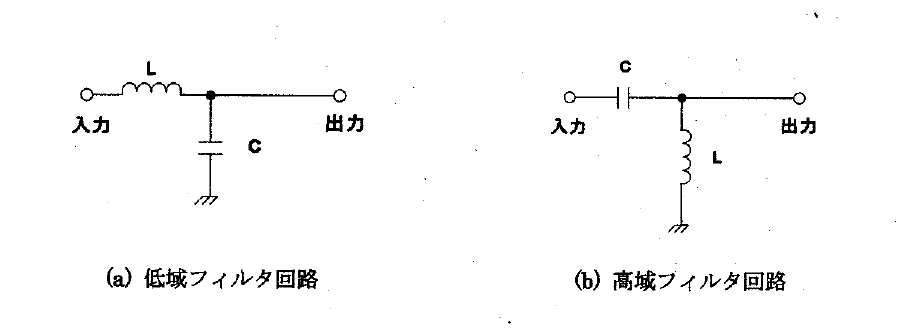
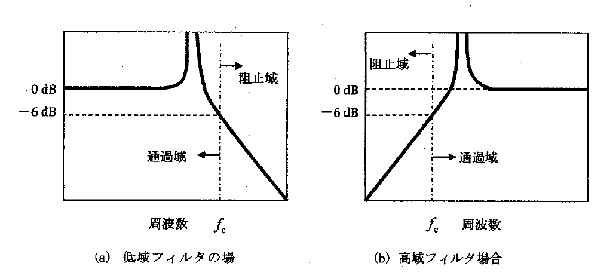
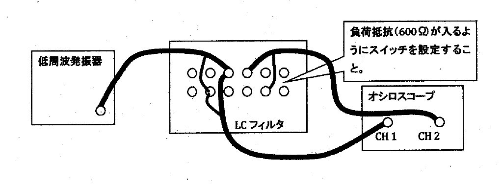
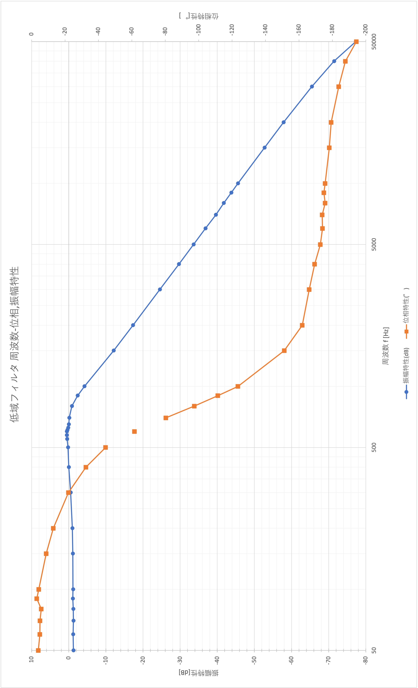
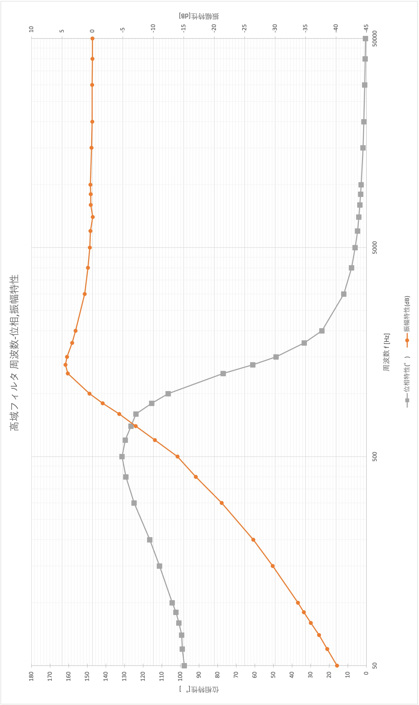
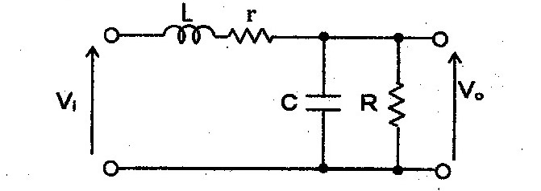
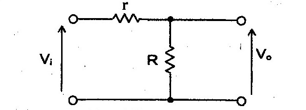
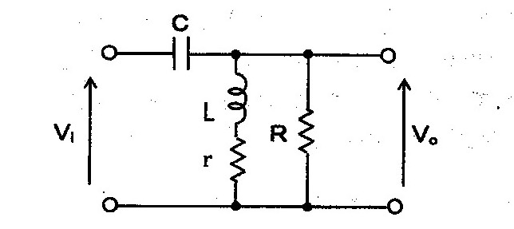
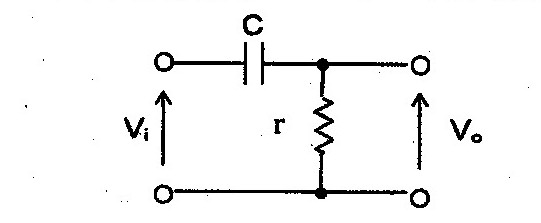

# 目的
&emsp;コイルとコンデンサによって形成された1段のLCフィルタの入出力電圧の周波数特性を測定することで、フィルタ回路のはたらきを理解する。  

# 理論
&emsp;交流回路の基礎実験で、RC 直列回路の入出力電圧の周波数特性には平坦(電圧比はほぼ１)な領域と、増加あるいは減少する領域があることを学んだ。これらの現象は、RC 直列回路はある周波数領域は電流をよく流すが、回路定数によって定まる特定の周波数より低い周波数あるいは高い周波数において、電流を流しにくいということを示している。このような特性を持つ回路を一般にフィルタ回路(ろ波器)と呼び、RC 直列回路もフィルタ回路の仲間である。  
&emsp;一般にコイルは周波数を高くしていくと電流を通さなくなり、コンデンサは周波数を低くしていくと電流を通さなくなる。このことを利用して、図 1(a)のような回路を考えた場合、入力側から出力側への電流は周波数が高くなるほど電流が流れにくくなる。逆に、入力側からグランド側へは周波数が高くなるほどコンデンサを伝って電流が流れやすくなる。したがって、この回路は低周波領域をよく通過させる回路であり、このような回路を低域フィルタ(Low Pass Filter)と呼んでいる。  
&emsp;一方、図 1(b)のような回路を考えた場合、入力側から出力側への電流は周波数が高くなるほど電流が流れやすくなる。逆に、入力側からグランド側へは周波数が高くなるほどコイルにより電流が流れにくくなる。したがって、この回路は高域波領域をよく通過させる回路であり、このような回路を高域フィルタ(High Pass Filter)と呼んでいる。  

&emsp;このことを数式で示すと、入力電圧を$V_{in}$、出力電圧を$V_{out}$とした場合、図 1(a)の回路の入出力電圧比は、

$$\frac{V_{out}}{V_{in}} = \frac{\frac{1}{j \omega C}}{j \omega L + \frac{1}{j \omega C}} = \frac{1}{1 - \omega ^ 2 LC}$$
となることから$\omega \ll \frac{1}{\sqrt{LC}}$の場合は$\frac{V_{out}}{V_{in}} \fallingdotseq 1$、$\omega=\frac{1}{\sqrt{LC}}$の場合は$\frac{V_{out}}{V_{in}}\rightarrow\infty$となることがわかる。また、$\omega \gg \frac{1}{\sqrt{LC}}$の場合は$\left|\frac{V_{out}}{V_{in}} \right| \fallingdotseq \frac{1}{\omega ^2 LC} \propto \omega ^{-2}$となり、周波数の二乗に逆比例して現数位することが分かる。  
&emsp;同様に、図1(b)の回路の入出力電圧比は、
$$ \frac{V_{out}}{V_{in}} = \frac{j \omega L}{j \omega L + \frac{1}{j \omega C} = \frac{1}{1 - \frac{1}{\omega ^2 LC}}} $$
となることから、$\omega \ll \frac{1}{\sqrt{LC}}$の場合は$\left| \frac{V_{out}}{V_{in}} \right| \fallingdotseq \omega^2LC \propto \omega ^2$となり、周波数の二乗に比例して増加することが分かる。また、$\omega = \frac{1}{\sqrt{LC}}$の場合は$\frac{V_{out}}{V_{in}}\rightarrow\infty$、$\omega \gg \frac{1}{\sqrt{LC}}$の場合は$\frac{V_{out}}{V_{in}} \fallingdotseq 1$となることが分かる。  
&emsp;したがって、図1(a)および(b)の回路の入出力電圧比は、それぞれ、図2(a)および(b)に示すような周波数特性となる。この時、入出力電圧比が平坦な領域(ここでは比の値は$1=0dB$)の半分の値になるような周波数(ここでは比の値は$0.5=-6dB$)を遮断周波数(Cut Off Frequency)と呼び、図中の$f_c$がそれにあたる。$f_c$を境に、平坦な周波数領域を通過域、上昇あるいは下降している領域を阻止域と呼ぶ。  
&emsp;この$f_c$は図1(a)の回路の場合は、式(1)より、
$$f_c = \frac{1}{2 \pi}\sqrt{\frac{3}{LC}}$$
また、図1(b)の回路の場合は、式(2)より、
$$f_c = \frac{1}{2 \pi}\sqrt{\frac{1}{3LC}}$$
となることが分かる。

&emsp;これらの回路の組み合わせて用いることで、希望の周波数のみを通すような帯域通過フィルタ(Band Pass Filter)や帯域消去フィルタ(Band Elimination Filter)なども作成され、希望信号の抽出や雑音除去など種々の用途に用いられている。

# 使用機器
&emsp;使用機器を表 1 に示す。

| 機器名 | 製造元 | 型番 | シリアル番号 | 個数 |
|------:|:------:|:------:|:------:|:------:|
| LCフィルタ高域フィルタ | - | - | - | 1 |
| LCフィルタ低域フィルタ | - | - | - | 1 |
| オシロスコープ | KEYSIGHT | EDUX1002A | CN 58280281 | 1 |
| 低周波発振器 | TEXIO | AG-204E | 13100528 | 1 |

:使用機器

# 実験方法
## 低域フィルタの周波数特性測定

1. 各装置の電源OFFを確認し、LCフィルタ（低域フィルタ）の入力側端子に低周波発振器の出力を接続した。  
2. 低周波発振器の周波数を50 Hz、出力を0 dBに設定した。
    ※オシロスコープで周期を読み取って周波数を合わせるのが本来であるが、時間短縮のため、本実験に限り、発振器の周波数の目盛りを信頼して周波数を設定した。
3. オシロスコープのCH1のプローブをLCフィルタの入力端子側に接続した。
4. オシロスコープのCH2のプローブをLCフィルタの出力端子側に接続した。
5. 低周波発振器、オシロスコープの電源を投入し、LCフィルタ入・出力端子それぞれの電圧の振幅、ならびに、入出力端子間での電圧の位相差を測定した。
6. 発振器の周波数を50kHzまで徐々に変化させ、5 の測定を繰り返した。
   測定する周波数は、最初は50, 60, 70, 80, 90, 100, 150, 200, 300, 400, 500, 600, 700, 800, 900, 1k, 1.5k, 2k, 3k, 4k, 5k, 6k, 7k, 8k, 9k, 10k, 15k, 20k, 30k, 40k, 50kHzとし、グラフを描いた後、変化が激しいところでグラフがどのようになるか分かるように密に周波数を変化させて追加測定した。特に、$\frac{V_{out}}{V_{in}}$の最大値とその付近では周波数も伴わせて測定した。

## 高域フィルタの周波数特性測定
&emsp;各装置の電源OFFを確認し、4-1の実験について、低域フィルタを高域フィルタに置き換え前項の 1~6 まで同様の測定を行った。  

\clearpage

# 実験結果
低域フィルタの実験結果を表 2 に、それらをグラフにしたものを 図 4 に示す。位相特性について、データが欠けている点があるが、これは振幅特性が最大になる付近での測定した際に、位相特性のデータは不要であったためである。

| f [Hz] | Vi[V] | Vo[V]  | ΔT[$\mu$s] | 振幅特性[dB] | 位相特性(°) |
|--------|-------|--------|--------|--------------|--------------|
| 50     | 3.025 | 2.613  | -220   | -1.273       | -3.960       |
| 60     | 3.038 | 2.650  | -230   | -1.187       | -4.968       |
| 70     | 3.075 | 2.663  | -200   | -1.249       | -5.040       |
| 80     | 3.063 | 2.663  | -200   | -1.216       | -5.760       |
| 90     | 3.025 | 2.663  | -96.0  | -1.107       | -3.110       |
| 100    | 3.025 | 2.650  | -120   | -1.150       | -4.313       |
| 150    | 2.875 | 2.538  | -161   | -1.083       | -8.694       |
| 200    | 2.763 | 2.475  | -180   | -0.9561      | -12.96       |
| 300    | 2.538 | 2.400  | -204   | -0.4856      | -22.03       |
| 400    | 2.313 | 2.313  | -226   | 0.0000       | -32.54       |
| 500    | 2.150 | 2.200  | -246   | 0.1997       | -44.28       |
| 550    | 2.063 | 2.175  | 0.000  | 0.4592       |              |
| 575    | 2.025 | 2.150  | 0.000  | 0.5203       |              |
| 600    | 1.975 | 2.100  | -285   | 0.5330       | -61.56       |
| 610    | 2.000 | 2.088  | 0.000  | 0.3740       |              |
| 625    | 2.025 | 2.063  | 0.000  | 0.1615       |              |
| 650    | 2.025 | 2.025  | 0.000  | 0.0000       |              |
| 700    | 1.975 | 1.950  | -319   | -0.1106      | -80.39       |
| 800    | 2.050 | 1.863  | -338   | -0.8308      | -97.34       |
| 900    | 2.238 | 1.700  | -344   | -2.388       | -111.5       |
| 1000   | 2.513 | 1.550  | -343   | -4.197       | -123.5       |
| 1500   | 3.713 | 0.9250 | -280   | -12.07       | -151.2       |
| 2000   | 4.350 | 0.5950 | -225   | -17.28       | -162.0       |
| 3000   | 4.825 | 0.2863 | -154   | -24.53       | -166.1       |
| 4000   | 5.025 | 0.1650 | -118   | -29.67       | -169.3       |
| 5000   | 5.125 | 0.1069 | -96.0  | -33.61       | -172.8       |
| 6000   | 5.200 | 0.0750 | -80.6  | -36.82       | -174.1       |
| 7000   | 5.250 | 0.0550 | -69.0  | -39.60       | -173.9       |
| 8000   | 5.250 | 0.0430 | -61.0  | -41.73       | -175.7       |
| 9000   | 5.250 | 0.0340 | -54.0  | -43.77       | -175.0       |
| 10000  | 5.250 | 0.0276 | -48.8  | -45.58       | -175.7       |
| 15000  | 5.250 | 0.0121 | -33.0  | -52.73       | -178.2       |
| 20000  | 5.250 | 0.0067 | -24.9  | -57.85       | -179.3       |
| 30000  | 5.250 | 0.0028 | -17.0  | -65.46       | -183.8       |
| 40000  | 5.325 | 0.0014 | -13.0  | -71.45       | -187.8       |
| 50000  | 5.325 | 0.0007 | -10.8  | -77.32       | -194.4       |

:低域フィルタの実験結果

\clearpage

\clearpage

高域フィルタの実験結果を表 3 に、それらをグラフにしたものを 図 5 に示す。

| f [Hz] | Vi[V] | Vo[V]  | ΔT[$\mu$s] | 振幅特性[dB] | 位相特性(°) |
|--------|-------|--------|--------|--------------|--------------|
| 50     | 5.625 | 0.0553 | 5440   | -40.16       | 97.92        |
| 60     | 5.775 | 0.0683 | 4580   | -38.55       | 98.93        |
| 70     | 5.800 | 0.0800 | 3940   | -37.21       | 99.29        |
| 80     | 5.750 | 0.0925 | 3500   | -35.87       | 100.8        |
| 90     | 5.675 | 0.1044 | 3160   | -34.71       | 102.4        |
| 100    | 5.600 | 0.1150 | 2900   | -33.75       | 104.4        |
| 150    | 5.225 | 0.1730 | 2060   | -29.60       | 111.2        |
| 200    | 4.925 | 0.2350 | 1618   | -26.43       | 116.5        |
| 300    | 4.350 | 0.3775 | 1156   | -21.23       | 124.8        |
| 400    | 3.800 | 0.5385 | 898    | -16.97       | 129.3        |
| 500    | 3.250 | 0.6500 | 730    | -13.98       | 131.4        |
| 600    | 2.725 | 0.8375 | 600    | -10.25       | 129.6        |
| 700    | 2.263 | 1.000  | 502    | -7.094       | 126.5        |
| 800    | 1.888 | 1.138  | 430    | -4.397       | 123.8        |
| 900    | 1.538 | 1.269  | 356    | -1.670       | 115.3        |
| 1000   | 1.319 | 1.394  | 296    | 0.4804       | 106.6        |
| 1250   | 1.044 | 1.663  | 171    | 4.044        | 76.95        |
| 1375   | 1.050 | 1.750  | 123.4  | 4.437        | 61.08        |
| 1500   | 1.131 | 1.831  | 90.0   | 4.185        | 48.60        |
| 1750   | 1.338 | 1.963  | 53.0   | 3.329        | 33.39        |
| 2000   | 1.519 | 2.088  | 33.2   | 2.763        | 23.90        |
| 3000   | 2.038 | 2.363  | 11.3   | 1.285        | 12.18        |
| 4000   | 2.275 | 2.475  | 5.580  | 0.7319      | 8.035        |
| 5000   | 2.413 | 2.538  | 3.380  | 0.4387      | 6.084        |
| 6000   | 2.475 | 2.573  | 2.220  | 0.3373      | 4.795        |
| 7000   | 2.538 | 2.525  | 1.636  | -0.0446     | 4.123        |
| 8000   | 2.538 | 2.625  | 1.234  | 0.2928      | 3.554        |
| 9000   | 2.575 | 2.663  | 0.968  | 0.2919      | 3.136        |
| 10000  | 2.550 | 2.650  | 0.786  | 0.3341      | 2.830        |
| 15000  | 2.613 | 2.663  | 0.344  | 0.1646      | 1.858        |
| 20000  | 2.613 | 2.625  | 0.193  | 0.0398      | 1.390        |
| 30000  | 2.650 | 2.663  | 0.0838 | 0.0425      | 0.905        |
| 40000  | 2.675 | 2.675  | 0.0472 | 0.0000      | 0.680        |
| 50000  | 2.663 | 2.663  | 0.0289 | 0.0000      | 0.520        |

:高域フィルタの実験結果

\clearpage

\clearpage

# 考察

1. 図 2 に示した入出力特性では、利得が非常に大きくなる周波数があるが、実際の実験ではこのような特性は観測されなかった。この理由を考える。
   図 2(a) は低域フィルタの特性を示している。ここで、回路に負荷抵抗が存在しない場合の増幅率は式 (1) から以下のようになる。
   $$\frac{V_{out}}{V_{in}} = = \frac{1}{1 - \omega ^ 2 LC}$$
   ここで、 $\omega = \frac{1}{\sqrt{LC}}$ のとき、分母は 0 になり、 $\frac{V_{out}}{V_{in}}\rightarrow\infty$ となるので、利得が非常に大きくなる。
   しかし、負荷抵抗が存在する場合には、増幅率は以下のようになる。
   $$\frac{V_o}{V_i} = \frac{1}{1- \omega^2 * LC + j \frac{\omega L}{R}}$$
   ここで、 $\omega = \frac{1}{\sqrt{LC}}$ のとき、分母には $j \frac{\omega L}{R}$ の項が残るため増幅率は有限の値となり、利得も有限になったのだと考えられる。

2. 低域フィルタにおいて、 50 Hz の振幅特性が 0 dB とならない理由を考える。
   実験で使用したコイル, コンデンサは L = 92 [mH], C = 0.54 [μF] なので、増幅率は式(6)から、1.0049(=0.042 dB)となり、実験値 -1.27 dB と異なる。
   ここで、実験の回路をコイルの巻線抵抗を含めて考えてみると、図 6 のようになる。

   { width=50% }

   更に、簡単のために低周波での動作に限定して考えてみると、周波数が低い領域ではコイルのリアクタンスは 0, コンデンサのリアクタンスは ∞ として近似できるので、図 6 は 図 7 のように簡略化できる。

   { width=50% }

   このとき、LPFの出力はコイルの抵抗分 r と負荷抵抗 R 分圧されるので、 $V_o < V_i$となる。そのため、利得は負の値になる。
   ここで、直流での動作と 50 Hz での動作での入出力特性を同様さらに、負荷抵抗 R = 600 $[\Omega]$ と仮定して、 50 Hz での実験結果を用いてコイルの巻線抵抗を求めてみる。抵抗 r での電圧降下を $V_r$ とすると、
   $$V_r : V_o = r : R$$
   $$RV_r = rV_o$$
   $$R(V_i-V_o) = rV_o$$
   $$r = \frac{R(V_i-V_o)}{V_o}$$
   $$r = \frac{600*(3.025 - 2.6125)}{2.6125} \approx 94.7 [\Omega]$$
   となる。

\clearpage

3. 高域フィルタにおいて、 50 Hz の位相特性が 180° ではなく、 90° に近い値となるか考察する。
   前項と同様に、コイルの巻線抵抗を考慮した HPF の等価回路を図 8 に示す。

   { width=50% }

   周波数が低い領域ではコイルのインピーダンスは r と比較して無視できる。更に、 $R \gg r$ が成立すれば、低周波数領域での HPF の等価回路は 図 9 のように簡略化できる。

   { width=50% }

   したがって、回路全体のインピーダンスを考えると、リアクタンスはコンデンサの成分だけを考えればいいことになる。
   ここで、コンデンサのリアクタンスは $\frac{1}{j{\omega}C}$ となるので、位相 $\phi$ は

   $${\phi} = \arctan{\frac{\frac{1}{{\omega}C}}{r}} = \arctan{\frac{1}{{\omega}Cr}}$$

   となる。
   ここで、コイルの巻線抵抗の値を実験結果から求める。
   図 9 から、回路のインピーダンス $\dot{Z}$ は

   $$ \dot{Z} = r + \frac{1}{j\omega C} = r -j\frac{1}{\omega C}$$

   となるので、分圧の式から出力電圧 $V_o$ は、 $\frac{1}{\omega} = X_c$ とすれば

   $$ V_o = \frac{r}{|\dot{Z}|}V_i$$
   $$ V_o = \frac{r}{\sqrt{r^2 + X_c^2}} V_i $$
   $$ V_o \sqrt{r^2 + X_c^2} = rV_i$$
   $$ V_o^2(r^2 + X_c^2) = r^2 V_i^2$$
   $$ r^2(V_i^2 - V_o^2) = V_o^2 X_c^2$$
   $$ r^2 = \frac{V_o^2 X_c^2}{V_i^2 - V_o^2}$$
   $$ r = \frac{V_o X_c}{\sqrt{V_i^2 - V_o^2}} (r > 0)$$
   $f = 50 [Hz]$ のとき、実験結果から、$V_i = 5.625 [V]$ , $V_o = 0.0553$ , $X_c = \frac{1}{\omega C} = \frac{1}{2\pi * 50 * 0.54 * 10^{-6}} \approx 5894.6$

   $$ r = \frac{0.0553 * 5894.6}{\sqrt{(5.625)^2 - (0.0553)^2}} = 57.8 [\Omega]$$

   この結果から、

   $f=50 [Hz]$ のとき、
   $${\phi} = \arctan{\frac{1}{{\omega}Cr}} = \arctan{\frac{1}{2{\pi}*50*0.54*10^{-6}*57.8}} \approx 89.4 [°]$$
   となるので、 高域フィルタにおいて 50 Hz の位相特性が 90° に近い値になることが分かる。

4. 理論式から計算した LPF と HPF それぞれでの巻線抵抗の値を、実際に測定した値と比較する。
   1. LPF での巻線抵抗の計算値は $94.7 [\Omega]$ で、実測値は $95.4 [\Omega]$ であった。
   2. HPF での巻線抵抗の計算値は $57.8 [\Omega]$ で、実測値は $57.8 [\Omega]$ であった。

   理論値と実測値は非常に近い値になった。

\clearpage

# 課題

1. 式 (1) から 式 (3) を導け。
   カットオフ周波数では利得は -6 dB, 増幅率は $\frac{1}{2}$ になるので、
    $$\left|\frac{V_{out}}{V_{in}}\right|=\left|\frac{\frac{1}{j \omega C}}{j \omega L + \frac{1}{j \omega C}}\right| = \left|\frac{1}{1-\omega^2LC}\right| = \frac{1}{2}$$
    $$|1-\omega^2LC| = 2$$
    $$-1 + \omega^2LC = 2$$
    $$\omega^2LC = 3$$
    $$ \omega^2 = \frac{3}{LC}$$
    $$\omega = \sqrt{\frac{3}{LC}}$$
    $$f_c = \frac{1}{2 \pi}\sqrt{\frac{3}{LC}}$$

2. 式 (2) から 式 (4) を導け。
   1 と同様に考える。
    $$\left|\frac{V_{out}}{V_{in}} = \frac{j \omega L}{j \omega L + \frac{1}{j \omega c}} \right|= \left|\frac{1}{1 - \frac{1}{\omega ^2 LC}} \right|= \frac{1}{2}$$
    $$\left|1-\frac{1}{\omega^2LC}\right| = 2$$
    $$-1 + \frac{1}{\omega^2LC} = 2$$
    $$\frac{1}{\omega^2LC} = 3$$
    $$\omega^2 = \frac{1}{3LC}$$
    $$\omega = \sqrt{\frac{1}{3LC}}$$
    $$fc = \frac{1}{2 \pi}\sqrt{\frac{1}{3LC}}$$

3. 低域フィルタの実験結果から、低域フィルタでの $f_c$ を求めよ。その際に、実験結果のグラフにおいて、入出力電圧比が -6 dB となる周波数を示すこと。また、式 (3) による計算値と比較せよ、ただし、計算には $L = 92 [mH]$ , $C = 0.54 [μF]$ を使用せよ。
   グラフから、振幅特性が - 6 dB となる周波数は 1.19 [KHz] であった。
   式 (3) より、

    $$fc=\frac{1}{2 \pi}\sqrt{\frac{3}{LC}} = \frac{1}{2 \pi}\sqrt{\frac{3}{92 * 10^{-3} * 0.54 * 10^{-6}}}\approx1.24 [kHz]$$

    となる。以上より、実験結果と理論値の誤差率は 4.03 % と、小さい値になった。

4. 高域フィルタの実験結果から、高域フィルタでの $f_c$ を求めよ。その際に、実験結果のグラフにおいて、入出力電圧比が -6 dB となる周波数を示すこと。また、式 (4) による計算値と比較せよ、ただし、計算には $L = 23 [mH]$ , $C = 0.54 [μF]$ を使用せよ。
   グラフから、振幅特性が - 6 dB となる周波数は 777 [Hz] であった。
   式 (4) より、
   $$fc=\frac{1}{2 \pi}\sqrt{\frac{1}{3LC}}=\frac{1}{2 \pi}\sqrt{\frac{1}{3 * 23 * 10^-3 * 0.54 * 10^-6}} \approx 825[Hz]$$

   となる。以上より、実験結果と理論値の誤差率は 5.82 % と、小さい値になった。
