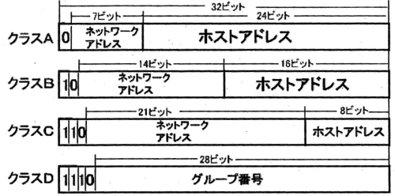
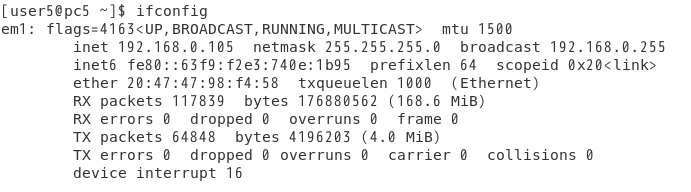
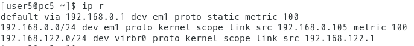
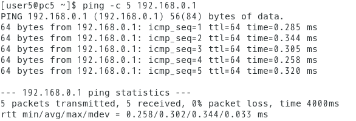

# 目的
&emsp; サーバー構築の準備 OSのインストール, ネットワークの設定

# 理論

## ソフトウェアの種類

&emsp; 計算機のソフトウェアには大きく分けて3種類ある。

### 基本ソフトウェア

&emsp; OS(Operating System) の事を示す。計算機を簡単に使用できるようにするためのソフトウェア。

### アプリケーション（応用ソフトウェア）

&emsp; 計算機で目的の作業を行うために作成されたソフトウェア。

### ミドルウェア

&emsp; 日本語変換を提供するなどアプリケーション内で呼び込まれ利用されるソフトウェア。

## OS の種類

### クライアント用 OS

&emsp; Microsoft の Windows系 と Unix系の二種類が主に使われている。Unix系のOSは多く存在している。本校の演習室で使われている Cent OS や、Apple社の Machintosh の macOS, スマートフォンで利用される iOS, Android なども Unix系 の OS である。

### サーバー用 OS

&emsp; Microsoft の Windows Server や、Unix系のサーバー用 OS が主に利用されている。

### ネットワーク・サーバー用 OS に UNIX系が多く用いられる理由

&emsp; Unix 自体は Microsot系 OS よりも歴史が古く、1980 年代に小型の計算機で利用できる OS として設計段階からネットワーク機能を実装していた。そのため、ネットワークサーバー機能との融和性が高い。その一方、Microsoft系 OSは開発段階ではネットワークは実装されず、後に必要に応じてネットワーク機能が付け加えられた。

## OS の Update の必要性

&emsp; ダウンロードした OS のイメージはそれが開発された時点の物であり、提供後に発見された不具合や特に問題となるネットワーク上のバグが含まれている可能性がある。これを解決するため、ユーザーは最新版との修正差分を受け取る事ができる。これを Update という。特に、ネットワーク上でサービスを提供するサーバーは攻撃を受けやすく、不具合を残したままではクラッカーに乗っ取られる可能性があるため、 OS のインストール後には必ず Update を行う必要性がある。

## IP アドレスの基本

&emsp; IP アドレス(Internet Protocol アドレス)とは、コンピュータネットワーク上で通信を行うために、各計算機に割り当てられる番地である。この番地は計算機を特定するために用いられるため、同じネットワークの中では一意である必要がある。
&emsp; IP アドレスには 32 ビットで表現される IPv4 と 128 ビットで表現される IPv6 の 2 形態が用意されている。 IPv4 は 32 ビットであるため、 2^32^ のアドレス空間を持つ。 IPv6 は 128 ビットであるため、 2^128^ のアドレス空間を持つ。

### グローバルアドレスとプライベートアドレス

&emsp; IPv4の 32 ビットアドレスにはインターネットでの通信を可能にするグローバルアドレスと組織内でのみ利用されるプライベートアドレスの二種類が用意されている。インターネットを利用する組織はグローバルアドレスを取得して、外部との送受信に用いる。組織内ネットワーク(Local Area NetWork; LAN) では各計算機にプライベートアドレスが割り当てられ、内部との送受信に使用する。外部との通信は、ルーターが送信元の計算機の IP アドレスをプライベートアドレスから組織が持つグローバルアドレスへの変換(Network Address Translation; NAT)を行うことで実現される。

### ネットワークアドレスとホストアドレス

&emsp; IPv4 の 32 ビット体系をネットワークアドレスとホストアドレスの２つの部分に分けて運用を行う。
情報処理技術者試験より引用した図を図 1に示す。伝統的に 4 クラスの分別を先頭ビットで識別し、運用規模に応じてクラスを使い分ける。ネットワークアドレスは運用する LAN の範囲を定義し、ホストアドレスは定義されたビットの範囲内で接続する機器に一対一で割り当てられる。同じ LAN 内に同一の IP アドレスが存在することは許されない。



### ネットワークアドレスの意味

&emsp; 荒川キャンパスのネットワーク構成を例にとって説明する。荒川キャンパスの ICT 実験室ではプライベートアドレスとして ```172.16.28.0/24```が割り当てられている。末尾の```/```以降の数字は、最上位ビットから何ビットがネットワークアドレスを表すかを示しており、サブネットマスクと呼ばれる。したがって今回の場合は最上位ビットから 24 ビットまでがネットワークアドレスであり、残りの 8 ビットがホストアドレスとして割り当てられる。

&emsp; ここでは実際にプライベートアドレスからネットワークアドレスを計算してみる。

1. IP アドレスを 10 進数から 2 進数に直す
   
    ```
    172.16.28.111(10) = 10101100.00010000.00011100.01101111(2)
    ```
2. 先頭から 24 ビットを 1 と AND 演算を行う

    ```
    11111111.11111111.11111111.00000000
    10101100.00010000.00011100.01101111
    ```

3. ネットワークアドレスを得られる

   ```
   10101100.00010000.00011100.00000000(2) = 172.16.28.0(10)
   ```
   
つまり、今回の場合は ```172.16.28``` が ICT 実験室に定義されたネットワークの範囲であり、残りの 8 桁の範囲(```0~255```)でホストアドレスが割り当てられる。但し 0 はネットワークそのものを表し、 255 はブロードキャストアドレスとして利用されるので、実際に計算機に割り当てられるのは ```1~254``` の範囲になる。
ネットワークの送受信では、宛先アドレスが自分のネットワークアドレスと同じであれば内部で直接通信を行い、宛先アドレスが自分のネットワークアドレスと異なる場合には出口であるデフォルトゲートウェイにパケットを送信する。

\clearpage

# 本演習に必要なコマンド類
&emsp; 本演習で使用するコマンドを表 1 にまとめた。

|操作|コマンドと説明|
|:----:|:----:|
| su | substitute userの略^[ Redhat より  (https://www.redhat.com/sysadmin/difference-between-sudo-su) ]。<br> 他のユーザーに切り替える。引数を渡さない場合は root が指定される |
| exit | 現在のユーザーからログアウトする<br> |
| cd | ディレクトリを移動する |
| ls | 引数で指定したディレクトリ内のファイルやフォルダを表示する <br> 引数を渡さない場合は カレントディレクトリが指定される | 
| cat | 引数で指定したファイルの内容を表示する | 
| ln | シンボリックリンクを作成するコマンド |
| cp | ファイルやディレクトリをコピーする | 
| mv | ファイルやディレクトリの移動および名前の変更を行う |
| chmod | ファイルやフォルダのアクセス、実行権限を変更する |
| vi |  Linuxの標準テキストエディタを起動する | 

:コマンドと説明

# 実験手順
&emsp; 本演習で使用したパラメータシートを表 2 に示す。

|名前|内容|
|:----:|:----:|
| ホスト名 | pc5.s5.t3.metro-cit.ac.jp | 
| IPアドレスとネットマスク | 192.168.0.105/24 |
| デフォルトゲートウェイ | 192.168.0.1 |

:パラメータシート

## OS のインストール
&emsp; OS のイメージが焼き込まれた USB メモリーを使用した。

1. 計算機の電源を入れた。  
2. BIOS(Basic Input System) が立ち上がり製造メーカーである DELL のマークが画面に表示される。この時画面右上にBoot方法のメッセージが表示されるのでファンクションキーの F11 を押下した。  
3. Boot Manager 画面が表示された。  
4. カーソルキーを使って Boot Setting を選択した。  
5. Boot Setting 画面で Set Legacy Hard Disk Drive Order をカーソルキーで選択した。  
6. Hard Disk Order 画面内でカーソルキーを使って、Hard Disk Drive#00 を選択し、 Enter キーを押下し、カーソルキーで San DISK を選択した。  
7. キーボード左上にある Esc キーを押した。設定内容を保存するか画面で問い合わせるが出るので Y キーを押した。  
8. Boot Manager 画面に戻るために Esc キーを押した。  
9. Boot Manager 画面に戻ったら Enter キーを押した。これで Install が開始された。  
10. USB メモリーから起動し、Install 画面が表示された。  
11. Install CentOS 7 をカーソルキーで選択し、Enter キーを押下した。  
12. Install 用の言語を選択した。今回は日本語を選択した。  
13. キーボードの選択は言語を日本語にすると自動的に日本語キーボードに設定される。
14. インストールの概要に進んだ。  
15. 地域設定とインストール先、ネットワークとホスト名、ソフトウェアの選択を順次行った。  
16. 地域設定をマウスでクリック、 アジア・東京 タイムゾーンを確認し、時刻を適切に合わせた。設定を終えて画面左上の完了をクリックした。  
17.  インストール先をクリックした。 500GB のハードディスクを選択し、画面左上の完了をクリックした。  
18.  インストールオプションの画面に切り替わった。右下の領域の確保をクリックし、削除をクリック。その後領域の再利用をクリックした。これでインストール先のハードディスクが利用できるようになった。  
1.   ネットワークの設定をクリックした。設定画面が表示された。  
2.   画面左下のホスト名に自分のパラメーターシートに記載されたホスト名を入力した。  
3.   画面右下の設定をクリックした。ネットワークの手動設定の画面に移行した。  
4.   IPv4 セッティングをマウスで選択し、方式をバーの右側のマークをクリックして手動を選択した。  
5.   アドレスの追加をクリックし、アドレス、ネットマスク、ゲートウェイに自分のパラメーターシートの値を
入力した。  
1.   DNS サーバの欄は ICT 演習室の DNS サーバのIPアドレス ```192.168.0.100``` を入力し、保存をクリックして
設定画面を終了した。  
1.   ネットワークとホスト名設定画面の右上の完了をクリックした。  
2.   ソフトウェアの選択をマウスで選択し、ソフトウェアの設定画面に移行した。  
3.   画面真中あたりの「サーバ( GUI 使用)」にマウスでチェックを入れ、完了をクリックした。  
4.   これでインストールが開始され、環境設定に移行した。  
5.   ユーザの設定画面で「 Root パスワード」の設定をクリックした。  
6.   入力された文字は表示そのままは表示されずに●により文字列の長さが表示された。間違いを避けるために
確認用に同じパスワードを入力した。2つの文字列が一致すると完了ボタンを押し、終了させた。  
1.   ユーザの作成をクリックした。フルネームは自分の名前を入力した。ユーザ名は指定されたユーザ名を入力
した。  
1.   パスワードをRoot時と同じ要領で入力し、パスワードの確認にも入力し2つが一致すれば完了ボタンを押
し、インストール時の設定が終了した。  
1.   以上の設定を終了しても多分インストールは終了しなかった。次の画面が出るまで待機した。  
2.   画面下で完了しましたと表示が出れば画面右下の再起動をクリックした。  
3.   インストール時の設定終了画面(終了プロセスが表示されている)が終わり、いったん画面が真っ黒になり再
び画面に起動表示(起動プロセスの表示)が出ればUSBメモリーを抜き取った。  
1.   再起動後、ライセンス情報の確認画面に移行した。  
2.   CentOS 7 を使用するので「ライセンス契約に同意します」をクリックし、完了をクリックした。  
3.   以上で CentOS 7 のインストール作業が終了した。  
4.   ログイン画面が出るのでユーザでログインした。Welcome 画面が出るので誠実に対応した。オンラインアカ
ウントはスキップした。以上で使用する準備が完了した。この後「初めて使う人へ」のヘルプ画面が表示され
たが、省略した。  

## ネットワーク設定の確認
&emsp; ネットワークの設定が正しく行われたか確認した。
1. 端末を起動した。    
2. ```ifconfig``` コマンドを実行して、実行結果をスクリーンキャプチャした。  
3. ```hostname``` コマンドを実行して、実行結果をスクリーンキャプチャした。  
4. ```ip r``` コマンドを実行して、実行結果をスクリーンキャプチャした。  
5. ```ping -c 5 192.168.0.1``` コマンドを実行して、実行結果をスクリーンキャプチャした。  
6. 全てのスクリーンキャプチャした画像を自分の USB メモリーに保存した。  


## OS のアップデート
&emsp; 不具合や脆弱性を取り除くために OS のアップデートを実行した。
1. 端末を起動した。  
2. ```su``` コマンドを実行して、インストール時に設定した root のパスワードを入力し、Enter キーを押下した。  
3. ```yum update``` コマンドを実行した。Update を実行するか確認するメッセージが 2 回出力されたので、2 回とも y 入力した。  
4. Update の完了を知らせるプロンプトが出力されたのを確認して、```exit``` コマンドを実行して root ユーザーをログアウトした。  

# 実験結果

1. ```ifconfig``` コマンドを実行した結果を図 2 に示した。IPv4 アドレスが ```192.168.0.105```, ネットマスクが ```255.255.255.0``` と表示された。



2. ```hostname``` コマンドを実行した結果を図 3　に示した。 ホスト名は ```pc5.s5.t3.metro-cit.ac.jp``` と表示された。


\clearpage


3. ```ip r ``` コマンドを実行した結果を図 4 に示した。 デフォルトゲートウェイは ```192.168.0.1``` と表示された。



4. ```ping -c 5 192.168.0.1``` コマンドを実行した結果を図 5 に示した。ゲートウェイからは 平均 0.3ms ほどで応答が帰ってきた。




# 考察
&emsp; 実験結果から、ネットワークの設定(IPv4 アドレス, ネットマスク, デフォルトゲートウェイ)が正しくされていて、LAN 内での通信を行えることが確認できた。また、 OS のアップデートが完了した事から、 デフォルトゲートウェイが正しく機能し、外部との通信も行えることを確認できた。以上より、本実験の目的である OS のインストールと、ネットワークの設定を行うことができた。  
&emsp;実験を通して、本校のように多くの計算機が存在する LAN 内で通信をするには、適切にサブネットを設計して、各計算機でデフォルトゲートウェイの設定を正しく行う事、ゲートウェイが適切にパケットを処理することの重要性を理解した。  
&emsp; また、 OS のアップデートの必要性を理解し、インストール後だけでなく自分の計算機を使用する度に Update を行うべきだと考えた。