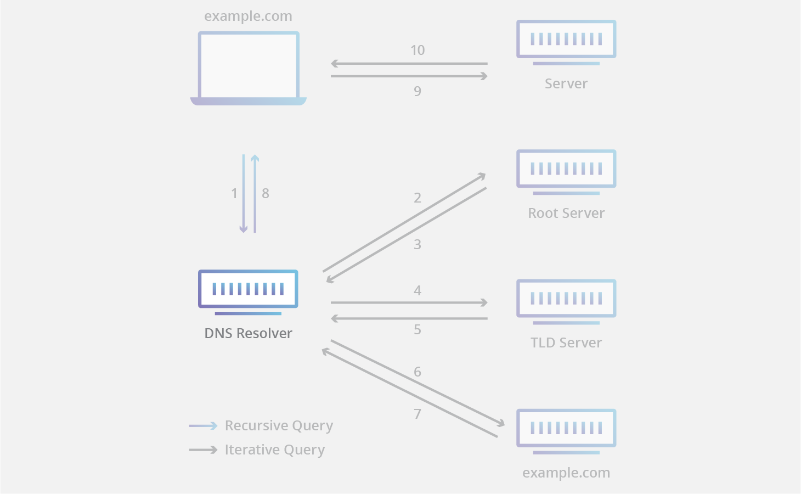
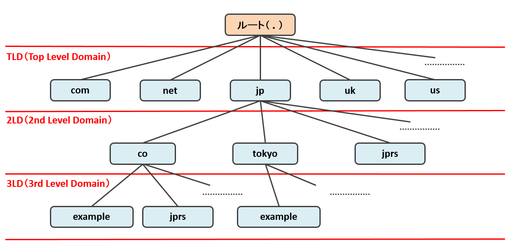
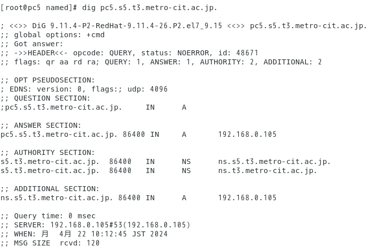
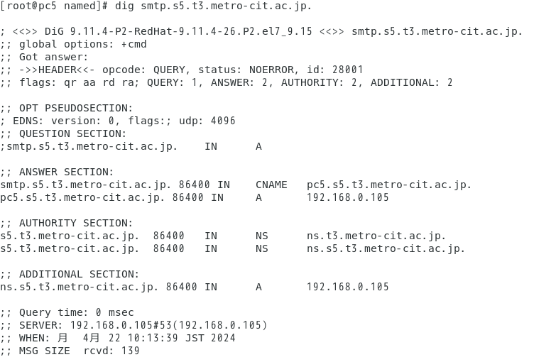
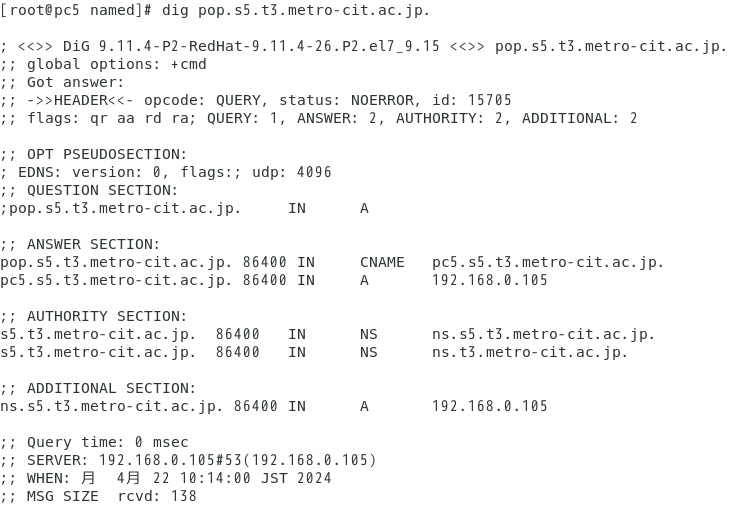

# 目的

&emsp; DNS サーバーの構築 原理の理解

# 理論

## DNS の役割

&emsp; インターネットにおいてネットワークに参加している計算機に設定されたホスト名と IP アドレスを対応付ける機能を Domain Name System (DNS) と呼ぶ。つまり、DNS は人間の認識しにくい IP アドレスを、認識し易い文字列として扱えるようにする役割を持つ。  
&emsp; 例えば、あるサイトにアクセスする時、通常は検索サイトの URL (Uniform Resource Locator) をブラウザに入力する。この時、計算機は登録した DNS サーバーに URL を送信し、それを受信した DNS サーバーはその URL に対応する IP アドレスを検索して、計算機に返答する。  
&emsp; DNS が存在しない場合、ユーザーはサーバーにアクセスするためには、そのサーバーの IP アドレスを直接入力する必要があり、インターネットの利便性は著しく低下することから、DNS は必要不可欠な存在である。そのような DNS はグローバル IP アドレスを取得している機関では運用が義務付けられている。

## 正引き, 逆引きについて

&emsp; DNS において、ホスト名から IP アドレスを知ることを「正引き」（名前解決）、IP アドレスからホスト名を知ることを「逆引き」と呼ぶ。通常、ネットワーク上の通信では正引きを利用する。逆引きは、通信の解析やアクセル履歴の分析等の、サーバー管理用途で使用されるが、悪用すればクラッキング行為にもなるため、利用には注意が必要である。多くの組織では DNS サーバーは逆引きの要求を拒否している。

## アクセスするサーバー名から IP アドレスの取得方法

&emsp; DNS は無数に存在するホストを効率的に管理するために階層化構造を取っている。ドメイン名から IP アドレスを取得するには、DNSリゾルバと呼ばれるプログラムが「上位のドメインを管理しているサーバーから下位のドメインを管理しているサーバーを取得し、そのサーバーから更に下位のドメインを管理しているサーバーを取得する...」　といった再帰的な処理を行う（図 1^[ Cloudflare より(https://www.cloudflare.com/ja-jp/learning/dns/dns-server-types/) ]）。  

{ width=85% }

\clearpage

実際に、本校の公式 Web サーバー(www.metro-cit.ac.jp) にアクセスするまでの流れを例にとって説明する。

1. ユーザーが登録している DNS リゾルバに www.metro-cit.ac.jp の IP アドレスを要求する  
2. DNS リゾルバが&nbsp;.jp を管理しているサーバーの IP アドレスを、ルートサーバーから取得する  
3. DNS リゾルバが&nbsp;.jp を管理しているサーバーから .ac を管理しているサーバーの IP アドレスを取得する  
4. DNS リゾルバが&nbsp;.ac を管理しているサーバーから .metro-cit を管理しているサーバーの IP アドレスを取得する  
5. DNS リゾルバが&nbsp;.metro-cit を管理している DNS サーバーから www.metro-cit.ac.jp の IPアドレスを取得し、ユーザーに通知する  
6. ユーザーが www.metro-cit.ac.jp のサーバーにアクセスする  

&emsp; .jp .ac .metro-cit などはそれぞれ Domain（領域）と呼ばれる。特に、.jp .com .net などの最上位のドメインを Top Level Domain (TLD) と呼び、これらのドメインを管理するサーバーを TLD サーバーと呼ぶ。そして、TLD サーバーを管理するサーバーをルートサーバーと呼び、これらは DNS における最上位のサーバーなのでその IP アドレスは DNS リゾルバに事前に登録されている^[ ホスト名として (a~m).root-servers.net の 13 個が使用されているが、実在するサーバーはこれより多い ]。この階層構造を図 2^[ jprs.jp より(https://jprs.jp/glossary/index.php?ID=0148) ]に示す。
&emsp; これらの他のサーバーに問い合わせることなく応答を返すことができるサーバーの事を、権威 DNS サーバーと呼ぶ。これに対応して、権威 DNS サーバーに問い合わせを行い IP アドレスを取得するサーバーの事をキャッシュサーバーと呼び、DNS リゾルバはこれに含まれる。  
&emsp; このようにサーバー名を Domain 毎の DNS で階層的に管理することにより、インターネット上で世界中のサーバーに DNS で IP アドレスを知ることができる。また、グローバル IP を所有している組織が各組織内で各種サーバーのホスト名と IP アドレスを変換する DNS サーバーを提供するだけで世界規模のアクセスに対応することができる。

{ width=90% }

\clearpage

# 実験手順

&emsp; 以下の8行程を順次行った。

1. サーバ機能を円滑に設定、運用するために CentOS 7 インストール時に自動で設定されている SElinux 機能を無効化した。  
2. DNSを実装するために管理サイトからアプリケーションを yum で導入した。  
3. ネットワークの設定を変更した。  
4. 自分及び自分以外の計算機に対して DNS サービスを提供するため、DNSの応答が可能になるようにファイヤーウォールの設定を変更した。  
5. 資料に入っている DVD に DNS を実装するための設定ファイルのひな型が入っているので計算機に導入し、設定変更ができるように設定した。  
6. DNS を運用する設定ファイルが3個あり、DNSサービス全体を管理する named.conf と正引き用の設定ファイル及び逆引き用の設定ファイルそれぞれを各自の環境に合わせて編集した。  
7. DNS が 3 個の設定ファイルを読み込んでサービスを開始した。  
8. 設定が正しく行われ、目的のサービスが提供されているかを確認した。  

管理者権限での作業になるので su コマンドで管理者権限がある状態にした。  

1. SELinux の無効化

   - setenforce 0- SElinuxの設定ファイルを開いた
     - vi /etc/selinux/config
       - SELINUX= disabled に変更
       - 修正後ファイルを保存
2. DNS 機能を実装するソフトウェアの導入

   - yum install bind bind-utils
     - 応答に y で答えた
3. 各自の DNS を実装するためにネットワーク設定の変更

   - ネットワークの設定ファイルをviで開いた
   - vi /etc/sysconfig/network-scripts/ifcfg-em1
     - 設定ファイルの中で DNS1=192.168.0.100->DNS1=192.168.0.105 に変更した
     - DNS1 の下に DNS2=192.168.0.100 を挿入した
     - 最終行に PEERDNS=yes を挿入した
   - ネットワークの再起動を行った
     - systemctl restart network.service
4. ファイヤーフォールに DNS の項目を追加

   - firewall-cmd --add-service dns
   - firewall-cmd --add-service dns --permanent
5. bind 設定ファイルひな型を資料付属のDVDからダウンロード

   - DVDを計算機から読めるようにした
     - mount /deve/cdrom/mnt
   - 設定ファイルをDVDからコピーした
     - cp /mnt/dekiru/named/named.conf /var/named
     - cp /mnt/dekiru/named/template* /var/named
   - ファイルのグループ属性を変更した
     - chgrp --R named /var/named
   - 設定ファイルが System から参照されるように仮想設定を行った
     - ln --sf /var/named/named.conf /etc
   - DVD を取り出した
     - umount /mnt
6. DNS の設定ファイルを各自の環境に合わせて編集した

   - DVD からコピーしたファイルは readonly になっているため、編集できるようにファイルの属性を変更した
     - cd /var/named
     - chmod +w named.conf
     - chmod +w template*
   - DNS の全体設定ファイルを修正した
     - vi named.conf
       - 設定行 listen-on port 53 と listen-on-v6 port 53 の2行をコメントアウトした
       - セカンダリDNSのIPアドレスは192.168.0.100
       - ネットワークアドレスは192.168.0.0/24
       - ゾーンの設定を修正した
         - ドメイン名は s5.t3.metro-cit.ca.jp
         - 正引き用の設定ファイル名は s5.t3.zone
       - 逆引き用の設定をした
         - ネットワークアドレスを逆にした数値 0.0.168.192 を入力した
         - 逆引きファイル名は s5.t3.rev
       - これで named.conf の修正は終了、ファイルを保存した
   - 正引き用、逆引き用の設定ファイルのファイル名を named.conf で指定したファイル名に変更した
     - cp /var/named/template /var/named/s5.t3.zone
     - cp /var/named/template.rev /var/named/s5.t3.rev
   - 正引き用の設定ファイルの修正した
     - vi s5.t3.zone
       - s5.t3.zone ファイル内の server は全て pc5 に修正した
       - ドメイン名の設定をした
         - 設定行 server.dekiru.gr.jp は pc5.s5.t3.metro-cit.ac.jp.
         - 設定行 postmaster.dekiru.gr.jp. は postmaster.s5.t3.metro-cit.ac.jp.
         - セカンダリ DNS は ns.t3.metro-cit.ac.jp.
       - 正引きの設定の修正をした
         - 設定行 router は使わないのでコメントアウトした
         - 設定行 server は上で述べたように pc5 に変更、ns と pc5 に各自のIPアドレスを記入した
       - ホスト名の別名の設定をした
         - 設定行 ftp と proxy は使わないのでコメントアウトした
       - 正引き用の設定ファイルを保存した
   - 逆引き用の設定ファイルの修正をした
     - vi s5.t3.rev
       - P.190 を参考に正引きファイルで行ったのと同じ修正を行った
       - 逆引きの設定をした
         - 設定行 router は使わないのでコメントアウトした
         - プライマリー DNS サーバーを指示に従って修正した
       - 逆引き用の設定ファイルを保存した
7. DNSサービスの起動

   - systemctl start named.service
   - systemctl enable named.service

8. DNS サービスの確認

   - 以下の正引きコマンドを実行した
     - dig pc5.s5.t3.metro-cit.ac.jp.
     - dig smtp.s5.t3.metro-cit.ac.jp.
     - dig pop.s5.t3.metro-cit.ac.jp.
     - dig www.s5.t3.metro-cit.ac.jp.
     - 以上を実行し正常な ANSER 応答を得られれば、キャプチャーした

\clearpage

# 実験結果

1. dig pc5.s5.t3.metro-cit.ac.jp. を実行した結果を図 3 に示した。 ANSWER として 192.168.0.105 が返答された

{ width=85% }

2. dig smtp.s5.t3.metro-cit.ac.jp. を実行した結果を図 4 に示した。 ANSWER として 192.168.0.105 が返答された

{ width=85% }

\clearpage

3. dig pop.s5.t3.metro-cit.ac.jp. を実行した結果を図 5 に示した。 ANSWER として 192.168.0.105 が返答された

{ width=85% }

4. dig www.s5.t3.metro-cit.ac.jp. を実行した結果を図 6 に示した。 ANSWER として 192.168.0.105 が返答された

{ width=85% }

\clearpage

# 考察
&emsp; DNSの構造は階層化されており、管理するゾーンによって ルートサーバー, TLDサーバー, そして組織毎の権威 DNS サーバーと分かれている。これによって新たにゾーンを追加する際にはそのゾーンを管理する DNS サーバーを構築し、上位 DNS サーバーにその情報を追加するだけで世界中のアクセスに対応できる事を理解した。  
&emsp; 実験結果から、ゾーン s5.t3.metro-cit.ac.jp を正しく構築し、各サービスのホスト名と IP アドレスの対応が設定された事を確認できた。この階層へのアクセスはこのゾーンを管理する権威サーバーに依存していることから、権威サーバーにはある程度の性能と冗長性が必要だと考える。  
&emsp; smtp, pop, www などのサービスのドメインは pc5 の別名（CNAME）として登録され、名前解決をする際には元のホスト名である pc5 を辿って IP アドレスの取得（A レコードの参照）をしていることが分かった。このような設定にすることでサーバーの IP アドレスが変更された時には一箇所を変更するだけで済むので効率的である。  
&emsp; セカンダリ DNS サーバーとして ns.t3.metro-cit.ac.jp. が登録されていることを確認した。  
&emsp; ルートサーバーについては、稀に IP アドレスが変わることがあり、その時には自分で DNS リゾルバの設定を更新する必要があると考えた。
