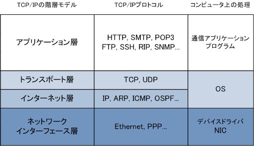
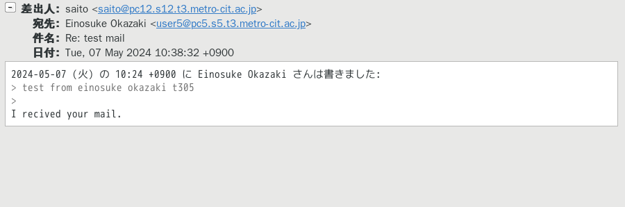
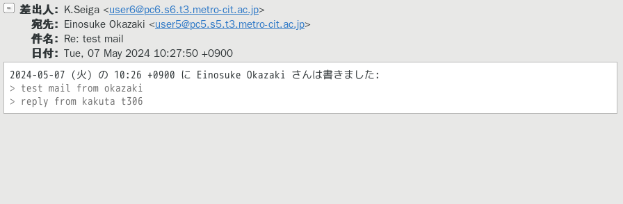

# 目的

&emsp; Mail の送受信方法の理解

# 理論

## プロトコルとは

&emsp; ネットワークサービスを実現するためには各種サービスにおいて、サーバ間、サーバー・クライアント間の通信手続きが明確に定義されていることが必要である。この通信手続きの事をプログラムと呼ぶ。プロトコルの代表的な例としては、Web サーバーと Web ブラウザとの通信方法を定義する HTTP(S) ( Hyper Text Transfer Protocol (Secure) ) が挙げられる。

## TCP/IPとは

&emsp; インターネットを含むコンピュータ間のネットワークにおける通信では、多くのプロトコルが利用されている。これらの内、最も利用されている基本的なプロトコル群を総称して TCP/IP と呼ぶ。  
&emsp; TCP/IP は通信プロトコルの集合体であり、役割によって分けられた4つの階層から構成されている。各層の名称と、代表的なプロトコルを図 1^[ https://www.infraexpert.com/study/tcpip.html より ]に示した。

&emsp; ネットワーク上の通信では、最上位層のアプリケーション層を起点として通信が発生し、下位の層を順番に通っていく過程で様々な情報が付加されることで、送受信について高い信頼性が確保される。この各層を通っていく通信内容のことをパケットと呼ぶ。つまり、インターネットにおける通信とはパケットのやり取りである。

### アプリケーション層

&emsp; 最上位層であるアプリケーション層では、ユーザーが使用するソフトウェアについてのプロトコルがまとめられている。例として、電子メール、Web、ファイル共有などの機能を実装したプロトコルがある。

### トランスポート層

&emsp; トランスポート層は、パケットの送受信における信頼性を確保する役割を持つ。データの送信時には、アプリケーション層から受け取ったパケットに信頼性を高めるための制御情報を付加して下位層のネットワーク層に引き渡す。受信時には、ネットワーク層から受け取ったパケットの制御情報を処理して、欠損のない完全なデータをアプリケーション層に引き渡す。具体的には、データの欠損の検出と訂正、再送制御、分割されたデータの並び順の整列などを行う。  
&emsp; この階層でよく用いられるプロトコルして、高い信頼性を実現し Web 通信などで利用される TCP、信頼性よりも速度が必要な場面（例えばゲーム、通話など）で利用される UDP がある。

### ネットワーク層

&emsp; ネットワーク層は端末、あるいはネットワーク同士を結びつけ、通信経路を確保する役割を持つ。具体的には、ネットワークへのアドレスの割り当て、データの転送経路の管理や選択などを行う。  
&emsp; 現代のネットワークではこの階層に IP (Internet Protocol) を用いるのが標準である。IP により結び付けられた世界的なネットワークをインターネットと呼ぶ。なお、IP アドレスとはこのプロトコルによって各ネットワークに割り当てられるアドレスの事である。

### ネットワークインターフェース層

&emsp; 上位層のネットワーク層はネットワーク間の関係性を定義し、パケットの通り道を決定する。一方、ネットワークインターフェース層は実際に物理的に接続された機器間での通信の方法を定義する。具体的には、通信相手の認識と伝送、上位層から受け取ったパケットの分割と組み立てなどを行う。なお、この時分割されたデータのことをフレームと呼ぶ。  
&emsp; この階層でよく用いられるプロトコルとして、有線通信で利用される Ethernet 、無線通信で利用される Wi-Fi がある。

## プロトコルとポート番号

&emsp; TCP、UDP を利用した通信では、パケット一つ一つにポート番号が割り当てられる。パケットを受信したホストはポート番号とプログラムの対応表を参照することで、パケットを目的のプログラムに転送する。この仕組みによって各プログラムは必要なパケットのみを受信できるので、効率的に処理を行える。各プロトコルにはそれぞれ異なるポート番号が、通信の標準化のために割り当てられている。ただし、この割当はは必ずしも従う必要があるものではなく、自分で自由に設定することができる。  
&emsp; 例えば、Web 通信で利用される HTTP には 80 番ポートが割り当てられている。その他にも、代表的なプロトコルのポート番号を表 1に示す。

|TCP/UDP|番号|プロトコル名|
|:----:|:----:|:----:|
| TCP | 20 | FTP(データ) |
| TCP | 21 | FTP(制御) |
| TCP | 22 | SSH |
| TCP | 23 | Telnet |
| TCP | 25 | SMTP |
| UDP | 53 | DNS |
| UDP | 67 | DHCP(サーバ) |
| UDP | 68 | DHCP(クライアント) |
| TCP | 80 | HTTP |
| TCP | 110 | POP3 |
| UDP | 123 | NTP |
| TCP | 443 | HTTPS |

:代表的なプロトコルとポート番号

## メール送受信におけるプロトコル

&emsp; メールの送受信においてはメールサーバー間のプロトコルとして SMTP (Simple Mail Transfer Protocol) と、メールサーバー・クライアント間の POP (Post Office Protocol) の二種類を用いた構成が一般的である。

### SMTP (Simple Mail Transfer Protocol)

&emsp; SMTP はメールサーバー間でメールを送受信するためのプロトコルであり、ポート番号として 25 が割り当てられている。これはあくまでサーバー間がメールを送受信するためのものであり、ユーザーがメールを受信することはできない。現実に置き換えれば、SMTP の機能は郵便局間の郵便物の輸送に相当するものであり、宛先への配達を担当する物ではない。  
&emsp; SMTP には暗号化技術が実装されていない。そのため、現代では暗号化が実装された SMTPs の利用が推奨される。

### POP ( Post Office Protocol )

&emsp; POP はユーザーがメールサーバーからメールを取り出すためのプロトコルであり、ポート番号として 110 が割り当てられている。例によって現実に置き換えれば、 POP の機能は郵便局から自宅のポストまでの郵便物の配達に相当するものである。 SMTP と同様に暗号化技術が実装されていないので、現代では暗号化が実装された POPs の利用が推奨される。

## メールのユーザーアカウントについて

&emsp; メールサーバーに登録されているユーザー ID がメールアカウントとして利用される。本校においては学内の統合認証基盤において全教職員、全学生のユーザー ID が管理されており、学外のメールサーバーが統合認証基盤を参照することから全教職員、全学生のメールアカウントが管理されている。今回の演習に置いては各自のサーバーのユーザー ID がメールアカウントとなる。

# 実験手順

1. DNS で SMTP と POP の名前解決の確認
2. SMTP と POP がサーバ上で使えるように Firewall の設定
3. Postfix の設定
4. Dovecot を yum で導入
5. Dovecot の設定を行う。
6. メーラーの導入とメーラーの設定
7. メールの送受信の確認(実験結果)

以上の 7 手順を順次行った。 2, 3, 4 では管理者としてコマンドを実行した。

1. DNSでの確認
  自分自身と送信相手に対して

   - dig.smtp.s5.t3.metro-cit.ac.jp.
   - dig smtp.t3.metro-cit.ac.jp.
   - dig pop.s5.t3.metro-cit.ac.jp.

    で名前解決ができるか確認した
2. Firewallの設定

   - SMTPが使えるように設定を追加した
     - firewall-cmd --add-service smtp
     - firewall-cmd --add-service smtp --permanent

3. Postfix の設定を変更した(資料 243 ページ)

   - vi/etc/postfix/main.cf  
     - ホスト名の設定をした
       - 設定ファイルの行 #myhostname=virtual.domain.tld の下に myhostname=pc5.s3.t3.metro-cit.ac.jp を追加した
     - サーバから送られるメールのアドレス形式の設定をした
       - #myorigin = $mydomain の分頭の#を削除した
     - 送信時に接続するインターフェイスを変更した
       - 使用するインターフェイス #int_interfaces = all の文頭の # を削除した
       - 停止するインターフェイス int_interfaces = localhost の文頭を # でコメントアウトした
     - サーバ内での配送設定
       - コメントアウト行 mydestination = ＄myhostname, localhost.＄mydomain, localhost
       - 実行させる行 mydestination = ＄myhostname, localhost.＄mydomain, localhost, $mydomain
     - 接続できるネットワークの設定をした
       - #mynetworks = を mynetworks = 192.168.0.0/24, 127.0.0.0/8 に変更した
     - メールの保存場所の設定をした
       - Mailbox に Maildir/ を使うので #home_mailbox = Maildir/ のコメントアウトを外した
     - 設定変更を保存して終了した
     - Postfixの再起動をした
   - systemctl restart postfix.service

4. POPを使うためにDovecotをインストールした

   - yum install dovecot を実行、応答に y で応えた。

5. dovecot の設定を変更した（資料 244ページ、245ページ参照）

   - Postfixで指定したメールの保存先を設定した
     - vi /etc/dovecot/conf.d/10-mail.conf
       - #mail_location = の下に mail_location = maildir:~/Maildir を追加した
     - 設定変更を保存して終了した
   - 認証設定の変更（平文パスワードでの認証を許可）
     - vi /etc/dovecot/conf.d/10-auto.conf
       - #disable_plaintext_auth = yes を disable_plaintext_auth = no に変更した
     - 設定変更を保存して終了した
   - サーバからクライアントへのPOPでの転送時に暗号化しいないように設定をするため設定ファイルを開いた
     - vi /etc/dovecot/conf.d/10-ssl.conf
       - ssl = no  に設定した
     - 設定を保存して終了した
   - POPが使えるようにfirewallで設定追加をした
     - firewall-cmd --add-port=110/tcp
     - firewall-cmd --add-port=110/tcp --permanent
   - dovecotの起動をした
     - systemctl start dovecot.service
     - systemctl enable dovecot.service
  
6. CentOSでメールの送受信をユーザが行うためにメーラーを準備した

   - evolutionを導入した
     - yum install evolution
   - evolutinを起動した
     - evolutin
   - 起動後、ユーザ設定、送信設定、受信設定を行った。
     - ユーザ設定
       - user5@pc5.s5.t3.metro-cit.ac.jp
     - 送信設定
       - SMTP
       - smtp.s5.t3.metro-cit.ac.jp
     - 受信設定
       - POP
       - pop.s5.t3.metro-cit.ac.jp
  
7. 準備ができているメンバーに、メールの送受信の確認を行った
   - メールを送信し、その返信メールを実験結果として保存した
  
\clearpage

# 実験結果

1. saito@pc12.s12.t3.metro-cit.ac.jp にメールを送信し、返信されたメールを図 2に示した。  
   送信元は saito@pc12.s12.t3.metro-cit.ac.jp、送信先は自分のメールアドレスである user5@pc5.s5.t3.metro-cit.ac.jp となっていた

2. user6o@pc6.s6.t3.metro-cit.ac.jp にメールを送信し、返信されたメールを図 3に示した。  
   送信元は user6@pc6.s6.t3.metro-cit.ac.jp、送信先は自分のメールアドレスである user5@pc5.s5.t3.metro-cit.ac.jp となっていた

# 考察

&emsp; ネットワーク上で提供されるサービスは、計算機間の通信がプロトコルに則って実行される事によって実現されている。また、各プロトコルにはポート番号が割り当てられており、これによってパケットとソフトウェアの紐づけが行われていることを理解した。特に、今回の実験ではメールサーバー間のやり取りでは SMTP , メールサーバーとユーザー間のやり取りでは POP が通信プロトコルとして利用され、ポート番号はそれぞれ 25、110 番が割り当てられていることを確認した。  
&emsp; 実験結果から、メールの送受信が行えており、SMTP、 POP の設定、そしてメーラーの設定が正しく行われている事を確認できた。また、メールの送受信はメーラーが SMTP サーバーにメールを送信し、SMTP サーバーがさらに送信先の SMTP サーバーにメールを転送をした後、ユーザーが POP を使用して SMTP サーバーからメールを取り出すという流れで実現されていることを確認できた。  
&emsp; Firewall にポート番号を指定して外部からのアクセスを一部受け入れるようにしたが、これはセキュリティ上のリスクを増やす事に繋がるので、開放するポー トは最小限にするべきだと考えた。  
&emsp; SMTP、POP を使用した通信をできるようになったが、これによって外部からの通信を受け入れるようになったので、SMTP と POP の脆弱性の発見に注意して、定期的にアップデートをする必要があると考えた。
