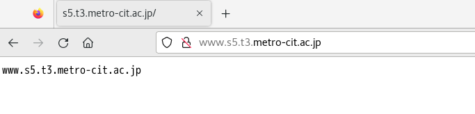
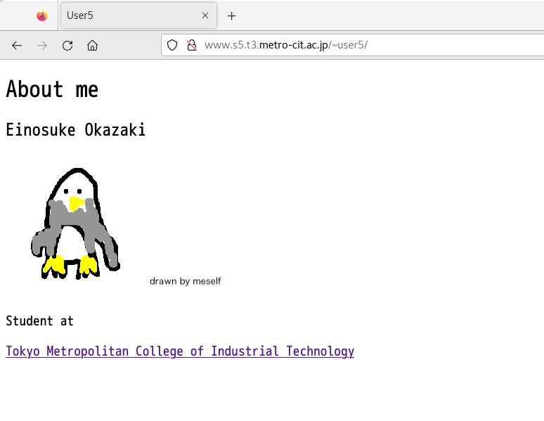
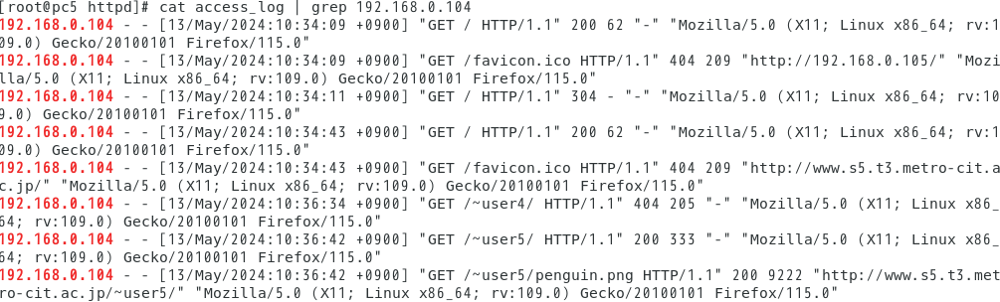

# 目的

&emsp; Web Server の設定と運用

# 理論

## サーバー・クライアント方式について

&emsp; サーバー・クライアント方式とは、コンピュータの処理形態の一つであり、サービスや情報を提供するサーバーにそれを利用するクライアントがネットワーク通信で接続し、クライアントからの要求にサーバーが応答する形で処理を進める方式の事である。  
&emsp; Web (World Wide Web) 通信はこの方式の処理形態であり、クライアントの Web ブラウザが Web サーバーに対し要求を送信し、Web サーバーが応答としてテキストや画像などを送信することで機能や情報を提供する。

## プロトコルとポート番号の関係

&emsp; Web サーバーにおける通信手続きは HTTP (Hyper Text Transfer Protocol) または HTTP の暗号化版である HTTPS (HTTP Secure) が利用される。ポート番号は HTTP、HTTPS それぞれに 80、443 番が割り当てられている。

### HTTP とは

&emsp; HTTP は、Web 上で Web サーバーとクライアントが後述の HTML (Hyper Text Markup Language ) で書かれた文書などの情報をやり取りするためのプロトコルである。実際に、クライアントがサーバーに要求（リクエスト）を送信し応答（レスポンス）を得るまでの流れを説明する。

1. クライアントがサーバーと通信を確立する
2. HTTP リクエストを作成し、サーバーに送信する。このリクエストには、クライアントが実行したい処理の内容や欲しい情報、そして HTTP プロトコルのバージョンが含まれている
3. サーバーがリクエストにレスポンスを送信する
4. サーバーとの通信を切断する

&emsp; HTTP の特徴として、このように通信が一度の送信に対して一度の応答のみで終わることが挙げられる。この仕組みの利点として、プログラムがシンプルになることが挙げられる。しかしクライアントを通信した処理を行う場合には様々な技術を使用する必要があり、処理が複雑になる事もある。

## Web ページの記述方式

&emsp; Web ページの記述には、 HTML (Hyper Text Markup Language ) が利用される。HTML は主にテキストとテキストに意味を与えるタグで構成されている。タグには文字の色や大きさ設定するもの、画像を参照させるものなどがあり、これらを Web ブラウザが読み取って画面に表示する。

## アクセスログの確認方法

&emsp; 多くの Web サーバーソフトはクライアントがサーバーにアクセスしたときに、ログを記録する。Web サーバーソフトの一つである Apache においては、ログは /var/log/httpd にテキストファイルとして保存される。ログには、アクセス時間、要求元の IP アドレス、要求されたファイルなどが記録される。具体的な確認手順を実験手順の 7 で示した。

\clearpage

# 実験手順

&emsp; 以下の 7 工程を順次行った。

1. http ポートが空いているかを確認した
2. httpd のインストールをした
3. httpd の設定を環境に合わせて書き換えた
4. Apache を起動した
5. ブラウザで Apache のテスト画面の確認
6. ユーザー毎にホームページが作成できるように変更した
7. アクセスログの確認をした。

管理者権限での作業になるので su コマンドで管理者権限がある状態にした。  

1. http のポートの設定確認

   - http が通信可能か確認した  
   - Firewall の確認、許可されているサービスを表示した  
     - firewall-cmd --list-service
     - http が list で表示されなければ、管理者権限でサービスを追加した
       - firewall-cmd --add-service http
       - firewall-cmd --add service http --permanent
       - 追加されたか確認をした
         - firewall-cmd --list-service

2. httpd のインストール
   - yum install httpd httpd-manual

3. httpd の設定変更

   - vi etc/httpd/conf/httpd.conf
     - ServerAdmin webmaster@s5.t3.metro-cit.ac.jp
     - ServerName 行の先頭の # を消去し、Webサーバのホスト名を設定した
       - ServerName wwws5.t3.metro-cit.ac.jp  
     - UseCanonicalName On
     - AddDefaultCharset UTF-8 をコメントアウトした  

4. Apache を起動

   - systemctl start httpd.service  
   - systemctl enable httpd.service  

5. ブラウザでApacheのテスト画面を確認

   - ブラウザで以下のいずれかを使用して Apache のテスト画面を確認した
     - www.s5.t3.metro-cit.ac.jp
     - 192.168.0.105
     - localhost
   - /var/www/html/ に index.html を作成した
     - /var/www/html/index.html
       - 以下の内容を入力し保存した
  
            ```html
            <body>
            <html>
            www.s5.t3.metro-cit.ac.jp
            </html>
            </body>
            ```

   - ブラウザで www.s5.t3.metro-cit.ac.jp にアクセスした
     - Apacheのテスト画面から作成した内容に変わったことを確認し、キャプチャーした

6. ユーザー毎に情報公開できるようにする

   - vi /etc/httpd/conf.d/userdir.conf
     - UserDir disabled をコメントアウトした
     - #Userdir public_html の分頭の # を外した
     - 保存した
   - httpdの再起動をした
     - systemctl restart httpd.service
   - HomeDirectoryのパーミションの変更をした
     - 管理者権限から抜けた
       - cd ~
       - chmod 771
       - mkdir public_html
       - chmod 775 public_html
   - ~/public_html/ に index.html を作成し、各自のページを制作した
   - ブラウザで www.s5.t3.metro-cit.ac.jp/~user5/ にアクセスした
     - 制作したページをキャプチャーした

7. アクセスログの確認
   - 現在のアクセス回数の確認をした
   - cd /var/log/httpd
   - wc acceess_log
     - 左から行数、空白で区切られた単語数、ファイル容量（バイト）が出力された
   - 指定したIPアドレスからのアクセス確認
     - cat access_log | grep IPアドレス
   - 実行結果をキャプチャーした
  
# 実験結果

1. www.s5.t3.metro-cit.ac.jp にブラウザからアクセスして表示された画面を図 1 に示した。テキストとして www.s5.t3.metro-cit.ac.jp が表示された

{ width=85% }

\clearpage

2. www.s5.t3.metro-cit.ac.jp/~user5/ にブラウザからアクセスして表示された画面を図 2 に示した。見出しのテキストとして About me、テキストとして Einosuke Okazaki、Student At、そして学校の URL がハイパーリンクとして設定された Tokyo Metropolitan College of Industrial Technology というテキスト、更にペンギンの絵が画像として表示された。

{ width=90% }

3. cat access_log | grep 192.168.0.104 を実行した結果を 図 3 に示した。該当する IP アドレスからのアクセスが、要求したファイルとアクセス日時と共に表示された

{ width=90% }

\clearpage

# 考察

&emsp; 実験から、Web 通信においてはサーバーが機能や文書、画像等のリソースを提供して、それらに対してクライアントが要求を送信し、サーバーが応答する事でやり取りを行うサーバー・クライアント方式が使用されていることを理解した。  
&emsp; Web 通信のプロトコルとして HTTP が利用され、そのポート番号に 80 番が割り当てられていること、HTTP の通信では一つの要求に対して一つの応答が返されて完結することを実験から理解した。  
&emsp; Web ページの記述には HTML が用いられ、その構造がテキストと、画像を表示する``````や、文字を見出しとして大きく表示する```<h1>```などのテキストに意味を与えたり情報を追加するタグなどから成っている事を理解した。  
&emsp; Web サーバーへのアクセスは IP アドレスや要求したファイルなどと共にログファイルに記録され、管理者から確認できる事を理解した。管理者はこの情報を利用して攻撃者など悪意のあるクライアントのアクセスを禁止する必要があると考えた。