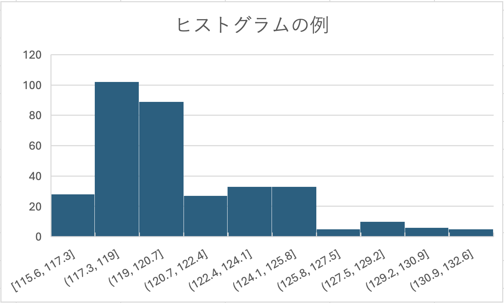
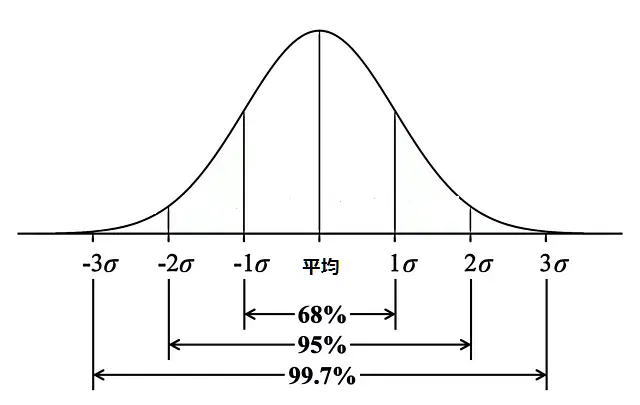
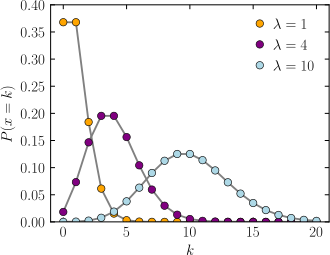
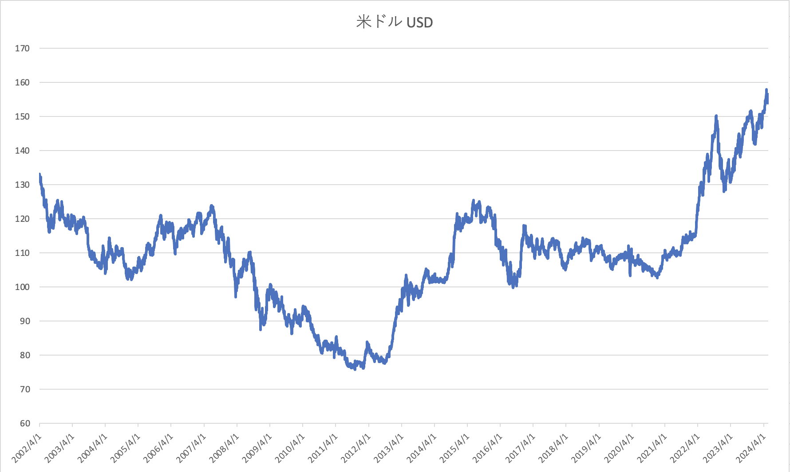
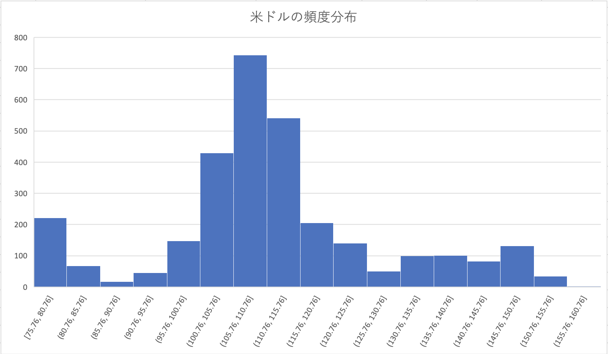
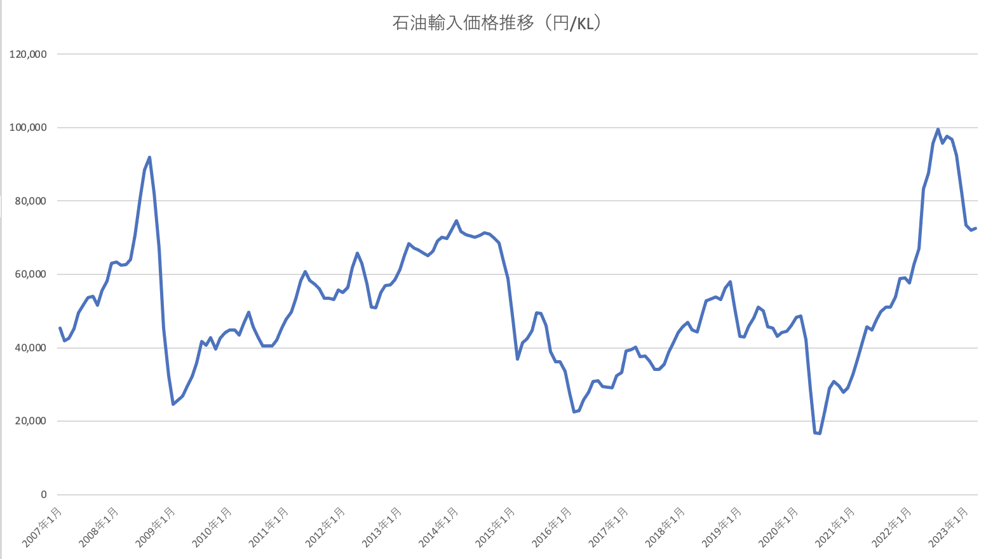
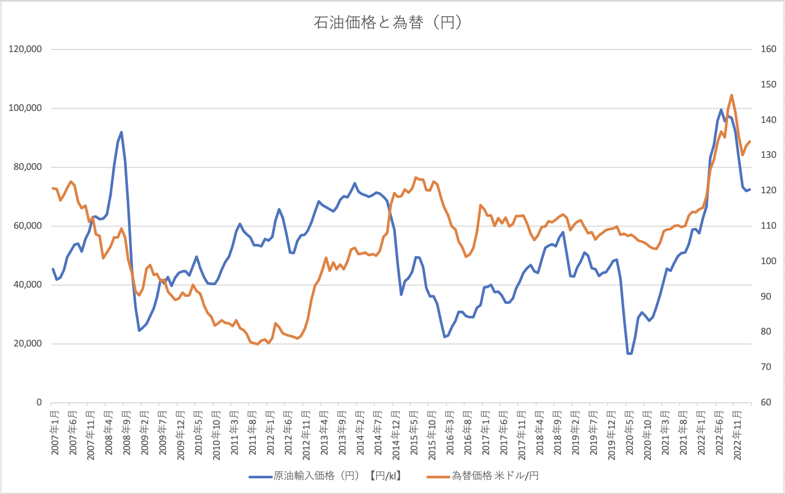
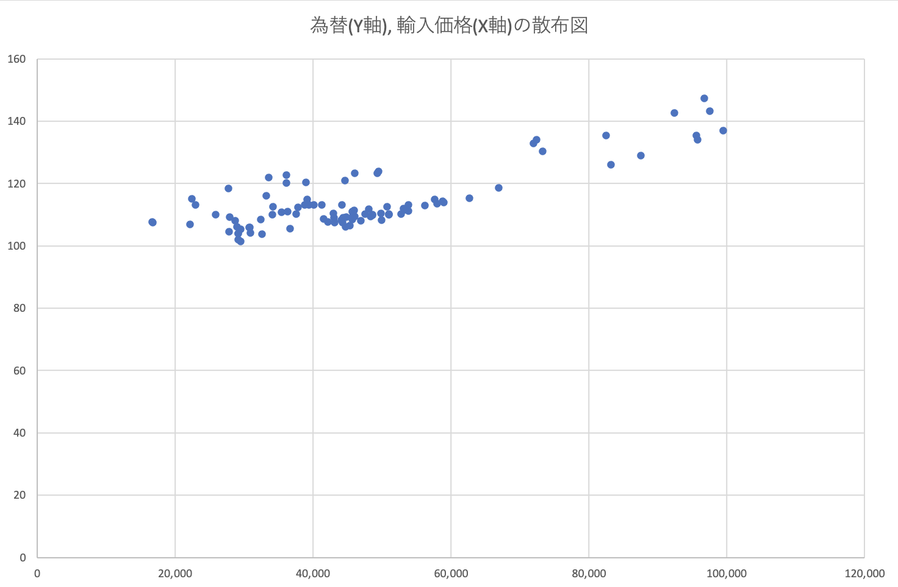
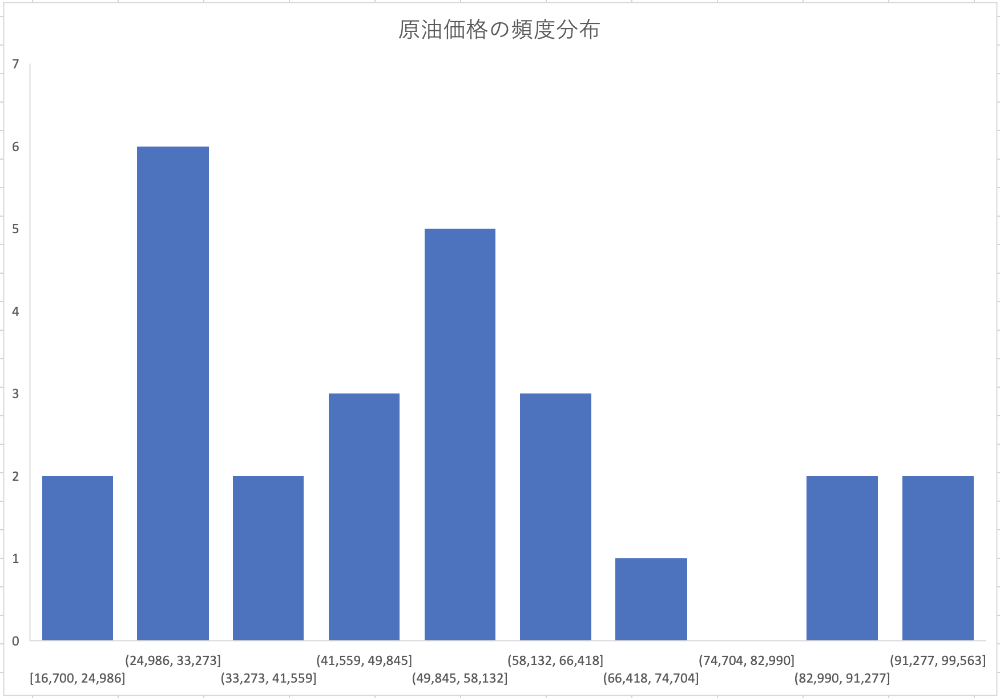

# 目的

&emsp; データの可視化とデータの統計処理

# 理論

## 一次データと二次データ

&emsp; インターネット上に直接存在しているデータは一般的に一次データと呼ばれる。この一次データを統計等の処理を行い、目的に沿った演算結果を二次データと呼ぶ。

## データ分布の扱い方

&emsp; データの分布が正規分布か、左右対称か否かによって適用できる統計的な法則は異なる。そのため、まず数値データの全体の傾向を把握する必要がある。  
&emsp;しかし、数値データを眺めていても全体の把握や、データが持つ特徴を見出すのは困難である。このため解析目的に応じた特徴を見出す方法としてデータのグラフ化がある。数値データをグラフ処理してデータの特徴を見出すことをデータの可視化と呼ぶ。このような一次データが持つ特徴から解析目的を決める場合やデータ全体を把握する場合には有用な手段である。また、演算処理した結果を示す場合も有用である。
<!-- 正規分布か、左右対称か非対称かで扱いが変わるので、データを可視化して判断する必要がある。 -->

## 平均値と最頻値

&emsp; データから特徴量の抽出方法として代表値がある。代表値としては最頻値、平均値が多く使用されている。代表値を求める際に作成する頻度分布をヒストグラムと呼ぶ。N個のデータがデータの大きさとして$a \leqq x_i \leqq b, i=1,2,3,\cdots n$で表されるとする。a から b までの区間を目的に応じて h 個の連続した区間に分け、それぞれの区間に含まれるデータの個数を求めることを頻度分布の作成と呼ぶ。頻度分布の中で最個数の多い区間を最頻値と呼ぶ。頻度分布が最頻値に対して左右対称であれば最頻値と平均値は同じになる。なぜなら、左右対称な形状では分布の両側に同じ数のデータ点があるので平均値は分布の中心を表し、最頻値もまた同じように中心に位置するからだ。

{ width=60% }

\clearpage

### 標準偏差

&emsp; 最頻値に対して左右対称の分布として正規分布が多く用いられる。頻度分布としての特徴量は最頻値(平均値)と頻度分布の幅である。この幅のことを標準偏差と呼び、頻度分布が正規分布に沿っているなら標準偏差の大きさによりデータ区間に含まれるデータ数は下図のように確率的に決まっている。

{ width=50% }

### 平均値と標準偏差の求め方

&emsp; 平均値を$<x>$とし、標準偏差を$\sigma$とすると  
$$<x> = \sum_{i=0}^{n} x_i/n$$
$$\sigma^2 = \frac{\sum_{i=0}^{n} (<x> - x_i)^2}{n-1}$$  
で表せる。

## データのばらつきに対する扱い方

&emsp; データの分布にはばらつきがあり、それは必ずしも最頻値に対して左右対称な分布にはならない。そのため、統計的な処理を行う前にデータを可視化して分布を確認し、それに応じた処理を行う必要がある。  
&emsp; 例として自然現象で多く現れるポアッソン分布の場合、最頻値の値が小さい場合は最頻値に対して左右対称にはならないが、最頻値の値が大きくなると正規分布に近づく。左右非対称なポアッソン分布の場合、分布の広がりは最頻値の平方根の大きさになる。

{ width=40% }

# 実験方法

## 第一週

&emsp; 本演習ではみずほ銀行が提供している外国為替公示データを利用した。外国為替データから時系列グラフを作成し、為替データが急速に変化している日時と、その経済状態の変化を引き起こした原因の推定を行った。為替データ全体の統計解析上の特徴値として為替データの頻度分布を作成し、最小値と最大値、最頻値と頻度分布の幅、平均値、標準偏差を求めた。

### データの取得

&emsp; インターネット経由で、みずほ銀行校外国為替公示ヒストリカルデータの「みずほリファレンスデータ」をダウンロードした。URL は以下の通りである。  
https://www.mizuhobank.co.jp/market/historical/index.html

### 時系列グラフの作成

&emsp; Excel グラフ機能を用いて時系列データを作成した。データの最小値、最大値を見出した。また、急激な価格変動のある箇所を三箇所見出し、価格と日時を調べた。また、変動した要因の推定も行った。

### 統計処理

&emsp; 求めた為替の最小値と最大値の間を 5 円刻みで区間に分け頻度分布を作成した。頻度分布から分布が最頻値に対して左右対称か否かを判断した。分布が最頻値に対して左右対称でない場合の最頻値の区間値、そして最頻値の平方根を取り、求めた頻度分布の幅に対応するか確認した。頻度分布が正規分布に従うと仮定して、平均と標準偏差を求めた。最頻値と平均値、最頻値の平方根と標準偏差の値を比較した。

## 第二週

&emsp; 二週目では、資源エネルギー庁が公開している石油の 1KL あたりの輸入価格（円）の月次データ^[ https://www.e-stat.go.jp/stat-search/database?statdisp_id=0003171973 ] について第一週と同じ手順で可視化を行い特徴量を見出し、統計処理を行った。更に、為替データとの相関関係を確認して通常とは異なる場合についてその要因を推測した。

\clearpage

# 実験結果

## 第一週

### 時系列データ

&emsp; 為替の時系列グラフを図 4 に示した。

{ width=100% }

グラフから、為替の最小値は 75.76 円、最大値は 157.93 円だと分かった。
  
&emsp; 急激な価格の変動が起きている箇所を以下の表 1 にまとめた。

|期間|最小値|最大値|
|:----:|:----:|:----:|
| 2008年9月15日~2009年2月2日 | 87.47円(2009年1月28日) | 106.96円(2008年9月17日) |
| 2015年11月19日~2016年8月18日 | 99.81円(2016年8月18日) | 123.56円(2015年11月19日) |
| 2022年11月1日~2023年3月7日 | 127.97円(2023年1月16日) | 148.78円(2022年11月1日) |

:急激な為替価格変動

1. 2008年9月15日~2009年2月2日  
&emsp; 2008年9月15日、アメリカの大手金融機関であるリーマン・ブラザーズが破綻した事により世界的な金融危機が発生した。多くの投資家が安全資産を求め、円を避難先として選択した事により円の需要が高まり円高が発生したと考えられる。

1. 2015年11月19日~2016年8月18日  
&emsp; 中国経済の減速や原油価格の急落など、世界的なリスク要因が増加した。また、アメリカ合衆国で大統領選挙が行われた事により政治的な不安定要因が生まれ、円が安全資産としての需要を高め、円高が進行したと考えられる。

1. 2022年11月1日~2023年3月7日  
&emsp; 2022年11月に発表された米国の消費者物価指数の伸び率が鈍化していたことにより、米ドルの需要が低下、リスク回避としての円の需要が高まり円高が進行したと考えられる。

\clearpage

### 統計処理

&emsp; 最小値と最大値を 5 円刻みで区間分けした頻度分布を図 5 に示した。

{ width=80%}

図 5 より最頻値の区間値は 105.75 ~ 110.76 であり、頻度分布は最頻値に対して左右対称的でないと考えられる。この時、最頻値の平方根は 10.4 で、標準偏差は 16.9、平均値は 111.7 となった。
以上より最頻値の区間値と平均値は近い値になる。さらに、標準偏差と最頻値の平方根も近しい値になったことから、統計的には、完全ではないが左右対称的な分布であると言える事が分かった。

## 第二週

### 時系列データ

&emsp; 石油輸入価格（円/KL）の時系列グラフを図 6 に示した。

{ width=80% }

グラフから、輸入価格の最小値は 16,700 円、最大値は 99,563 円だと分かった。

\clearpage

&emsp; 急激な価格変動が起きている箇所を以下の表 2 にまとめた。

|期間|最小値|最大値|
|:----:|:----:|:----:|
| 2008年8月~2009年8月 | 24,621円(2009年1月) | 91,974円(2008年8月) |
| 2020年1月~2020年10月 | 16,700円(2020年6月) | 48,648円(2020年2月) |

:急激な石油価格変動

1. 2008年8月~2009年8月  
&emsp; リーマンショックにより多くの国で景気が悪くなり消費が鈍化したことにより、石油の需要が急激に低下した。それによって石油の需要と供給のバランスが崩れ、供給量が需要を上回ったことで日本での石油輸入価格は大きく低下したと考えられる。更に、円が安全資産としての需要が高まり、円高が発生したことも原因として考えられる。

1. 2020年1月~2020年10月  
&emsp; 新型コロナウイルスの感染拡大による石油の需要減少を原因として、輸入価格が下落したと考えられる。

&emsp; 次に、一週目で扱った為替価格と石油価格を一つにまとめたグラフを図 7 に、為替と石油の輸入価格の散布図を図 8 に示した。

{ width=100% }

\clearpage

{ width=100%}

グラフから、2015 年以降の区間では石油の輸入価格と為替価格はある程度相関している事がわかる。この区間での相関係数は 0.82 であり、強い相関関係がある事が確認できた。これは、石油取引の決済は主にドルで行われるため、米ドルが高くなれば必然的に輸入価格も高くなるからであると考えられる。
しかし、2008 年から 2012 年の区間ではその相関関係は弱くなっている。これは、2008 年に発生したリーマン・ショックによって円安傾向になった事と、世界的な石油の需要増加が独立して起こったからであると考えられる。

\clearpage

### 統計処理

&emsp; 最小値と最大値を間を 8286 円刻みで区間した頻度分布を図 9 に示した。

{ width=100% }

図 9 より最頻値の区間値は 24,986 ~ 33,273 であり、頻度分布は最頻値に対して左右対称的ではないと分かる。この時、最頻値の平方根は 170.67 で、標準偏差は 22,264 、平均値は 50,448 となった。
以上より最頻値の区間値と平均値は大きく異なる。さらに、標準偏差と最頻値の平方根も大きく異なることから、原油価格の頻度分布は統計的にも左右対称的でないことが分かった。

# 考察

&emsp; インターネット上に存在している一次データはそのままではそれが何を意味するデータなのか見出しにくく、目的に応じて可視化や統計的な処理を行う必要があることが分かった。  
&emsp; データの分布の形には様々な種類があり、それぞれに応じた統計処理の方法があるため、まずデータの全体の傾向を把握する必要があった。例えば、最頻値に対して左右対称な正規分布においては特徴量として最頻値と平均値、そして頻度分布の幅である標準偏差などが重要な意味（最頻値の区間値は平均値と等しくなり、標準偏差から区間に含まれるデータ数が確率的に決まる）を持つことを理解した。  
&emsp; また、非左右対称的な場合でも標準偏差と最頻値の平方根は近い値となることから、分布にばらつきがある場合でもそれに応じた統計的な処理を行うことで意味を見出す事ができる事を理解した。  
&emsp; 以上より、データの分析を行う際にはまずデータの全体を把握して、そのデータに合った適切な統計処理を行うことが意味を見出す上で重要であるとわかった。
