# 目的 
L と C を用いた基本的な発振回路(ハートレー,コルピッツ)及び, RC による位相発振回路(進相形、遅相形)の動作特性を調べることにより, 発振回路の原理及び回路動作特性について理解を深める.

# 原理説明

## LCを用いた発振回路

### LC並列回路の基礎

図 1 に示したLC並列回路の ① ③ 間に, 交流電源を接続した場合に L, C を流れる電流を考える.この回路の L と C に流れる電流はそれぞれ $\dot{I_l} = \frac{\dot{V}}{j\omega L}$ , $\dot{I_c} = j \omega C \dot{V}$ であり，これらの位相は互いに逆になる.

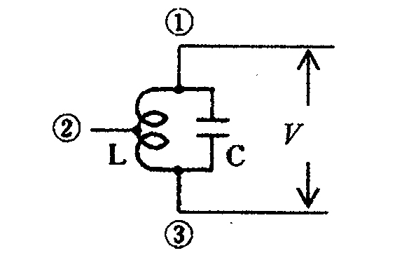

ここで, この回路に加える周波数 $f$ を $f_0 = \frac{1}{2 \pi \sqrt{LC}}$ とすると並列回路が共進状態になる．この周波数 $f_0$ を共進周波数と呼ぶ.

### LC並列共振と発振現象

図 1 のように L, C に電流が流れている状態(電圧を掛けてから,時間が十分に経過し,安定した状態)で, この電源を取り去ると, 損失(抵抗)の無い理想状態ではこの電流は消滅することなく流れ続ける. 現実には, 抵抗により損失が生じ, 電流は徐々に減少し, $\textcircled{\scriptsize 1}\textcircled{\scriptsize 3}$ 間の電圧も降下して, 最終的にゼロとなる. したがって, この回路の損失分をトランジスタやFETなどの増幅回路を用いて補うことにより共振電流は持続されて発振が起こる. 以上の考え方をインダクタ L で電圧分割を行う, ハートレー発振回路（ 図 2 ）で解説する.

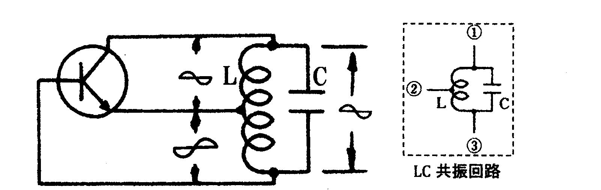

図 2 に示すように, 損失を補うために, $\textcircled{\scriptsize 2}\textcircled{\scriptsize 3}$ 間の電圧を取り出し, この電圧を拡大(増幅)して $\textcircled{\scriptsize 1}\textcircled{\scriptsize 3}$ 間に電圧源として加え続けることで, $\textcircled{\scriptsize 1}\textcircled{\scriptsize 3}$ 間の電圧降下は解消され, 共振電流が持続する.  
ここで, 発振とは, 回路の中で, 特定の周波数の信号が連続的に現れる現象である. $\textcircled{\scriptsize 2}\textcircled{\scriptsize 3}$ の 電圧情報を $\textcircled{\scriptsize 1}\textcircled{\scriptsize 3}$ に戻す操作を正帰還( 増幅回路の出力の一部が同位相で入力に戻ること )をかけると言い, 発振はこの正帰還がかかることにより生じる現象である. トランジスタが発振というものを起こっているのではなく, 理想状態では消滅しない LC 共振回路の共振電流が, 実際には損失してしまう分をトランジスタが補っていると考える方が自然である.
トランジスタの増幅作用とは, 簡単に言えばベースに注入された百倍前後の電流がコレクタに流れ込むことである. ただし, 注意すべきことは, ベースに流れ込む電流とコレクタに流れ込む電流とでは位相が反転していることである. したがって, 正帰還を掛けたい場合は, コレクタ電流をさらに反転させた位相の電流をベースに注入する必要がある. $\textcircled{\scriptsize 2}$ をアースと考え, $\textcircled{\scriptsize 3}$ に $\textcircled{\scriptsize 1}$ とは反転した位相の電圧を取り出している.

### 電圧分割条件の違いによる発振回路の構成法

L と C を用いた発振回路には, 電圧分割方法の違いから, ハートレー, コルピッツの二種類の発振回路がある．ここでは, この2タイプの回路での発振原理について述べる.

#### ハートレー発振回路

ハートレー発振回路は, インダクタ L で電圧分割を行う発振回路であり, 2.1.2 で述べた原理で正帰還を生成している. 図 2 のように, LC 共振回路がコレクタ, ベース間に接続され, インダクタンス L の途中がエミッタに接続されている. このため, コレクタ電圧とベース電圧はエミッタに対して常に逆位相になる. コレクタ・エミッタ間の波形が&emsp;のときは, エミッタ・ベース間には&emsp;のような波形が現れる. エミッタ接地トランジスタにより, 再び位相が逆転するので, 全体として正帰還になり発振する. 図 2 のようにベ―スへの正帰還電圧はインダクタ L の中間タップで作られるが, 正帰還量が多すぎる場合やベースのバイアス電流が不適切な場合には良好な波形は得られない. ハートレー発振器の回路構成例を図 3 に示す.

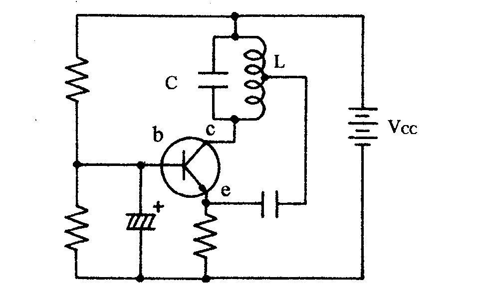

#### コルピッツ発振回路

コルピッツ発振回路は, コンデンサ C で電圧分割を行う発振回路である. 図 4 のようにコレクタ・ベース間に接続された LC 共振回路の $C_1$, $C_2$ により分割され, その中点がエミッタに接続されている. このため, コレクタ電圧とベース電圧はエミッタに対して常に逆位相になる. コレクタ・エミッタ間の波形が&emsp;のときは, エミッタ・ベース間には&emsp;のような波形が現れる. さらに, エミッタ接地増幅回路で位相が反転するため, 全体として図 4 のように正帰還となり, 発振する. コルピッツ発振回路の構成例を図 5 に示す.

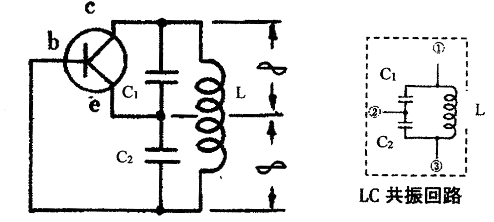{width=200px}

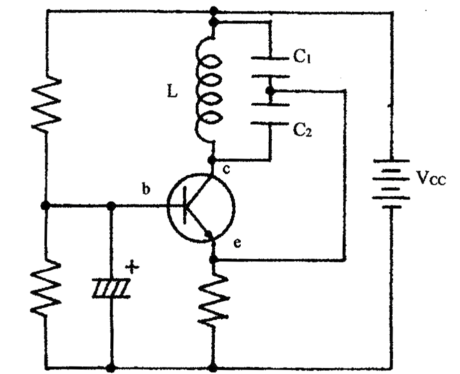{width=200px}

## RCを用いた位相発振回路

### 位相発振回路の意義と必要性

2.1 では $LC$ による発振回路の動作原理について解説した. ここでは, $RC$ による発振回路について述べる. 2.1 では, 共振回路の無損失化という概念から発振を考えていた. 実は, 最初に与えた交流電流源 V は $f_0$ の単一周波数である必要はなく, 広帯域な周波数成分の中に $f_0$ を含んでいれば, それが LC 回路で共振するため, 繰り返し増幅され協調して発振が生じる. したがって, 最初に与える V は単発パルスでも十分である. LCの共振を利用した発振回路以外に, もう一つ発振が生じる回路例がある. CR による多段移相器を用いた正帰還回路である. これは, まさにトランジスタが発振していると呼ぶに相応しい回路である.  
トランジスタのコレクタに流れる電流に比例した電流をベースに戻すことで, まさに正帰還がかかり, トランジスタの中で電流の無限ループが生じることになる. 2.1 で述べたようにトランジスタのベース電流とコレクタ電流は逆位相( 位相差は $\pi$ )であることから, ベースに正帰還をかけるためには, コレクタ電流の位相を反転させて( $\pi$ の位相差を与える )ベースに注入すれば良いことが分かる. 位相差を得るには, コンデンサに加える電流と電圧との位相が $\frac{\pi}{2}$ であることを利用して, 多段構成すれば $\pi$ の位相差が得られることが考えられる. コンデンサの電流と同位相の電圧を取り出すには R が必要であるため, 実際には図 7 に示すように 1 段あたりの位相差は $\frac{\pi}{2}$ よりは小さくなる. したがって, $\pi$ の位相差を得るためには3段あれば十分である. このとき, 与えられた CR によって $\pi$ の位相差となる周波数は唯一である( コンデンサのインピーダンスが $\frac{1}{j \omega C}$ であることに起因する ). そのため, 正帰還がかかる周波数は CR の定義によって決まる唯一の周波数となる. この周波数が共振回路の共振周波数と等価となり, 電源に正弦波を加えなくても, この周波数成分をもつ電圧だけがトランジスタで無限増幅されて発振現象を起こす.

\clearpage

### 進相形発振回路(はしごCR形)

図 6 の回路において, 入力( $\dot{E}$ )と出力( $\dot{E_0}$ )の位相の関係を確認する.

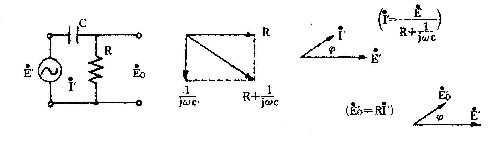{width=400px}

図 6 からわかるように, R を流れる電流 $\dot{I\prime}$ は入力電圧 $I\prime$ に比べ進むことがわかる. そこで, 図 7 に示すように, CR 回路を 3 段にする( はしご状に重ねる )と 180 度まで進ませることができる.

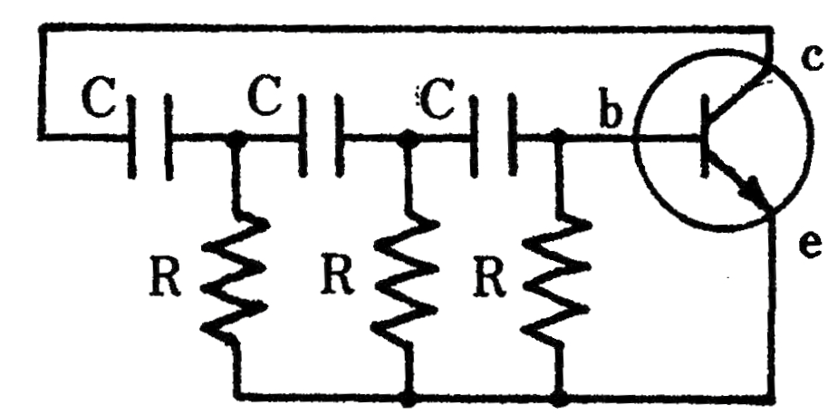{width=400px}

図 7 において，c-e 間の電圧波形が&emsp;のとき, b-c 間は $180^\circ$ 進むので電圧波形は&emsp;のようになる. さらに, トランジスタにより位相反転が起きるので正帰還が形成される.  
発振周波数 $f_0$ は $f_0 = \frac{1}{2 \pi \sqrt{6} RC}$ となる.  
実際の進相形発振回路の構成例を図 8 に示す.

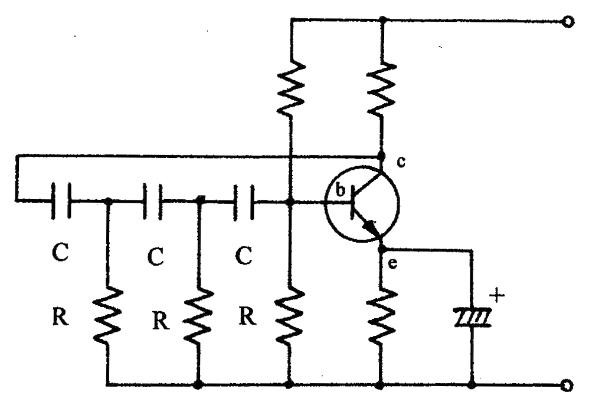{width=400px}

\clearpage

### 遅相形発信回路(はしごRC形)

図 9 に示す RC 回路において, 入力( $\dot E$ )と出力( $\dot E_0$ )の位相の関係を確認する.  

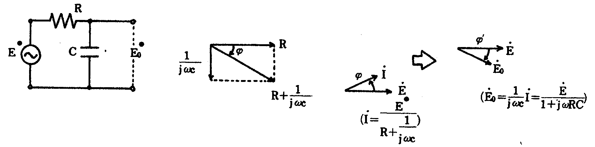

図 9 からわかるように, C の両端の電圧 $E_0$ は入力電圧 E より遅れている. 一段あたりで得られる位相差は $90^\circ$ 未満のため, RC 回路を3段, はしご状に重ねると $180^\circ$ まで遅らせることができる.  

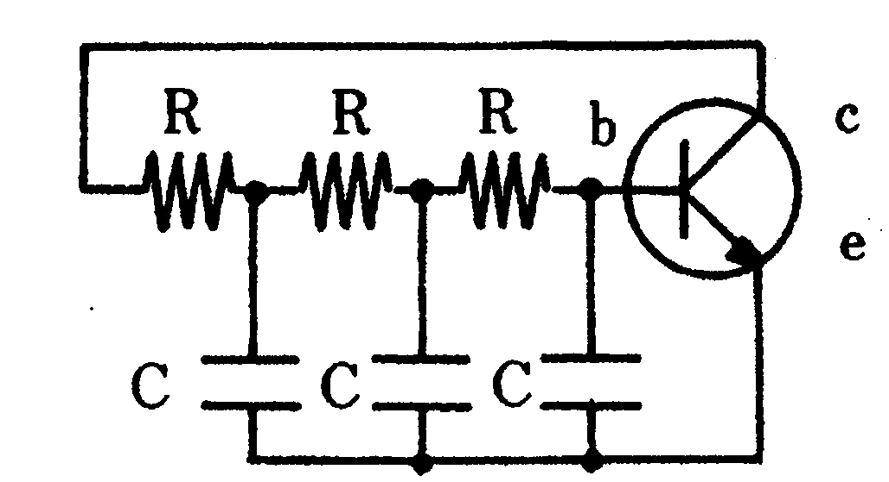

図 11 において, c-e 間の電圧波形が&emsp;のとき, b-c 間は $180^\circ$ 遅れるので電圧波形は&emsp;のようになる. さらに, トランジスタにより位相反転が起きるので正帰還が形成される.  
発振周波数 $f_0$ は $f_0 = \frac{\sqrt{6}}{2\pi RC}$ となる.  
実際の遅相発振回路の構成例を図 11 に示す.

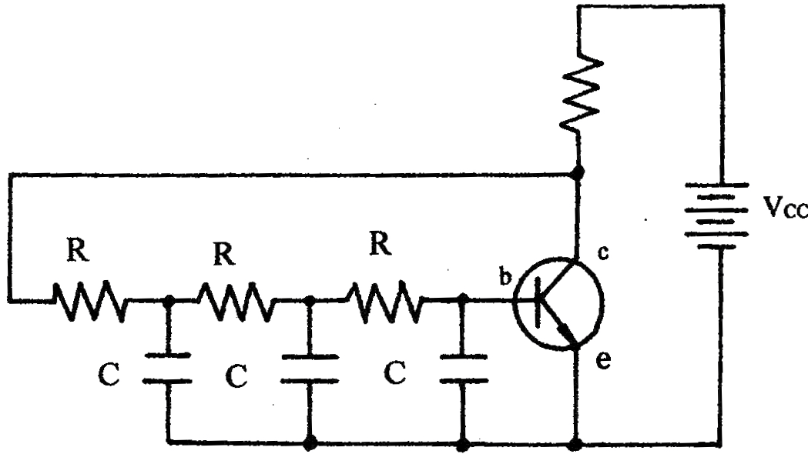

\clearpage

# 実験方法

1. 電子ブロックを組み合わせ, ハートレー発振回路を実体配線図（ 図 12 ）のように構成した.
2. 端子 B’ を電源の + 端子に, A’ を電源の GND 端子に接続した.
3. 電源装置の電源調整つまみを 5 [ V ] にし,微調整つまみで 6 [ V ]に近づけた.
4. オシロスコープのプローブの信号端子を C へ, GND 端子を D へ接続した.
5. オシロスコープに表示された波形から, 発振が起こることを確認し, その波形をグラフ用紙にトレースした.
6. コルピッツ発振回路( 図 13 ), 進相形発振回路( 図 14 ), 遅相形発振回路( 図 15 )及び課題 5.2.2 についても, 同様のことを行った.

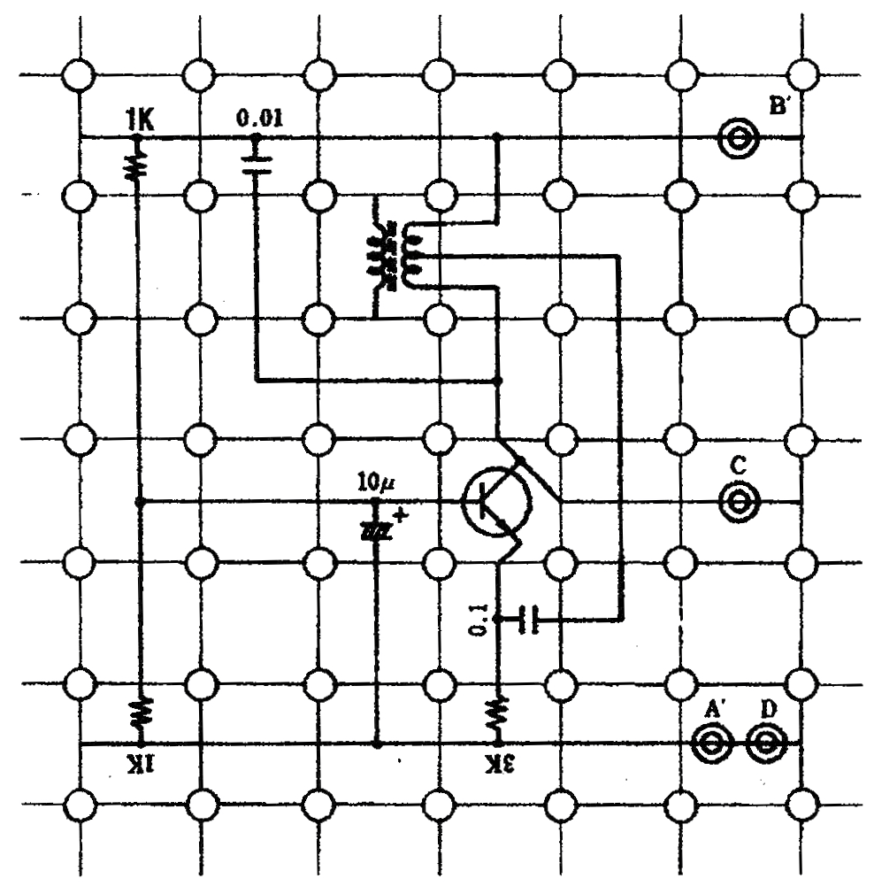{width=400px}

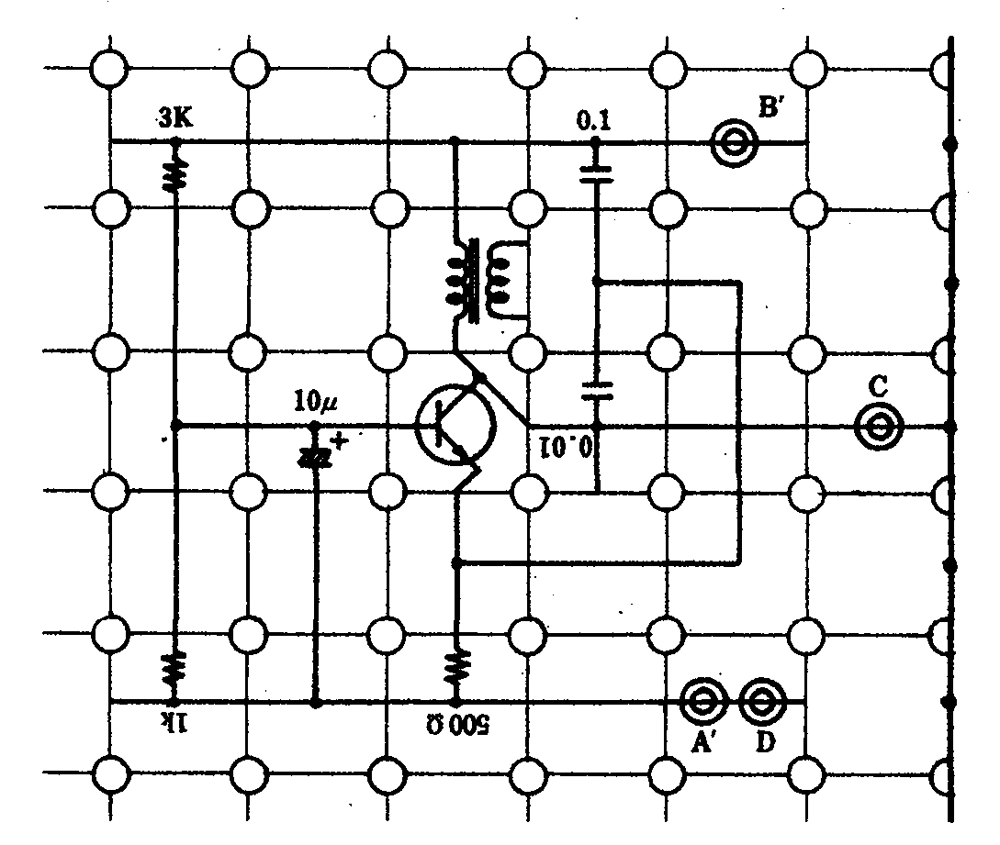{width=400px}

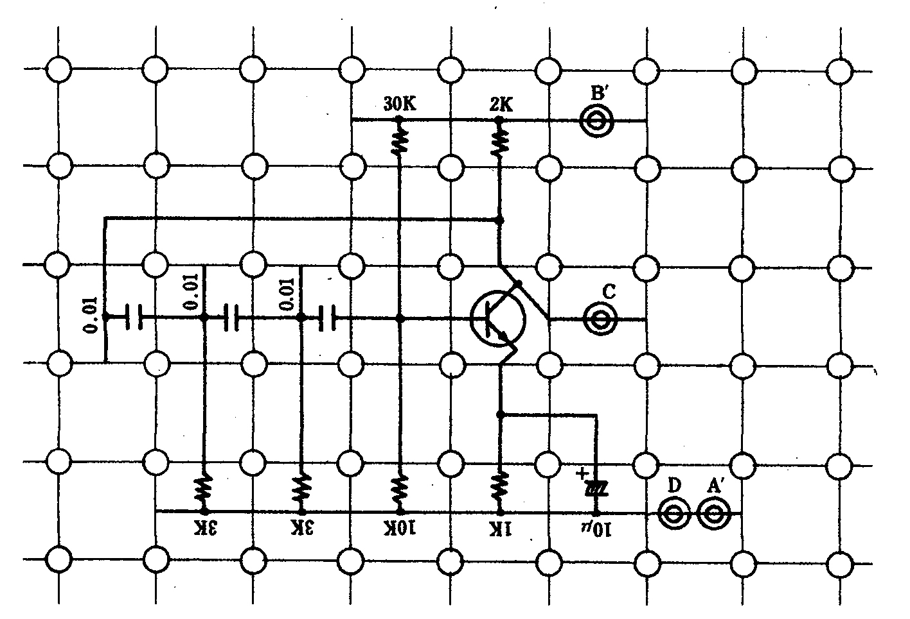{width=600px}

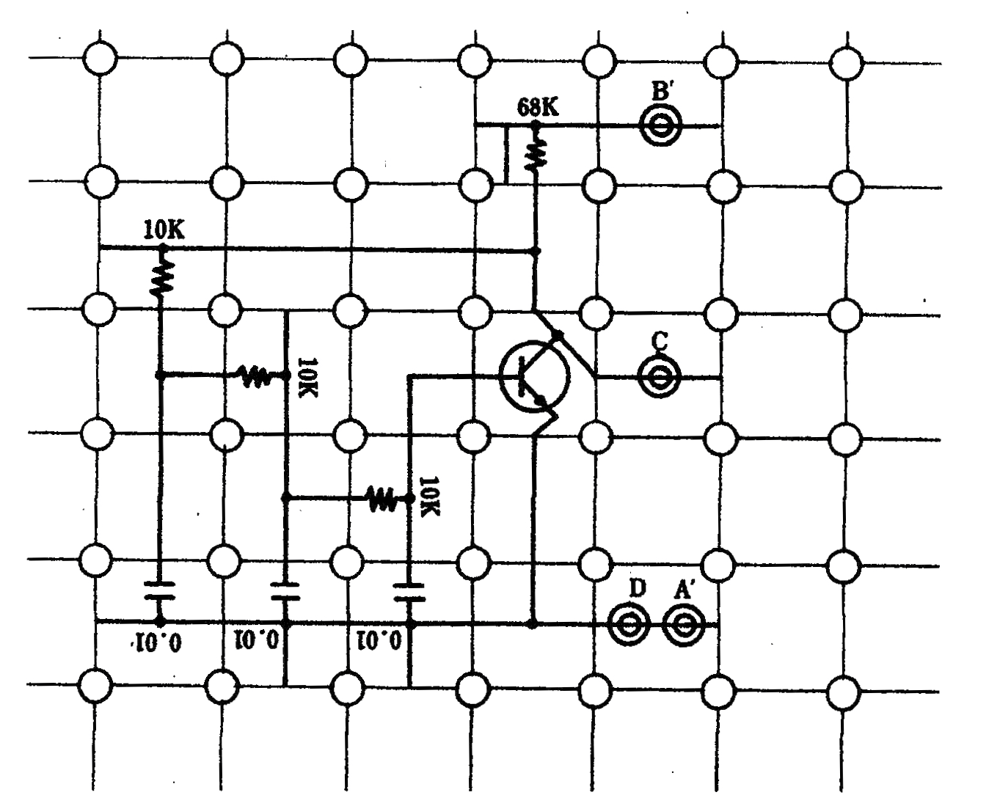{width=600px}

\clearpage

# 使用機器

使用機器について以下の表 1 に示した.

| 機器名 | 製造元 | 型番 | シリアル番号 | 個数 |
|------:|:------:|:------:|:------:|:------:|
| 電子回路ブロックおよび固定台 |  | | | 1 |
| オシロスコープ | KEYSIGHT | EDUX1002A | CN 58280328 | 1 |
| 直流安定化電源 | Metronix | 532C | 970480 | 1 |

:使用機器

# 実験結果

## ハートレー発振回路

ハートレー発振回路の観測波形を図 16 に示した.

## コルピッツ発振回路

コルピッツ発振回路の観測波形を図 17 に示した.

## 進相形発振回路

進相形発振回路の観測波形を 図 18 に示した.

## 遅相形発振回路

遅相形発振回路の, 3 , 4, 2 段の観測波形をそれぞれ図 19, 20, 21 に示した.

\clearpage

# 課題

## LC 発振回路（ ハートレー発振回路のみ ）

### トレースした波形から発振周波数 $f_0$ を求めよ

図 16 に示したように, 一周期は 11.1 [ $\mu$s ] ( = 5.55 div * 2.000 $\mu$s / div) であったので、発振周波数 $f_0$ は
$$f_0 = \frac{1}{11.1*10^{-6}} \approx 90.1 [ kHz ]$$

### 発振周波数は $f_0=\frac{1}{2\pi\sqrt{LC}}$ として与えられる.この関係を用いて各発振回路を構成する同調回路内のインダクタンス L の値を求めよ

$$f_0=\frac{1}{2\pi\sqrt{LC}}$$
$$\sqrt{LC} = \frac{1}{2 \pi f_0}$$
$$LC = \frac{1}{4\pi^2 f_0^{2}}$$
$$ L = \frac{1}{4\pi^2 f_0^{2}C} = \frac{1}{4\pi^2 \cdot (90.1 \cdot 10^3)^2 \cdot 0.01 \cdot 10^{-6}} \approx 3.12 \cdot 10^{-4}[H] = 0.312[mH] $$

## RC を用いた位相発振回路

### トレースした波形から発振周波数 $f_0$ を求めよ.（ 3 段進相形発振回路, 3 段遅相形発振回路 ）

#### 進相形発振回路（ 3 段 ）

図 17 に示したように, 一周期は 538 [ $\mu$s ] ( = 5.38 div * 100.000 $\mu$s / div) であったので、発振周波数 $f_0$ は
$$f_0 = \frac{1}{538*10^{-6}} \approx 1.86 [ kHz ]$$

#### 遅相形発振回路（ 3 段 ）

図 18 に示したように, 一周期は 250 [ $\mu$s ] ( = 5.00 div * 50.00 $\mu$s / div) であったので、発振周波数 $f_0$ は
$$f_0 = \frac{1}{250*10^{-6}} \approx 4.00 [ kHz ]$$

### 遅相形発振回路の段数を増減させて実験し, 観測された波形をトレースし, 発振周波数 $f_0$ を算出する. このとき、どのような現象が観測されたか

#### 4 段

図 19 に示したように, 一周期は 458 [ $\mu$s ] ( = 4.58 div * 100.00 $\mu$s / div) であったので、発振周波数 $f_0$ は
$$f_0 = \frac{1}{458*10^{-6}} \approx 2.18 [ kHz ]$$
段数の増加により、発振周波数 $f_0$ は低くなった.

#### 2 段

図 20 の結果から、2 段遅相形発振回路では発振減少は観測されなかった.これは、2 段では信号の遅相が 180° 未満となり、正帰還が形成されなかったためだと考えられる.

\clearpage

### 本実験で扱った以外の発振回路の例（ 1 ~ 2 例 ）について調べよ

#### 水晶発振回路

水晶発振回路は, 水晶振動子の持つ誘導性リアクタンスを, LC 発振回路のコイル L として使用することにより構成される.
図 22 に水晶振動子のリアクタンス特性を示す.この, 直列共振周波数 $f_0$ と並列共振周波数 $f_\infty$ の差が非常に小さい特性を利用することで、周波数変動の小さい発振回路を作ることができる.
図 23 に実際の推奨発振回路の例を示す. (a) , (b) はそれぞれ、ハートレー発振回路と、コルピッツ発振回路の L を水晶振動子に置き換えた物であり、(a) の回路を ピアス BE 発振回路, (b) の回路を ピアス CB 発振回路と呼ぶ.

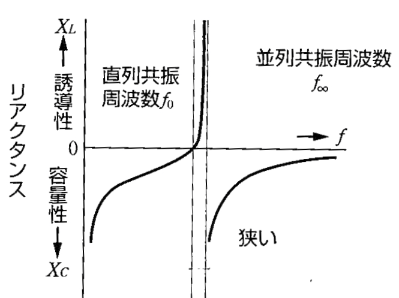{width=300px}

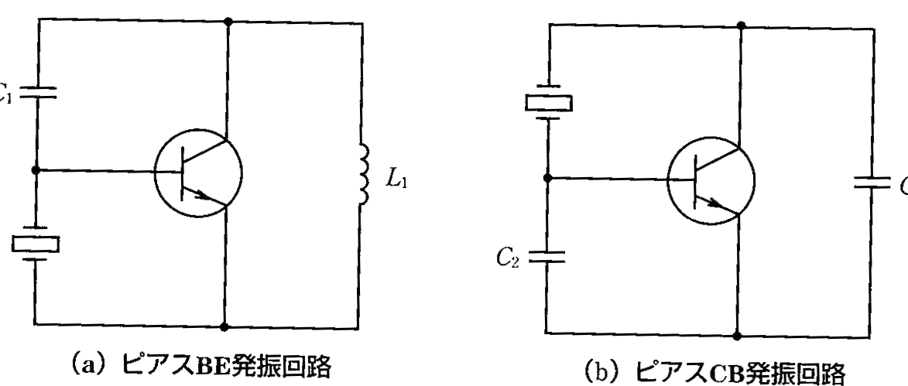{width=400px}

# 考察

## 遅相形発振回路で段数を増やすと, 発振周波数が低くなる理由を考察する.

遅相形発振回路では, RC の遅相回路によって位相差を発生させ, これを多段接続したときに合計での位相差が $\pi$ となる信号を, トランジスタで増幅することで発振させる.
ここで、全段の合計の位相差を $\pi$ とすると、段数が増えたときには, 一段当たりでの位相差は減少しなければならない.
このとき, 一段での位相差は $\arctan({\omega CR})$ で表され, C と R は定数かつ, この関数は単調増加である. よって, 位相差が小さくなるとき, $\omega=2\pi f$ も小さくなるので、発振周波数 $f_0$ は段数が増えると, 低くなる.

## 進相形発振回路で段数を増やすと, 発振周波数が高くなる理由を考察する.

前項と同様に考える. RC の進相回路一つでの位相差は $\arctan({\frac{1}{\omega CR}})$ で表されるので, 段数が増えたとき, 一段での位相差を小さくするためには, $\omega$ が大きくならなければならないので、発振周波数 $f_0$ も高くなる.

# 参考文献

電子回路概論, 実教出版（髙木茂孝, 鈴木憲次 監修）