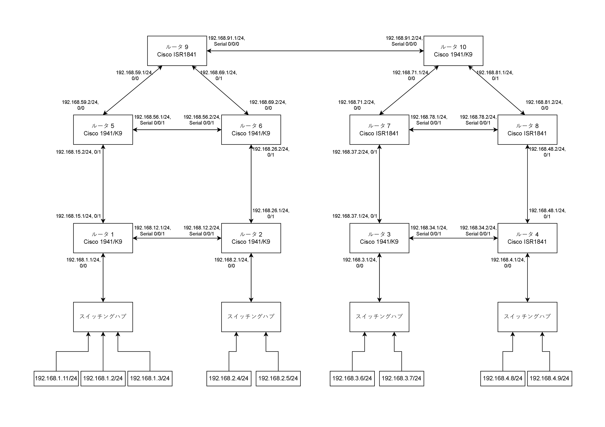
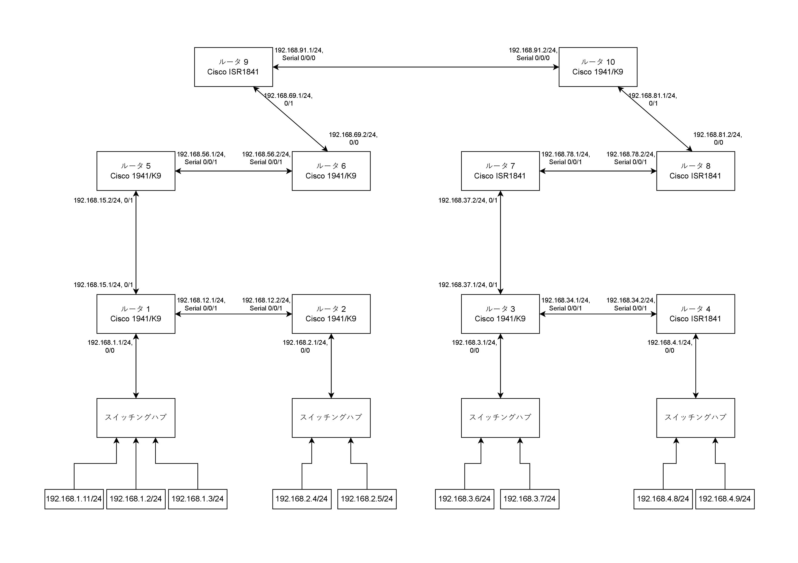

# 目的

コンピュータネットワークにおいて、IP アドレス、ルータの役割を理解し、ルータの設定の仕方を学習し、ルータによるルーティングを確認することを目的とした。

# 使用機器

使用機器を表 1 に示す。

| 機器名 | 製造元 | 型番 |  個数 |
|------:|:------:|:------:|:------:|
| ルータ( 1000M ) | Cisco | 1941/K9 | 6 |
| ルータ( 100M )  | Cisco | ISR1841 | 4 |
| スイッチングハブ( 1000M )| Cisco | CBS110-8T-D | 2 |
| スイッチングハブ( 1000M )| Buffalo | LSW4-GT-8NP/WH | 2 |

:使用機器

# 実験方法

## ネットワークの設計

ネットワークの構成を図 1 のように定めた。

- ルータの IP アドレスは各ポート毎に別々のネットワークとして割り当てた
- 0/0, 0/1, Serial 0/0/0, Serial 0/0/1 はインターフェース名
- 0/0 : FastEthernet 0/0 または GigabitEthernet 0/0
- 0/1 : FastEthernet 0/1 または GigabitEthernet 0/1
- FastEthenert は 100 Mbps, GigabitEthernet は 1 Gbps であり、それぞれ ```ISR1841```, ```1941/K9``` が対応するルータ

## ネットワークの配線

図 1 と同じ構成になるように各ルータ、スイッチングハブ、PC を接続した。使用したケーブルは以下のルールに従った。

- ルータ同士（縦）はストレートのツイストペアケーブル
- ルータ同士（横）はシリアル通信ケーブル（DCE, DTE）
- それ以外はクロスのツイストペアケーブル

配線が終わったら、全ての機器に電源ケーブルを接続し、電源を入れた。
PC は USB メモリから Linux(knoppix) を起動した。

\clearpage



## PC のインターフェース設定

以下のコマンドを実行し、IP アドレスを各 PC に割り当てた。割り当てた IP アドレスは図 1 の通りである。

1. ```su```
2. ```ifconfig eth0 192.168.Y.X netmask 255.255.255.0```
3. ```route add default gw 192.168.Y.1```

## ルータのインターフェース設定

以下の手順で、各ルータの各ポートに IP アドレスを割り当てた。割り当てた IP アドレスは図 1 の通りである。

1. PC の USB ポートとルータのコンソールポートをコンソールケーブルで接続した
2. PC で Terminal を開き、```cu -s 9600 -l /dev/ttyUSB0``` でルータと接続した
3. ```enable```
4. ```configure terminal```
5. ```interface {GigabitEthernet, FastEthernet, Serial} {0/0, 0/1, 0/0/0, 0/0/1} 192.168.Y.1 255.255.255.0```
6. ```no shutdown```
7. ```exit```
8. 5 ~ 7 を繰り返し各ポートの設定を行った

## ルータのルーティング設定

以下の手順で、RIP の設定を行った。

1. 前項と同様にルータと PC を接続した。
2. ```enable```
3. ```configure terminal```
4. ```router rip```
5. ```network {ルータの各ポートのネットワークアドレス}```
6. 5 を、各ポートに割り当てられたネットワークアドレスについて実行した

## 設定の確認

以下のコマンドをルータで実行し、各ルータのインターフェース、ルーティングテーブルの状態を確認して、結果を記録した。

1. ```show ip interface brief```
2. ```show ip route```

## 接続確認 1

以下の接続確認を行い、結果を記録した。

1. 各 PC から全てのルータに対して ping コマンドで接続を確認した。ルータは複数の IP アドレスを持つが、ネットワーク的に最も近いアドレスを指定した。

2. 各 PC から他の全ての PC に対して ```ping``` コマンドで接続を確認した。
3. 各 PC から他の全ての PC に対して ```traceroute``` コマンドで通信経路を確認した

## 接続確認 2

図 2 に示した構成になるようにケーブルを外した上で以下の接続確認を行い、結果を記録した。

1. 各 PC から他の全ての PC に対して ```traceroute``` コマンドで通信経路を確認した



# 実験結果

## ルータのインターフェース設定

ルータ 6 のインターフェースの設定を表 2 に示す。

| インターフェース | IP アドレス     | ステータス         | プロトコル |
|------------------|----------------|--------------------|------------|
| GigabitEthernet0/0 | 192.168.69.2 | up                | up         |
| GigabitEthernet0/1 | 192.168.26.2 | up                | up         |
| Serial0/0/1       | 192.168.56.2 | up                | up         |

:ルータ 6 のインターフェースの設定

## ルータのルーティング設定

ルータ 6 のルーティングテーブルを表 3 に示す。

| ネットワークアドレス | メトリック | 経由先 IP アドレス | インターフェース         |
|----------------------|------------|--------------------|--------------------------|
| 192.168.1.0/24      | 120/2      | 192.168.56.1       | Serial0/0/1              |
| 192.168.1.0/24      | 120/2      | 192.168.26.1       | GigabitEthernet0/1       |
| 192.168.2.0/24      | 120/1      | 192.168.26.1       | GigabitEthernet0/1       |
| 192.168.3.0/24      | 120/4      | 192.168.69.1       | GigabitEthernet0/0       |
| 192.168.4.0/24      | 120/4      | 192.168.69.1       | GigabitEthernet0/0       |
| 192.168.12.0/24     | 120/1      | 192.168.26.1       | GigabitEthernet0/1       |
| 192.168.15.0/24     | 120/1      | 192.168.56.1       | Serial0/0/1              |
| 192.168.26.0/24     | -          | -                  | GigabitEthernet0/1 (直接接続) |
| 192.168.26.2/32     | -          | -                  | GigabitEthernet0/1 (直接接続) |
| 192.168.34.0/24     | 120/4      | 192.168.69.1       | GigabitEthernet0/0       |
| 192.168.37.0/24     | 120/3      | 192.168.69.1       | GigabitEthernet0/0       |
| 192.168.48.0/24     | 120/3      | 192.168.69.1       | GigabitEthernet0/0       |
| 192.168.56.0/24     | -          | -                  | Serial0/0/1 (直接接続)   |
| 192.168.56.2/32     | -          | -                  | Serial0/0/1 (直接接続)   |
| 192.168.59.0/24     | 120/1      | 192.168.69.1       | GigabitEthernet0/0       |
| 192.168.59.0/24     | 120/1      | 192.168.56.1       | Serial0/0/1              |
| 192.168.69.0/24     | -          | -                  | GigabitEthernet0/0 (直接接続) |
| 192.168.69.2/32     | -          | -                  | GigabitEthernet0/0 (直接接続) |
| 192.168.71.0/24     | 120/2      | 192.168.69.1       | GigabitEthernet0/0       |
| 192.168.78.0/24     | 120/3      | 192.168.69.1       | GigabitEthernet0/0       |
| 192.168.81.0/24     | 120/2      | 192.168.69.1       | GigabitEthernet0/0       |
| 192.168.91.0/24     | 120/1      | 192.168.69.1       | GigabitEthernet0/0       |

:ルータ 6 のルーティングテーブル

\clearpage

## 接続確認 1

192.168.2.4 から全てのルーターに対して ping コマンドを実行した結果を表 4 に示す。

| 宛先 IP アドレス   | 応答時間 (min/avg/max) [ms] | パケット送信数 | パケット受信数 | パケットロス率 |
|--------------------|-----------------------------|----------------|----------------|----------------|
| 192.168.12.1      | 24.110/24.233/24.299        | 3              | 3              | 0%             |
| 192.168.2.1       | 0.484/0.559/0.610           | 3              | 3              | 0%             |
| 192.168.37.1      | 24.815/24.910/24.986        | 3              | 3              | 0%             |
| 192.168.48.1      | 24.960/25.215/25.368        | 3              | 3              | 0%             |
| 192.168.56.1      | 24.392/24.464/24.532        | 3              | 3              | 0%             |
| 192.168.26.2      | 0.788/0.816/0.831           | 3              | 3              | 0%             |
| 192.168.78.1      | 36.772/36.865/36.917        | 3              | 3              | 0%             |
| 192.168.81.1      | 24.584/24.594/24.615        | 3              | 3              | 0%             |
| 192.168.59.1      | 12.941/13.132/13.252        | 3              | 3              | 0%             |
| 192.168.91.2      | 24.481/24.539/24.580        | 3              | 3              | 0%             |

:ルータに対する ping コマンドの結果

192.168.2.4 から全ての PC に対して ping コマンドを実行した結果を表 5 に示す。

| 宛先 IP アドレス   | 応答時間 (min/avg/max) [ms] | パケット送信数 | パケット受信数 | パケットロス率 |
|--------------------|-----------------------------|----------------|----------------|----------------|
| 192.168.1.11      | 24.384/24.587/24.727        | 3              | 3              | 0%             |
| 192.168.1.2       | 24.358/24.541/24.767        | 3              | 3              | 0%             |
| 192.168.1.3       | 24.263/24.554/24.731        | 3              | 3              | 0%             |
| 192.168.2.4       | 0.042/0.052/0.057           | 3              | 3              | 0%             |
| 192.168.2.5       | 0.519/0.654/0.743           | 3              | 3              | 0%             |
| 192.168.3.6       | 25.238/25.355/25.446        | 3              | 3              | 0%             |
| 192.168.3.7       | 25.133/25.230/25.412        | 3              | 3              | 0%             |
| 192.168.4.8       | 25.051/25.179/25.284        | 3              | 3              | 0%             |
| 192.168.4.9       | 24.975/25.084/25.202        | 3              | 3              | 0%             |

:PC に対する ping コマンドの結果

192.168.2.4 から全ての PC に対して traceroute コマンドを実行した結果を表 6 に示す。

| 宛先 IP アドレス   | ホップ数 | 経路                                                                 |
|--------------------|----------|----------------------------------------------------------------------|
| 192.168.1.11      | 3        | 192.168.2.1 → 192.168.12.1 → 192.168.1.11                           |
| 192.168.1.2       | 3        | 192.168.2.1 → 192.168.12.1 → 192.168.1.2                            |
| 192.168.1.3       | 3        | 192.168.2.1 → 192.168.12.1 → 192.168.1.3                            |
| 192.168.2.4       | 1        | 192.168.2.4                                                        |
| 192.168.2.5       | 1        | 192.168.2.5                                                        |
| 192.168.3.6       | 7        | 192.168.2.1 → 192.168.26.2 → 192.168.69.1 → 192.168.91.2 →         |
|                    |          | 192.168.71.2 → 192.168.37.1 → 192.168.3.6                          |
| 192.168.3.7       | 7        | 192.168.2.1 → 192.168.26.2 → 192.168.69.1 → 192.168.91.2 →         |
|                    |          | 192.168.71.2 → 192.168.37.1 → 192.168.3.7                          |
| 192.168.4.8       | 7        | 192.168.2.1 → 192.168.26.2 → 192.168.69.1 → 192.168.91.2 →         |
|                    |          | 192.168.81.2 → 192.168.48.1 → 192.168.4.8                          |
| 192.168.4.9       | 7        | 192.168.2.1 → 192.168.26.2 → 192.168.69.1 → 192.168.91.2 →         |
|                    |          | 192.168.81.2 → 192.168.48.1 → 192.168.4.9                          |

:PC に対しての traceroute コマンドの結果

## 接続確認 2

図 2 の構成で、 192.168.2.4 から全てのルータに対して traceroute コマンドを実行した結果を表 7 に示す。

| 宛先 IP アドレス   | ホップ数 | 経路                                                                 |
|--------------------|----------|----------------------------------------------------------------------|
| 192.168.1.11      | 3        | 192.168.2.1 → 192.168.12.1 → 192.168.1.11                           |
| 192.168.1.2       | 3        | 192.168.2.1 → 192.168.12.1 → 192.168.1.2                            |
| 192.168.1.3       | 3        | 192.168.2.1 → 192.168.12.1 → 192.168.1.3                            |
| 192.168.2.4       | 1        | 192.168.2.4                                                        |
| 192.168.2.5       | 1        | 192.168.2.5                                                        |
| 192.168.3.6       | 10       | 192.168.2.1 → 192.168.12.1 → 192.168.15.2 → 192.168.56.2 →         |
|                    |          | 192.168.69.1 → 192.168.91.2 → 192.168.81.2 → 192.168.78.1 →        |
|                    |          | 192.168.37.1 → 192.168.3.6                                         |
| 192.168.3.7       | 10       | 192.168.2.1 → 192.168.12.1 → 192.168.15.2 → 192.168.56.2 →         |
|                    |          | 192.168.69.1 → 192.168.91.2 → 192.168.81.2 → 192.168.78.1 →        |
|                    |          | 192.168.37.1 → 192.168.3.7                                         |
| 192.168.4.8       | 11       | 192.168.2.1 → 192.168.12.1 → 192.168.15.2 → 192.168.56.2 →         |
|                    |          | 192.168.69.1 → 192.168.91.2 → 192.168.81.2 → 192.168.78.1 →        |
|                    |          | 192.168.37.1 → 192.168.34.2 → 192.168.4.8                          |
| 192.168.4.9       | 11       | 192.168.2.1 → 192.168.12.1 → 192.168.15.2 → 192.168.56.2 →         |
|                    |          | 192.168.69.1 → 192.168.91.2 → 192.168.81.2 → 192.168.78.1 →        |
|                    |          | 192.168.37.1 → 192.168.34.2 → 192.168.4.9                          |

:PC に対しての traceroute コマンドの結果(断線想定)

\clearpage

# 課題

## 図 1 の構成での traceroute の結果と図 2 の構成での traceroute の結果を比較せよ

192.168.1.0/24 のネットワークに属する PC への経路には変化がないため、ホップ数は変わらなかった。
しかし、 192.168.3.0/24, 192.168.4.0/24 のネットワークに属する PC に対しては最短経路が変化したため、ホップ数が増加した。

## ルーティングテーブルを考察せよ

直接、あるいは間接的に接続されているネットワークがルーティングテーブルに登録されており、それぞれの宛先について次に経由するべきルータの IP アドレスと、それに対応するインターフェイス名が登録されていることがわかった。このようなテーブルを各々のルータが持つことで、パケットは宛先の端末まで転送を繰り返してたどり着くことができるのだと分かった。
また、あるネットワークへの経路は無数にあるが、その内で最短経路になるような転送先のみが登録されている事がわかった。Cisco の公式ドキュメント[^1]によれば、最短経路はメトリックという値により決定されている。このメトリックの値はプロトコルによって異なり、帯域幅やホップ数で決定されるが、今回の実習では、RIP というプロトコルを使用したため、ホップ数で決定されていることがわかった。
例えば、 192.168.3.0/24 までの経路では、ルータ 9, 10, 7, 3 を経由するため、メトリック値は 4 となっている事が分かる。
メトリック値の 120 という値は、Cisco の公式ドキュメント[^2]によると、アドミニストレーティブディスタンスと呼ばれるもので、ルーティングプロトコルの信頼性を示す値であることが分かった。この値は、ルーティングプロトコル毎に異なり、RIP の場合は 120 であることが分かった。この値があることで、同じネットワークに対して異なるルーティングプロトコルが存在する場合でも、どちらのプロトコルを使用するかを決定することができるのだと考えられる。
公式ドキュメント[^2]から引用したルーティングプロトコル毎のアドミニストレーティブディスタンス値のデフォルト値の一覧を表 8 に示す。

| ルートの情報源 | デフォルトのディスタンス値 |
| :------------- | --------------------------: |
| 接続されているインターフェイス | 0 |
| スタティックルート | 1 |
| EIGRPサマリールート | 5 |
| 外部BGP | 20 |
| 内部EIGRP | 90 |
| IGRP | 100 |
| OSPF | 110 |
| IS-IS | 115 |
| RIP | 120 |
| EGP | 140 |
| ODR（オンデマンドルーティング） | 160 |
| 外部EIGRP | 170 |
| IBGP | 200 |
| 不明* | 255 |

[^1]: ルーティングプロトコルの再配布の設定, Cisco, https://www.cisco.com/c/ja_jp/support/docs/ip/enhanced-interior-gateway-routing-protocol-eigrp/8606-redist.html#toc-hId-1440711928 (2024-11-22, メトリック)

[^2]: アドミニストレーティブディスタンスの説明, Cisco, https://www.cisco.com/c/ja_jp/support/docs/ip/border-gateway-protocol-bgp/15986-admin-distance.html (2024-09-27)

# 結論

コンピュータネットワークにおける IP アドレス、ルータの役割、ルーティングの意味を理解し、さらにその経路の決定方法についても理解することができた。
