# 目的

トランジスタ及びオペアンプを用いた増幅回路、フィルタ回路の設計・作成を行い、その特性を理解する。

# 理論

## 利得

増幅回路の増幅度（出力と入力の比）を常用対数で表したものを利得といい、単位には [dB] が用いられる。増幅回路の電圧、電流、電力の利得は、次のように定義される。

電圧利得 $G_{v}$ は $A_{v} = | \frac{v_{o}}{v_{i}} |$ とすると
$$ G_{v} = 20{\log_{10} A_{v}} [dB]$$
電流利得 $G_{i}$ は $A_{i} = | \frac{i_{o}}{i_{i}} |$ とすると
$$ G_{i} = 20{\log_{10} A_{i}} [dB]$$
電力利得 $G_{P}$ は $A_{P} = | \frac{P_{o}}{P_{i}} |$ とすると
$$ G_{P} = 10{\log_{10} A_{P}} [dB]$$

## トランジスタの増幅回路

### 電流増幅作用

トランジスタは小さいベース電流 $I_{B}$ で、大きいコレクタ電流 $I_{C}$ を制御することができる。コレクタ電流とベース電流の関係は直流電流増幅率 $h_{FE}$ を用いて以下の式で表される。$h_{FE}$ はトランジスタ固有の値である。

$$h_{FE} = \frac{I_{c}}{I_{b}}$$

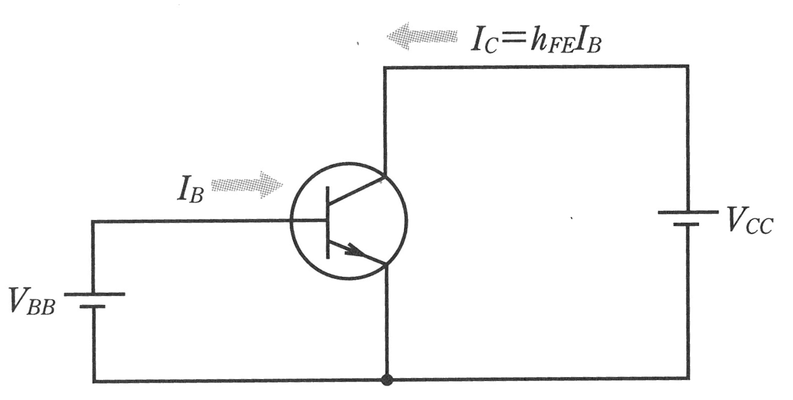

\clearpage

### エミッタ接地増幅回路

トランジスタのベースに微小な振幅な交流電圧を加えると、コレクタには交流分を含む電流が流れる。この交流分を含む電流を抵抗に流して電圧降下を発生させると、電流の変化を電圧の変化として取り出すことができる。
図 2[^1] は、コレクタに抵抗 $R_{c}$ を接続した回路で、コレクタとエミッタの間から、交流分を含んだ電圧を取り出すことができる。この回路はエミッタを接地するので、エミッタ接地増幅回路という。

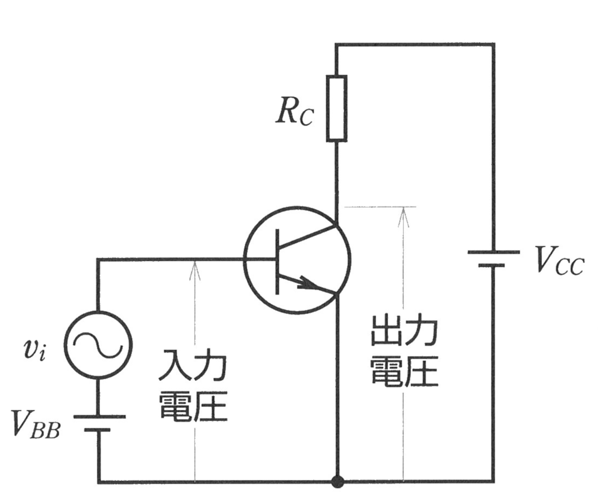

### バイアスと動作点

前項より、エミッタ接地増幅回路では、ベースの電圧の変化を増幅して、コレクタエミッタ間の電圧として取り出せる。このとき、コレクタエミッタ間電圧は、交流分を除いたときの直流電圧を中心値として、交流分が上下に変化する。この中心値となる直流電圧を動作点といい、この動作点を決定するためにベースエミッタ間に印加する直流電圧をバイアス電圧、または単にバイアスという。

### 固定バイアス回路

図 2 のエミッタ接地増幅回路では、ベース端子に接続された直流電源から直接ベース端子にバイアス電圧を加えていた。このバイアス方式は、$V_{BB}$ と $V_{cc}$ の 2 つの電源を必要とするため、2 電源方式と呼ばれる。一方、$V_{cc}$ をバイアス用の電源としてて共有する方式を 1 電源方式と呼ぶ。この 1 電源方式の内、最も簡単なバイアス回路として固定バイアス回路がある。この回路を図 3[^1] に示す。

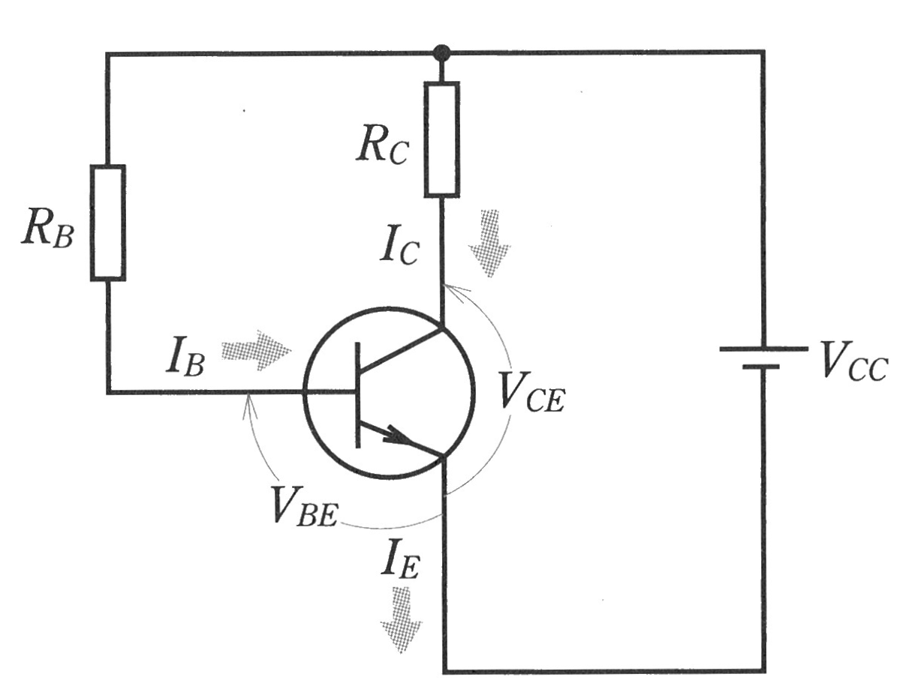

この回路では、ベース電流 $I_{B}$ を、電源電圧 $V_{cc}$ からバイアス抵抗 $R_{B}$ を通して流す方法を取っている。このベース電流 $I_{B}$ は以下の式で表される。

$$I_{B} = \frac{V_{cc} - V_{BE}}{R_{B}}$$

\clearpage

## オペアンプの増幅回路

### オペアンプ

オペアンプは、図 4[^2] に示す図記号で表され、反転入力と非反転入力の 2 つの入力端子と、1 つの出力端子を持っている。また、基本的には電源として正負 2 つの直流電圧を必要とする。
オペアンプの基本的な特性として、以下のようなものがある。

- 2 つの入力端子間の電圧差を増幅して出力する
- 入力インピーダンスが非常に大きい
- 出力インピーダンスが小さい
- 非常に高い利得

オペアンプは利得が非常に大きいので、負帰還をかけて使用するのが一般的である。負帰還は、出力端子の電圧を反転入力端子へ入力することによってかけることができる。
これらの特性を持つオペアンプを用いることで、素子毎の個体差を考慮せずに、増幅回路を設計することができる。

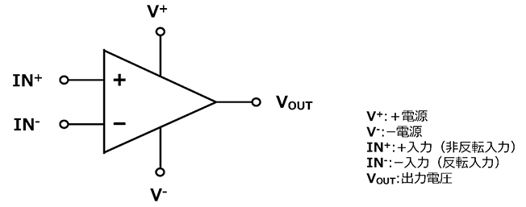{width=70%}

### 非反転増幅回路

非反転増幅回路は、非反転入力端子に加えられた電圧を、同相のまま増幅する回路である。回路図を 図 5 に示す。

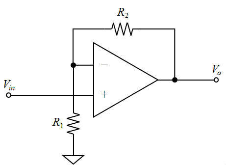{width=50%}

電圧の増幅度 $A_{v}$ は、以下の式で表される。
$$A_{v} = 1 + \frac{R_{2}}{R_{1}}$$

\clearpage

## フィルタ回路

フィルタ回路は、特定の周波数帯域の信号を通過させたり、減衰したりする回路である。フィルタ回路には、ローパスフィルタ、ハイパスフィルタ、バンドパスフィルタなどがある。フィルタ回路において、利得が平坦な区間と比べて -3 [dB] になる周波数をカットオフ周波数と呼ぶ。

### ローパスフィルタ

ローパスフィルタは、ある周波数以下の信号は通過させ、それ以上の周波数の信号は減衰させるフィルタである。。抵抗 R とコンデンサ C からなる RC ローパスフィルタは、図 6[^3] のように構成される。このローパスフィルタのカットオフ周波数は、以下の式で表される。

$$f_{c} = \frac{1}{2 \pi R C}$$

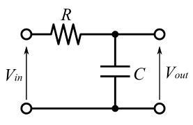{width=35%}

### ハイパスフィルタ

ハイパスフィルタは、カットオフ周波数以上の周波数の信号は通過させ、それ以下の周波数の信号は減衰させるフィルタである。抵抗 R とコンデンサ C からなる RC ハイパスフィルタは、図 7[^3] のように構成される。このハイパスフィルタのカットオフ周波数は、以下の式で表される。

$$f_{c} = \frac{1}{2 \pi R C}$$

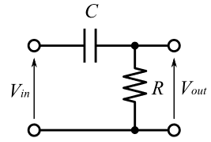{width=35%}

### バンドパスフィルタ

バンドパスフィルタは、特定の周波数帯域の信号のみを通過させ、それ以外の周波数の信号は減衰させるフィルタである。バンドパスフィルタは、ローパスフィルタとハイパスフィルタを組み合わせることで実現される。このとき、低い周波数帯でのカットオフ周波数を低域カットオフ周波数、高い周波数帯でのカットオフ周波数を高域カットオフ周波数と呼ぶ。

\clearpage

# 使用機器

使用機器を表 1 に示す。

| 機器名 | 製造元 | 型番 |  個数 |
|------:|:------:|:------:|:------:|
| 実習装置 | National Instruments | NI  ELVIS II | 1 |
| 回路シミュレータ | National Instruments | NI Multisim | - |
| トランジスタ |  | 2SC1815 | 1 |
| オペアンプ | | LF356N | 1 |
| 炭素被膜抵抗 | - | - | - |
| アルミ電解コンデンサ | - | - | - |
| セラミックコンデンサ | - | - | - |

:使用機器

# 実験方法

## トランジスタ増幅回路

トランジスタ増幅回路について設計、シミュレーション、実験を行った。
周波数 10 [Hz] ~ 1 [MHz] の範囲で、利得が 40 [dB] ~ 55 [dB] となるように設計を行った。

### 設計

設計したエミッタ接地のトランジスタ増幅回路を図 8 に示す。バイアス方式は固定バイアス方式を採用した。トランジスタは 2SC1815 を使用した。

{width=90%}

\clearpage

各記号を以下のように定義する。

- $C_{1}, C_{2}$: カップリングコンデンサ
- $R_{1}$: コレクタ抵抗
- $R_{2}$: ベース抵抗
- $V_{cc}$: 電源電圧
- $V_{be}$: ベース-エミッタ間電圧
- $V_{ce}$: コレクタ-エミッタ間電圧
- $V_{rc}$: コレクタ抵抗の端子電圧
- $V_{rb}$: ベース抵抗の端子電圧
- $I_{C}$: コレクタ電流
- $I_{b}$: ベース電流
- $h_{FE}$: トランジスタの直流電流増幅率

以下の各値を条件として設定した。

- $V_{cc}$ = 12 [V]
- $V_{be}$ = 0.7 [V]
- $h_{FE}$ = 100

出力電圧の振幅が最大になるように、動作点 $V_{ce}$ を電源電圧の半分 $V_{cc} / 2 = 6 [V]$ とした。 $I_{C}$ はトランジスタの最大消費電流を考慮して $I_{C} = 1 [mA]$ として、これらの条件から、以下のように各抵抗値を定めた。

- $R_{1} = \frac{V_{rc}}{I_{C}} = \frac{V_{cc} - V_{ce}}{I_{C}} = \frac{12 - 6}{1 \times 10^{-3}} = 6 [k\Omega]$
- $R_{2} = \frac{V_{rb}}{I_{b}} = \frac{V_{cc} - V_{be}}{\frac{I_{c}}{h_{FE}}} = \frac{12 - 0.7}{\frac{1 \times 10^{-3}}{100}} = 1.13 [M\Omega]$

$R_{2}$ については、実験室にある抵抗器の内、最も近い値であった $1 [M\Omega]$  を使用した。

### シミュレーション

図 8 に示したトランジスタ増幅回路について NI Multisim を用いて以下の条件でシミュレーションを行った。得られた周波数特性をボーデ線図として保存した。

- 入力信号は振幅 0.01 V の交流信号
- 周波数は 20 [mHz] ~ 50 [MHz]

### 実験

図 8 に示したトランジスタ増幅回路について NI ELVIS II を用いて以下の条件で実験を行った。得られた周波数特性をボーデ線図として保存した。

- 入力信号は振幅 0.01 V の交流信号で、NI ELVIS II の Function Generator を使用
- 周波数は 10 [Hz] ~ 200 [kHz]
- 測定点数は 5 [Steps / Decade] (10 倍の周波数範囲あたりの測定点数)
- NI ELVIS II の測定端子として ```AI 6 (入力電圧)```, ```AI 7 (出力電圧)``` を使用

\clearpage

## オペアンプ増幅回路
オペアンプ増幅回路について設計、シミュレーション、実験を行った。
周波数 10 [Hz] ~ 1 [MHz] の範囲で、利得が 35 [dB] となるように設計を行った。

### 設計

設計した非反転増幅回路を図 9 に示す。オペアンプは LF356N を使用した。

{width=90%}

35 [dB] の利得になるように、各抵抗値を定めた。

まず、利得 $G_{v}$ [dB] から増幅率 $A_{v}$ [倍] に変換すると、

$$ G_{v} = 20\log_{10} {A_{v}} $$
より、
$$ A_{v} = 10^{\frac{35}{20}} \approx 56.2 $$

入力電圧 $V_{i}$ の最大値を 0.01 [V] とした場合、出力電圧 $V_{o}$ の最大値は以下のように計算できる。

$$V_{o} = A_{v} \cdot V_{i} = 56.2 \cdot 0.01 = 0.562 [V]$$

設計に余裕を持たせるため、出力電圧 $V_{o}$ の最大値を 1.0 V と仮定した。また、出力先の入力抵抗として $R_{1}$ を 1 [kΩ]、オペアンプの最大出力電流 $I_{o}$ を 10 [mA] と仮定した。
これらの条件から、オペアンプが最大の出力電圧を出すために必要な負荷抵抗の大きさは以下のように計算できる

$$ R_{1} \parallel (R_{2} + R_{3}) \geq \frac{V_{o}}{I_{o}} = \frac{1.0}{10 \times 10^{-3}} = 100 [Ω]$$

ここで、非反転増幅回路の増幅率 $A_{v}$ は以下の式で表される。

$$A_{v} = 1 + \frac{R_{3}}{R_{2}}$$

$R_{2} = 1 [kΩ]$ とした場合、$R_{3}$ の値は以下のように計算され、先程の条件を満たす抵抗値が得られた。

$$R_{3} = (A_{v} - 1) \cdot R_{2} = (56.2 - 1) \cdot 1 \times 10^{3} = 55.2 [kΩ]$$
$R_{3}$ については、実験室にある抵抗器の内、最も近い値であった $56 [kΩ]$ を使用した。

### シミュレーション

図 9 に示したオペアンプ増幅回路について NI Multisim を用いて以下の条件でシミュレーションを行った。得られた周波数特性をボーデ線図として保存した。

- 入力信号は振幅 0.01 V の交流信号
- 周波数は 1 [Hz] ~ 5 [MHz]

### 実験

図 9 に示したオペアンプ増幅回路について NI ELVIS II を用いて以下の条件で実験を行った。得られた周波数特性をボーデ線図として保存した。

- 入力信号は振幅 0.01 V の交流信号で、NI ELVIS II の Function Generator を使用
- 周波数は 10 [Hz] ~ 200 [kHz]
- 測定点数は 20 [Steps / Decade]
- NI ELVIS II の測定端子として ```AI 4 (入力電圧)```, ```AI 5 (出力電圧)``` を使用

\clearpage

## ローパスフィルタ

ローパスフィルタについて設計、シミュレーション、実験を行った。
カットオフ周波数が 1 [kHz] ~ 50 [kHz] となるように設計を行った。

### 設計

設計したローパスフィルタを図 10 に示す。前項で設計した非反転増幅回路の出力に接続する形で設計した。

{width=90%}

カットオフ周波数が 5 [kHz] となるように、抵抗値、静電容量を定めた。
ローパスフィルタのカットオフ周波数は以下の式で表される。

$$f_{c} = \frac{1}{2 \pi R_{5} C_{2}}$$

ここで、$R_{5}$ は抵抗値、$C_{2}$ はコンデンサの静電容量である。
$C_{2} = 0.02 [\mu F]$ とした場合、$R_{5}$ の値は以下のように計算された。

$$R_{5} = \frac{1}{2 \pi f_{c} C_{2}} = \frac{1}{2 \pi \times 5 \times 10^{3} \times 0.02 \times 10^{-6}} \approx 1596.63 [Ω]$$

$R_{5}$ については、ちょうど良い抵抗値の抵抗器が実験室になかったため、3.3 [kΩ] の抵抗器を二並列接続して $3.3 / 2 = 1.65 [kΩ]$ とした。このときのカットオフ周波数は以下のようになったが、要件は満たしていた。

$$f_{c} = \frac{1}{2 \pi R_{5} C_{2}} = \frac{1}{2 \pi \times 1.65 \times 10^{3} \times 0.02 \times 10^{-6}} \approx 4.81 [kHz]$$

### シミュレーション

図 10 に示したローパスフィルタについて NI Multisim を用いて以下の条件でシミュレーションを行った。得られた周波数特性をボーデ線図として保存した。

- 入力信号は振幅 0.01 V の交流信号
- 周波数は 1 [Hz] ~ 5 [MHz]

### 実験

図 10 に示したローパスフィルタについて NI ELVIS II を用いて以下の条件で実験を行った。得られた周波数特性をボーデ線図として保存した。

- 入力信号は振幅 0.01 V の交流信号で、NI ELVIS II の Function Generator を使用
- 周波数は 10 [Hz] ~ 100 [kHz]
- 測定点数は 20 [Steps / Decade]
- NI ELVIS II の測定端子として ```AI 4 (入力電圧)```, ```AI 5 (出力電圧)``` を使用

\clearpage

## ハイパスフィルタ

ハイパスフィルタについて設計、シミュレーション、実験を行った。
カットオフ周波数が 50 [Hz] ~ 100 [Hz] となるように設計を行った。

### 設計

設計したハイパスフィルタを図 11 に示す。前項で設計した非反転増幅回路の出力に接続する形で設計した。

{width=90%}

カットオフ周波数が 75 [Hz] となるように、抵抗値、静電容量を定めた。
ハイパスフィルタのカットオフ周波数は以下の式で表される。

$$f_{c} = \frac{1}{2 \pi R_{4} C_{1}}$$

ここで、$R_{4}$ は抵抗値、$C_{1}$ はコンデンサの静電容量である。
$C_{1} = 1 [\mu F]$ とした場合、$R_{4}$ の値は以下のように計算された。

$$R_{4} = \frac{1}{2 \pi f_{c} C_{1}} = \frac{1}{2 \pi \times 75 \times 1 \times 10^{-6}} \approx 2.12 [kΩ]$$

$R_{4}$ については、実験室にある抵抗器の内、最も近い値であった $2 [kΩ]$ を使用した。このときのカットオフ周波数は以下のようになったが、要件は満たしていた。

$$f_{c} = \frac{1}{2 \pi R_{4} C_{1}} = \frac{1}{2 \pi \times 2 \times 10^{3} \times 1 \times 10^{-6}} \approx 79.58 [Hz]$$

### シミュレーション

図 11 に示したハイパスフィルタについて NI Multisim を用いて以下の条件でシミュレーションを行った。得られた周波数特性をボーデ線図として保存した。

- 入力信号は振幅 0.01 V の交流信号
- 周波数は 1 [Hz] ~ 5 [MHz]

### 実験

図 11 に示したハイパスフィルタについて NI ELVIS II を用いて以下の条件で実験を行った。得られた周波数特性をボーデ線図として保存した。

- 入力信号は振幅 0.01 V の交流信号で、NI ELVIS II の Function Generator を使用
- 周波数は 10 [Hz] ~ 200 [kHz]
- 測定点数は 20 [Steps / Decade]
- NI ELVIS II の測定端子として ```AI 4 (入力電圧)```, ```AI 5 (出力電圧)``` を使用

\clearpage

## バンドパスフィルタ
バンドパスフィルタについて設計、シミュレーション、実験を行った。
低域カットオフ周波数が 50 [Hz] ~ 75 [Hz]、高域カットオフ周波数が 1 [kHz] ~ 50 [kHz] となるように設計を行った。

### 設計

設計したバンドパスフィルタを図 12 に示す。


前項で設計したローパスフィルタとハイパスフィルタを組み合わせた形で設計した。
そのため、低域カットオフ周波数は 79.58 [Hz]、高域カットオフ周波数は 4.81 [kHz] となった。

### シミュレーション

図 12 に示したバンドパスフィルタについて NI Multisim を用いて以下の条件でシミュレーションを行った。得られた周波数特性をボーデ線図として保存した。

- 入力信号は振幅 0.01 V の交流信号
- 周波数は 1 [Hz] ~ 5 [MHz]

### 実験

図 12 に示したバンドパスフィルタについて NI ELVIS II を用いて以下の条件で実験を行った。得られた周波数特性をボーデ線図として保存した。

- 入力信号は振幅 0.01 V の交流信号で、NI ELVIS II の Function Generator を使用
- 周波数は 10 [Hz] ~ 100 [kHz]
- 測定点数は 20 [Steps / Decade]
- NI ELVIS II の測定端子として ```AI 4 (入力電圧)```, ```AI 5 (出力電圧)``` を使用

\clearpage

# 実験結果

各実験の結果を示す。

## トランジスタ増幅回路

### シミュレーション

シミュレーションの結果のボーデ線図を図 13 に示す。

利得が平坦な区間は約 1.97 [Hz] ~ 1.21 [MHz] であり、その範囲での利得は約 47.7 [dB] であった。
また、47.7 [dB] から -3 [dB] のカットオフ周波数は、低域カットオフ周波数が 0.68 [Hz]、高域カットオフ周波数が 3.5 [MHz] であった。

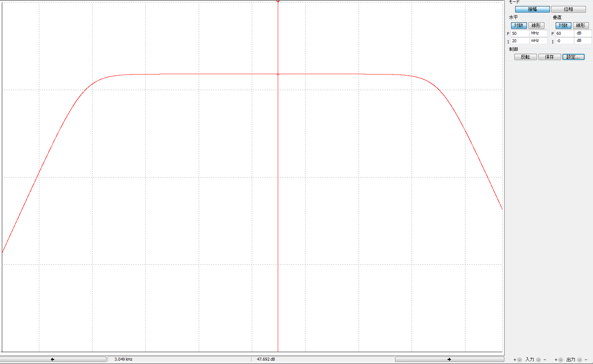

### 実験

実験の結果のボーデ線図を図 14 に示す。

利得が平坦な区間は約 200 [Hz] ~ 25 [kHz] であり、その範囲での利得は約 51 [dB] であった。

\clearpage


\clearpage

## オペアンプ増幅回路

### シミュレーション

シミュレーションの結果のボーデ線図を図 15 に示す。

平坦な区間での利得は 35.115 [dB] であった。

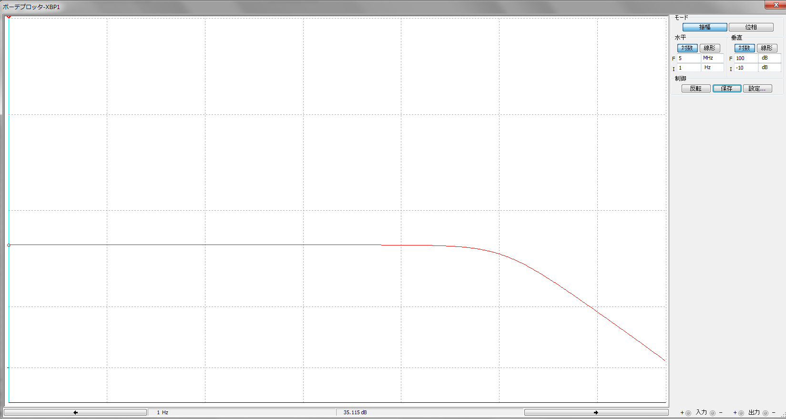

### 実験

実験の結果のボーデ線図を図 16 に示す。

平坦な区間での利得は 35.72 [dB] であった。カットオフ周波数はおおよそ 75 [kHz] であった。

\clearpage


\clearpage

## ローパスフィルタ

### シミュレーション

シミュレーションの結果のボーデ線図を図 17 に示す。

平坦な区間での利得はおおよそ 35.1 [dB] であった。カットオフ周波数(32.098 [dB])は 4.823 [kHz] であった。

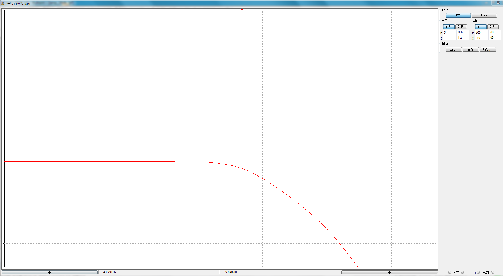

### 実験

実験の結果のボーデ線図を図 18 に示す。

平坦な区間での利得はおおよそ 35.7 [dB] であった。カットオフ周波数(32.70 [dB])は約 4.467 [kHz] であった。

\clearpage


\clearpage

## ハイパスフィルタ

### シミュレーション

シミュレーションの結果のボーデ線図を図 19 に示す。

平坦な区間での利得はおおよそ 35.1 [dB] であった。カットオフ周波数(32.106 [dB])は 79.6 [Hz] であった。

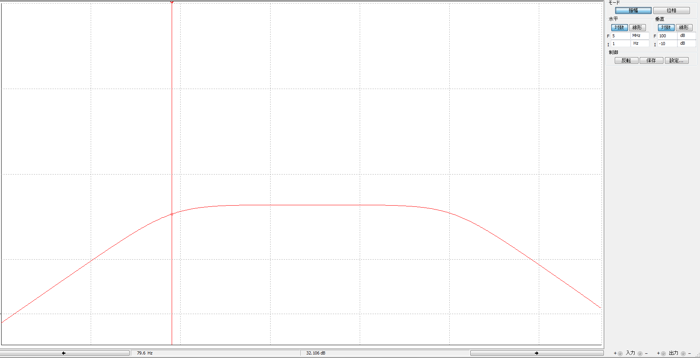

### 実験

実験の結果のボーデ線図を図 20 に示す。

平坦な区間での利得はおおよそ 36 [dB] であった。カットオフ周波数(33 [dB])は約 90 [Hz] であった。

\clearpage


\clearpage

## バンドパスフィルタ

### シミュレーション

シミュレーションの結果のボーデ線図を図 21 に示す。

平坦な区間での利得はおおよそ 35 [dB] であった。カットオフ周波数(32.009 [dB])は高域においては 4.81 [kHz]、低域においては 79.6 [Hz] であった。

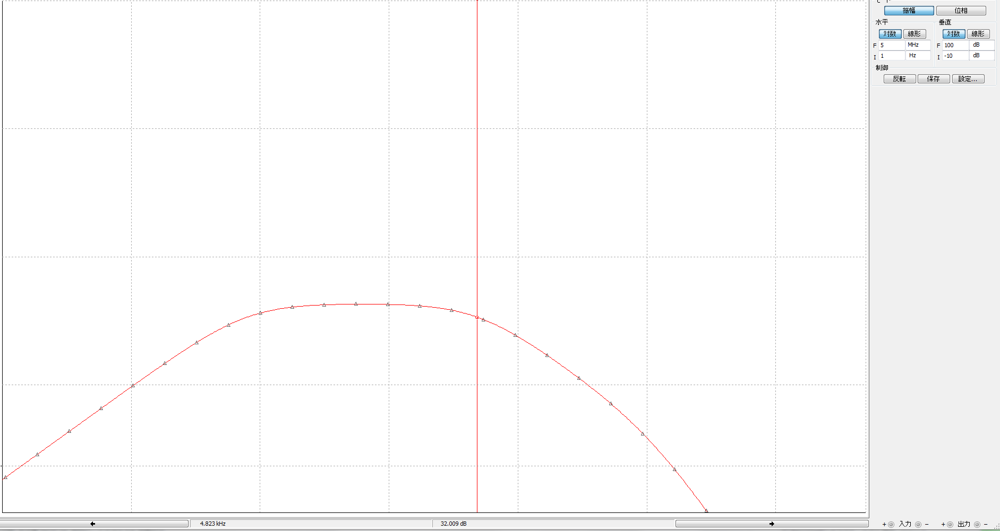

### 実験

実験の結果のボーデ線図を図 22 に示す。

平坦な区間での利得はおおよそ 35.2 [dB] であった。カットオフ周波数(32.21 [dB])は高域においては 4.467 [kHz]、低域においては 79.35 [Hz] であった。

\clearpage


\clearpage

# 考察

## トランジスタ増幅回路

シミュレーション、実験結果の両方で、利得が 40 [dB] ~ 55 [dB] という要件を満たしていた。
シミュレーションと比べると、実験結果の利得は大きい値となった。これは、シミュレーターのトランジスタのモデルと、実際のトランジスタの間で増幅率などのパラメータが異なっていたことが、原因の一つとして考えられる。

図 14 に示したボーデ線図について、100 [Hz] 近傍で急激に利得が大きくなっていた。この理由について考察する。

入力カップリングコンデンサ $C_{1}$ が原因であると仮定する。このコンデンサと、トランジスタの入力抵抗によって構成されるハイパスフィルタを考える。トランジスタの入力抵抗は、図 23 に示したデータシート[^4]より、約 1.7 [kΩ] である。

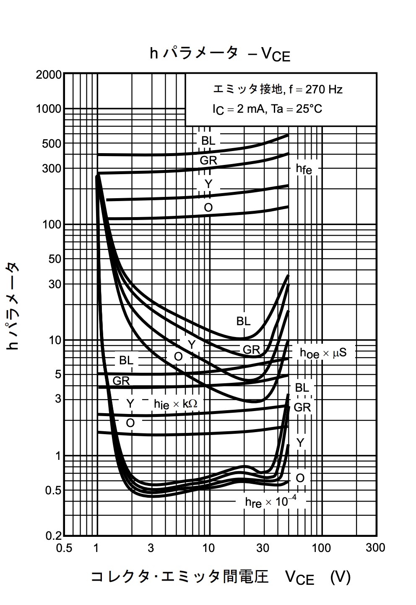{width=40%}

よって、このフィルタのカットオフ周波数 $f_{c}$ は
$$ f_{c} = \frac{1}{2 \pi R_{in} C} \approx \frac{1}{2 \pi \times 1.7 \times 10^{3} \times 100 \times 10^{-6} } \approx 0.94 [Hz] $$

であり、100 [Hz] 近傍の領域ではトランジスタの入力抵抗に比べてカップリングコンデンサのインピーダンスは十分に小さい。したがって、利得の低下の原因はカップリングコンデンサではないと考えられる。

他の原因として、測定点数が 5 step/decade と粗かったために、見かけ上急激に利得が大きくなったとも考えられる。

## オペアンプ増幅回路

シミュレーションにおいては利得が 35.115 [dB] になった。これは、利得がちょうど 35[dB] になる 55.2 [kΩ] の抵抗が実験室になかったために、$R_{3}$ を 56 [kΩ] にしたことが原因だと考えられる。$R_{3} = 56 [kΩ]$ での利得を計算すると、以下のようにシミュレーション結果と一致することがわかる。

$$ G_{v} = 20\log_{10}{(1 + \frac{R_{3}}{R_{2}})} $$
$$ G_{v} = 20\log_{10}{(1 + \frac{56 \times 10^3}{1 \times 10^3})} $$
$$ G_{v} \approx 35.117 $$

実験結果においては、利得が 35.72 [dB] であった。設計からのズレの原因としては、抵抗値の誤差が考えられる。$R_{3}, R_{2}$ の抵抗値をテスターで測ると、それぞれ 57 [kΩ], 0.985 [kΩ] であった。この値を元に利得を計算すると、

$$ G_{v} = 20\log_{10}{(1 + \frac{R_{3}}{R_{2}})} $$
$$ G_{v} = 20\log_{10}{(1 + \frac{57 \times 10^3}{0.985 \times 10^3})} $$
$$ G_{v} \approx 35.4 [dB]$$

となり、実験結果と理論値が元の結果より近しい値になった。

## ローパスフィルタ

設計はカットオフ周波数が 4.81 [kHz] になるように行った。シミュレーションにおいては 4.823 [kHz] であり、理論値に対しての誤差率は 0.27 % であった。一方、実験においては 4.467 [kHz] であり、誤差率は 7.1 % であった。原因としては、使用したセラミックコンデンサの容量許容差が ±20 %, 抵抗器の許容誤差が ±5 % であったことが考えられる。

## ハイパスフィルタ

設計はカットオフ周波数が 79.58 [Hz] になるように行った。シミュレーションにおいては 79.6 [Hz] であり、理論値に対しての誤差率は 0.25 % であった。一方、実験においては 90 [Hz] であり、誤差率は 13 % であった。
原因として、使用したアルミ電解コンデンサの容量許容差が ±20 % であったことが考えられる。
コンデンサや抵抗器は許容誤差が大きいので、使用する部品を選ぶ際に実際に値を測る必要がある。

## バンドパスフィルタ

シミュレーションと実験共に、ローパスフィルタとハイパスフィルタの結果を反映して、同じカットオフ周波数を持っていることが確認できた。

# 結論

トランジスタ及びオペアンプを用いた増幅回路、フィルタ回路の設計・作成を行い、その特性を理解することができた。

[^1]:髙木茂孝 鈴木憲次, "電子回路概論", 実教出版
[^2]:オペアンプ基礎講座 ～種類や特性について詳しく解説！～, https://www.nisshinbo-microdevices.co.jp/ja/design-support/basic-opamp/, 日清紡マイクロデバイス株式会社
[^3]:「フィルタ回路」の解説, https://synapse.kyoto/glossary/filter/page001.html
[^4]: https://akizukidenshi.com/goodsaffix/2sc1815.pdf
