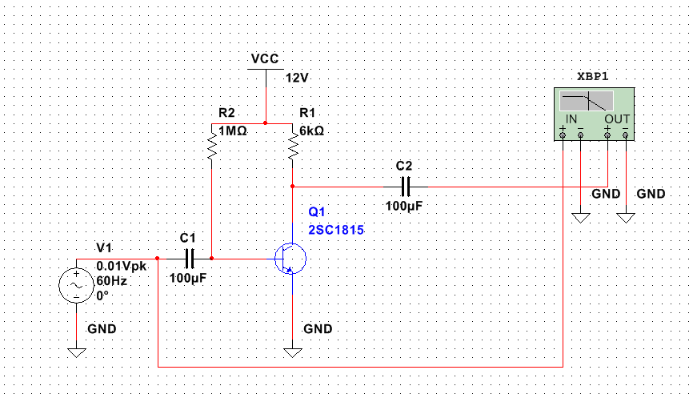
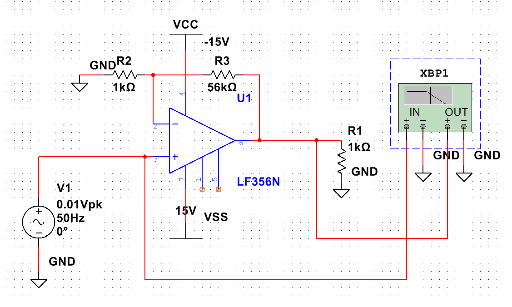
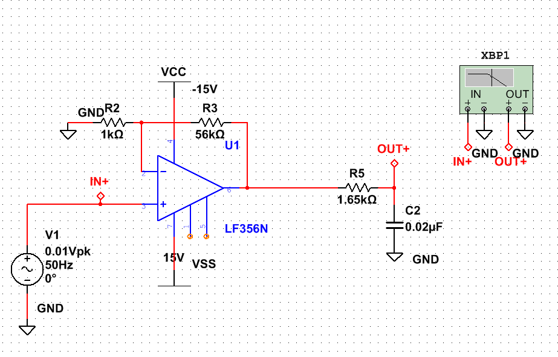
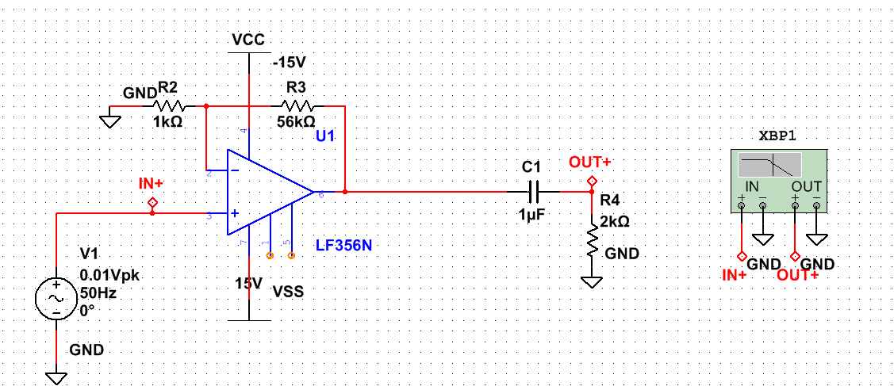
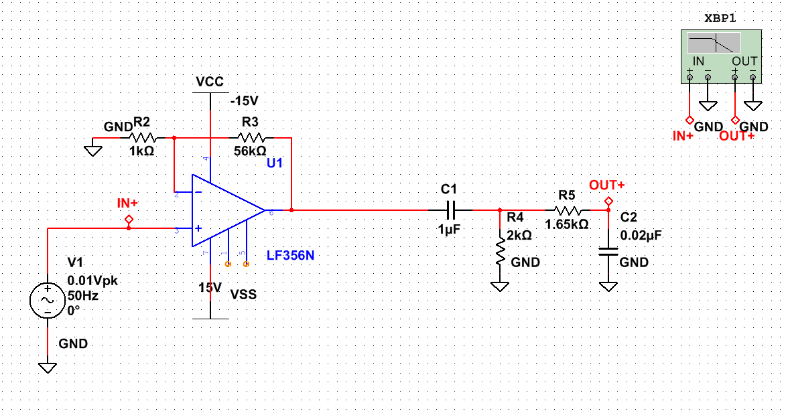

# 目的
トランジスタを用いた増幅回路及びオペアンプをも言いたフィルタ回路の設計・作成を行い、その特性を理解する。

# 理論

## トランジスタの増幅回路

## オペアンプの増幅回路

## フィルタ回路

### ローパスフィルタ

### ハイパスフィルタ

### バンドパスフィルタ


# 使用機器

使用機器を表 1 に示す。

| 機器名 | 製造元 | 型番 |  個数 |
|------:|:------:|:------:|:------:|
| 実習装置 | National Instruments | NI  ELVIS II | 1 |
| 回路シミュレータ | National Instruments | NI Multisim | - |
| トランジスタ |  | 2SC1815 | 1 |
| オペアンプ | | LF356N | 1 |
| 炭素被膜抵抗 | - | - | - |
| アルミ電解コンデンサ | - | - | - |
| セラミックコンデンサ | - | - | - |

:使用機器

# 実験方法

## トランジスタ増幅回路
トランジスタ増幅回路について設計、シミュレーション、実験を行った。
周波数 10 [Hz] ~ 1 [MHz] の範囲で、利得が 40 [dB] ~ 55 [dB] となるように設計を行った。

### 設計

設計したエミッタ接地のトランジスタ増幅回路を図 1 に示す。バイアス方式は固定バイアス方式を採用した。トランジスタは 2SC1815 を使用した。



各記号を以下のように定義する。

- $C_{1}, C_{2}$: カップリングコンデンサ
- $R_{1}$: コレクタ抵抗
- $R_{2}$: ベース抵抗
- $V_{cc}$: 電源電圧
- $V_{be}$: ベース-エミッタ間電圧
- $V_{ce}$: コレクタ-エミッタ間電圧
- $V_{rc}$: コレクタ抵抗の端子電圧
- $V_{rb}$: ベース抵抗の端子電圧
- $I_{C}$: コレクタ電流
- $I_{b}$: ベース電流
- $h_{fe}$: トランジスタの直流電流増幅率

以下の各値を条件として設定した。

- $V_{cc}$ = 12 [V]
- $V_{be}$ = 0.7 [V]
- $h_{fe}$ = 100

出力電圧の振幅が最大になるように、動作点 $V_{ce}$ を電源電圧の半分 $V_{cc} / 2 = 6 [V]$ とした。 $I_{C}$ はトランジスタの最大消費電流を考慮して $I_{C} = 1 [mA]$ として、これらの条件から、以下のように各抵抗値を定めた。

- $R_{1} = \frac{V_{rc}}{I_{C}} = \frac{V_{cc} - V_{ce}}{I_{C}} = \frac{12 - 6}{1 \times 10^{-3}} = 6 [k\Omega]$
- $R_{2} = \frac{V_{rb}}{I_{b}} = \frac{V_{cc} - V_{be}}{\frac{I_{c}}{h_{fe}}} = \frac{12 - 0.7}{\frac{1 \times 10^{-3}}{100}} = 1.13 [M\Omega]$

$R_{2}$ については、実験室にある抵抗器の内、最も近い値であった $1 [M\Omega]$  を使用した。

### シミュレーション

図 1 に示したトランジスタ増幅回路について NI Multisim を用いて以下の条件でシミュレーションを行った。得られた周波数特性をボーデ線図として保存した。

- 入力信号は振幅 0.01 V の交流信号
- 周波数は 20 [mHz] ~ 50 [MHz]

### 実験

図 1 に示したトランジスタ増幅回路について NI ELVIS II を用いて以下の条件で実験を行った。得られた周波数特性をボーデ線図として保存した。

- 入力信号は振幅 0.01 V の交流信号で、NI ELVIS II の Function Generator を使用
- 周波数は 10 [Hz] ~ 200 [kHz]
- 測定点数は 5 [Steps / Decade] ( 10 倍の周波数範囲あたりの測定点数 )
- NI ELVIS II の測定端子として ```AI 6 (入力電圧)```, ```AI 7 (出力電圧)``` を使用

## オペアンプ増幅回路
オペアンプ増幅回路について設計、シミュレーション、実験を行った。
周波数 10 [Hz] ~ 1 [MHz] の範囲で、利得が 35 [dB] となるように設計を行った。

### 設計

設計した非反転増幅回路を図 2 に示す。オペアンプは LF356N を使用した。



35 [dB] の利得になるように、各抵抗値を定めた。

まず、利得 $A_{v}$ を dB 単位から増幅率（倍）に変換すると、

$$ A_{v} = 10^{\frac{35}{20}} \approx 56.2 $$

入力電圧 $V_{i}$ の最大値を 0.01 [V] とした場合、出力電圧 $V_{o}$ の最大値は以下のように計算できる。

$$V_{o} = A_{v} \cdot V_{i} = 56.2 \cdot 0.01 = 0.562 [V]$$

設計に余裕を持たせるため、出力電圧 $V_{o}$ の最大値を 1.0 V と仮定した。また、出力先の入力抵抗として $R_{1}$ を 1 [kΩ]、オペアンプの最大出力電流 $I_{o}$ を 10 [mA] と仮定した。
これらの条件から、オペアンプが最大の出力電圧を出すために必要な負荷抵抗の大きさは以下のように計算できる

$$ R_{1} \parallel (R_{2} + R_{3}) \geq \frac{V_{o}}{I_{o}} = \frac{1.0}{10 \times 10^{-3}} = 100 [Ω]$$

ここで、非反転増幅回路の利得 $A_{v}$ は以下の式で表される。

$$A_{v} = 1 + \frac{R_{3}}{R_{2}}$$

$R_{2} = 1 [kΩ]$ とした場合、$R_{3}$ の値は以下のように計算され、先程の条件を満たした抵抗値が得られた。

$$R_{3} = (A_{v} - 1) \cdot R_{2} = (56.2 - 1) \cdot 1 \times 10^{3} = 55.2 [kΩ]$$
$R_{3}$ については、実験室にある抵抗器の内、最も近い値であった $56 [kΩ]$ を使用した。

### シミュレーション

図 2 に示したオペアンプ増幅回路について NI Multisim を用いて以下の条件でシミュレーションを行った。得られた周波数特性をボーデ線図として保存した。

- 入力信号は振幅 0.01 V の交流信号
- 周波数は 1 [Hz] ~ 5 [MHz]

### 実験

図 2 に示したオペアンプ増幅回路について NI ELVIS II を用いて以下の条件で実験を行った。得られた周波数特性をボーデ線図として保存した。

- 入力信号は振幅 0.01 V の交流信号で、NI ELVIS II の Function Generator を使用
- 周波数は 10 [Hz] ~ 200 [kHz]
- 測定点数は 20 [Steps / Decade]
- NI ELVIS II の測定端子として ```AI 4 (入力電圧)```, ```AI 5 (出力電圧)``` を使用

## ローパスフィルタ

ローパスフィルタについて設計、シミュレーション、実験を行った。
カットオフ周波数が 1 [kHz] ~ 50 [kHz] となるように設計を行った。

### 設計

設計したローパスフィルタを図 3 に示す。前項で設計した非反転増幅回路の出力に接続する形で設計した。



カットオフ周波数が 5 [kHz] となるように、抵抗値、静電容量を定めた。
ローパスフィルタのカットオフ周波数は以下の式で表される。

$$f_{c} = \frac{1}{2 \pi R_{5} C_{2}}$$

ここで、$R_{5}$ は抵抗値、$C_{2}$ はコンデンサの静電容量である。
$C_{2} = 0.02 [\mu F]$ とした場合、$R_{5}$ の値は以下のように計算された。

$$R_{5} = \frac{1}{2 \pi f_{c} C_{2}} = \frac{1}{2 \pi \times 5 \times 10^{3} \times 0.02 \times 10^{-6}} \approx 1596.63 [Ω]$$

$R_{5}$ については、ちょうど良い抵抗値の抵抗器が実験室になかったため、3.3 [kΩ] の抵抗器を二並列接続して $3.3 / 2 = 1.65 [kΩ]$ とした。このときのカットオフ周波数は以下のようになったが、要件は満たしていた。

$$f_{c} = \frac{1}{2 \pi R_{5} C_{2}} = \frac{1}{2 \pi \times 1.65 \times 10^{3} \times 0.02 \times 10^{-6}} \approx 4.81 [kHz]$$

### シミュレーション

図 3 に示したローパスフィルタについて NI Multisim を用いて以下の条件でシミュレーションを行った。得られた周波数特性をボーデ線図として保存した。

- 入力信号は振幅 0.01 V の交流信号
- 周波数は 1 [Hz] ~ 5 [MHz]

### 実験

図 3 に示したローパスフィルタについて NI ELVIS II を用いて以下の条件で実験を行った。得られた周波数特性をボーデ線図として保存した。

- 入力信号は振幅 0.01 V の交流信号で、NI ELVIS II の Function Generator を使用
- 周波数は 10 [Hz] ~ 100 [kHz]
- 測定点数は 20 [Steps / Decade]
- NI ELVIS II の測定端子として ```AI 4 (入力電圧)```, ```AI 5 (出力電圧)``` を使用

## ハイパスフィルタ

ハイパスフィルタについて設計、シミュレーション、実験を行った。
カットオフ周波数が 50 [Hz] ~ 100 [Hz] となるように設計を行った。

### 設計

設計したハイパスフィルタを図 4 に示す。前項で設計した非反転増幅回路の出力に接続する形で設計した。



カットオフ周波数が 75 [Hz] となるように、抵抗値、静電容量を定めた。
ハイパスフィルタのカットオフ周波数は以下の式で表される。

$$f_{c} = \frac{1}{2 \pi R_{4} C_{1}}$$

ここで、$R_{4}$ は抵抗値、$C_{1}$ はコンデンサの静電容量である。
$C_{1} = 1 [\mu F]$ とした場合、$R_{4}$ の値は以下のように計算された。

$$R_{4} = \frac{1}{2 \pi f_{c} C_{1}} = \frac{1}{2 \pi \times 75 \times 10^{0} \times 1 \times 10^{-6}} \approx 2.12 [kΩ]$$

$R_{4}$ については、実験室にある抵抗器の内、最も近い値であった $2 [kΩ]$ を使用した。このときのカットオフ周波数は以下のようになったが、要件は満たしていた。

$$f_{c} = \frac{1}{2 \pi R_{4} C_{1}} = \frac{1}{2 \pi \times 2 \times 10^{3} \times 1 \times 10^{-6}} \approx 79.58 [Hz]$$

### シミュレーション

図 4 に示したハイパスフィルタについて NI Multisim を用いて以下の条件でシミュレーションを行った。得られた周波数特性をボーデ線図として保存した。

- 入力信号は振幅 0.01 V の交流信号
- 周波数は 1 [Hz] ~ 5 [MHz]

### 実験

図 4 に示したハイパスフィルタについて NI ELVIS II を用いて以下の条件で実験を行った。得られた周波数特性をボーデ線図として保存した。

- 入力信号は振幅 0.01 V の交流信号で、NI ELVIS II の Function Generator を使用
- 周波数は 10 [Hz] ~ 200 [kHz]
- 測定点数は 20 [Steps / Decade]
- NI ELVIS II の測定端子として ```AI 4 (入力電圧)```, ```AI 5 (出力電圧)``` を使用

## バンドパスフィルタ
バンドパスフィルタについて設計、シミュレーション、実験を行った。
低域カットオフ周波数が 50 [Hz] ~ 75 [kHz]、高域カットオフ周波数が 1 [kHz] ~ 50 [kHz] となるように設計を行った。

### 設計

設計したバンドパスフィルタを図 5 に示す。



前項で設計したローパスフィルタとハイパスフィルタを組み合わせた形で設計した。
そのため、低域カットオフ周波数が 79.58 [Hz]、高域カットオフ周波数は 4.81 [kHz] となる。

### シミュレーション

図 5 に示したバンドパスフィルタについて NI Multisim を用いて以下の条件でシミュレーションを行った。得られた周波数特性をボーデ線図として保存した。

- 入力信号は振幅 0.01 V の交流信号
- 周波数は 1 [Hz] ~ 5 [MHz]

### 実験

図 5 に示したバンドパスフィルタについて NI ELVIS II を用いて以下の条件で実験を行った。得られた周波数特性をボーデ線図として保存した。

- 入力信号は振幅 0.01 V の交流信号で、NI ELVIS II の Function Generator を使用
- 周波数は 10 [Hz] ~ 100 [kHz]
- 測定点数は 20 [Steps / Decade]
- NI ELVIS II の測定端子として ```AI 4 (入力電圧)```, ```AI 5 (出力電圧)``` を使用